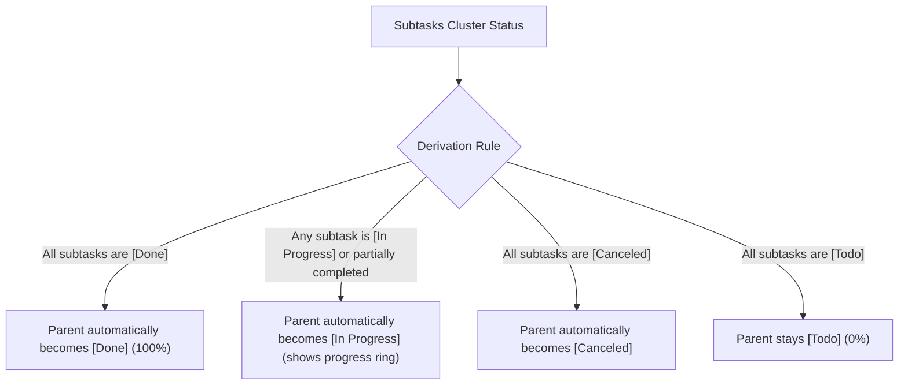

# Ordo (知序) User Manual

> **"Order and Priority. Know what matters, act with clarity."**  
> Ordo is a minimalist, local-first cross-platform personal task and order management application. Designed for Android, Windows, and Linux, Ordo provides a 3-level hierarchical task tree, custom smart views, calendar scheduling with Chinese lunar & statutory holidays, WebDAV/S3 relay synchronization, and offline snapshot backups.

---

## Table of Contents

- [1. Quick Start](#1-quick-start)
  - [1.1 Core Philosophy](#11-core-philosophy)
  - [1.2 Interface Layout & Navigation](#12-interface-layout--navigation)
  - [1.3 Create Your First Task in 3 Minutes](#13-create-your-first-task-in-3-minutes)
- [2. Core Concepts & Task Management](#2-core-concepts--task-management)
  - [2.1 The 4-State Task Lifecycle](#21-the-4-state-task-lifecycle)
  - [2.2 3-Level Hierarchical Task Tree](#22-3-level-hierarchical-task-tree)
  - [2.3 Derived State Logic: Parent-Child Linkage](#23-derived-state-logic-parent-child-linkage)
  - [2.4 Reordering, Indenting, and Outdenting](#24-reordering-indenting-and-outdenting)
  - [2.5 Task Attributes (Dates, Priority, Notes & Tags)](#25-task-attributes-dates-priority-notes--tags)
- [3. Organization: From Chaos to Order](#3-organization-from-chaos-to-order)
  - [3.1 Inbox: Capture Thoughts & Fleeting Ideas](#31-inbox-capture-thoughts--fleeting-ideas)
  - [3.2 Folders & Projects: Structured Containers](#32-folders--projects-structured-containers)
  - [3.3 Moving Tasks Across Projects & Folders](#33-moving-tasks-across-projects--folders)
  - [3.4 Tag System: Multidimensional Categorization](#34-tag-system-multidimensional-categorization)
  - [3.5 Today View: The Power of Focus](#35-today-view-the-power-of-focus)
- [4. Calendar & Scheduling](#4-calendar--scheduling)
  - [4.1 Month, Week, and Day Views](#41-month-week-and-day-views)
  - [4.2 Chinese Lunar Calendar & Solar Terms](#42-chinese-lunar-calendar--solar-terms)
  - [4.3 Statutory Holidays & Shift Workday Badges](#43-statutory-holidays--shift-workday-badges)
  - [4.4 Quick Scheduling from Calendar Cells](#44-quick-scheduling-from-calendar-cells)
- [5. Custom Views (Smart Lists)](#5-custom-views-smart-lists)
  - [5.1 What are Custom Views?](#51-what-are-custom-views)
  - [5.2 Combining Multiple Filters](#52-combining-multiple-filters)
  - [5.3 Pinning Views to the Sidebar](#53-pinning-views-to-the-sidebar)
- [6. Multi-Device Relay Synchronization](#6-multi-device-relay-synchronization)
  - [6.1 Relay Sync Architecture (LWW & Merging)](#61-relay-sync-architecture-lww--merging)
  - [6.2 Configuring WebDAV (Nutstore / Nextcloud, etc.)](#62-configuring-webdav-nutstore--nextcloud-etc)
  - [6.3 Configuring S3 Compatible Storage (MinIO / Cloudflare R2 / OSS)](#63-configuring-s3-compatible-storage-minio--cloudflare-r2--oss)
  - [6.4 Credential Security & Hardware Protection](#64-credential-security--hardware-protection)
- [7. Data Safety & Offline Backups](#7-data-safety--offline-backups)
  - [7.1 Auto-Snapshot Pool](#71-auto-snapshot-pool)
  - [7.2 Single-Point Rollback to Historical Snapshots](#72-single-point-rollback-to-historical-snapshots)
  - [7.3 Full Offline Backup (.ordobak format)](#73-full-offline-backup-ordobak-format)
  - [7.4 Full Replace vs. Incremental Merge](#74-full-replace-vs-incremental-merge)
- [8. Personalization & Settings](#8-personalization--settings)
  - [8.1 8 Curated Theme Palettes & Dark Mode](#81-8-curated-theme-palettes--dark-mode)
  - [8.2 Multi-Language Support (Simplified Chinese / English)](#82-multi-language-support-simplified-chinese--english)
  - [8.3 Gestures & Desktop Shortcuts](#83-gestures--desktop-shortcuts)
- [9. Frequently Asked Questions (FAQ)](#9-frequently-asked-questions-faq)

---

## 1. Quick Start

### 1.1 Core Philosophy

"Ordo" is the Latin root of the English word "Order". The application is built on four core principles:
* **Order & Priority**: Instead of drowning in endless to-do lists, gain control over your life and work through clear hierarchical breakdown and priority distinctions;
* **Local-First, Total Control**: All your tasks, lists, tags, and settings are stored locally in an embedded SQLite database. Even completely offline, queries and updates occur with sub-millisecond response times;
* **Pure & Unobtrusive**: No advertisements, no spam notifications, no cloud account lock-in. Your focus belongs to you;
* **Minimalist Aesthetics & Smooth Haptics**: Combines Squircle (continuous curvature continuous rounded corners) design with elastic motion to deliver a natural, comfortable tactile experience across both desktop and mobile.

### 1.2 Interface Layout & Navigation

Ordo automatically adapts to your screen size:

* **Desktop / Large Tablets**:
  * **Persistent Sidebar (AppSidebar)**: Quick navigation for Inbox, Today, Calendar, Projects, Tags, Custom Views, and Settings;
  * **Main Content Area**: Shows selected tasks, projects, or calendar grid. On wide screens, task editing opens in an integrated side sheet.
* **Mobile Phones**:
  * **Top Navigation Bar**: Hamburger menu button to reveal the navigation drawer;
  * **Interactive Task List**: Full touch gesture support (swipe left/right);
  * **Floating Action Button (FAB)**: Prominent `+` button in the bottom right corner for immediate task creation.

### 1.3 Create Your First Task in 3 Minutes

1. Click or tap the **`+` (New Task)** floating button;
2. **Enter Title**: E.g., `Prepare slides for tomorrow morning's meeting`;
3. **Pick Schedule**: Choose start date/time and due date/time;
4. **Assign Project**: Keep it in the default **Inbox**, or assign it to an existing project;
5. Click **Save** (or press `Ctrl + Enter` / `Cmd + Enter`);
6. Your new task appears immediately! Check the circle icon on the left to mark it done.

---

## 2. Core Concepts & Task Management

### 2.1 The 4-State Task Lifecycle

Ordo replaces binary "checked / unchecked" states with an expressive **4-state lifecycle**:

| State | Visual Badge | Usage & Meaning |
| :--- | :--- | :--- |
| **Todo** | Gray dashed circle ⚪ | Planned task that has not started yet. |
| **In Progress** | Amber partial ring 🟡 | Active task currently being worked on. |
| **Done** | Emerald solid check circle 🟢 | Task successfully completed; title is struck through. |
| **Cancelled** | Muted red cross circle 🔴 | Abandoned due to external changes; kept for review. |

> [!TIP]
> Tap the circle icon to toggle between **Todo** and **Done**. To switch to **In Progress** or **Cancelled**, swipe right on the task card or edit the task details.

### 2.2 3-Level Hierarchical Task Tree

To help you decompose major milestones into actionable steps, Ordo supports up to **3 hierarchical levels**:
* **Level 1 (Root Task)**: High-level goal or milestone (e.g., `Release Ordo v1.0`);
* **Level 2 (Subtask)**: Sub-module or core phase (e.g., `Write User Manual`);
* **Level 3 (Leaf Task)**: Atomic execution unit (e.g., `Draft Calendar Section`).

> [!IMPORTANT]
> **Why 3 Levels?**  
> Based on cognitive load research, arbitrary nesting beyond 3 levels introduces management paralysis and leads to severe clutter on mobile screens. A 3-level tree provides sufficient depth for GTD workflows while maintaining crystal-clear visibility.

### 2.3 Derived State Logic: Parent-Child Linkage

In Ordo, **a parent task's state and progress are derived dynamically from its subtasks**, ensuring logical consistency:

* **Progress Ring Indicator**: The status indicator in front of the parent task displays a circular progress ring (e.g., if 2 of 4 subtasks are completed, the parent displays a 50% emerald green ring);
* **Auto-completion & Awakening**: When you check off the final remaining subtask, the parent task is automatically marked as completed; when you uncheck any subtask back to todo, the parent task automatically re-awakens into the in-progress state.

### 2.4 Reordering, Indenting, and Outdenting

Ordo offers flexible tree structuring:
1. **Drag & Drop**: Long press the drag handle on the right of any task card to move it up or down;
2. **Indent (Demote)**: Indenting makes the current task a subtask of the task directly above it (level + 1);
3. **Outdent (Promote)**: Outdenting moves a subtask one level to the left, promoting it to a higher rank (level - 1);
4. **Cycle Prevention**: The database layer enforces topological safety; parent tasks cannot be moved inside their own descendant branches.

### 2.5 Task Attributes (Dates, Priority, Notes & Tags)

Inside the task editor:
* **Title**: Clear, concise goal summary (required, max 100 characters);
* **Project / Folder**: Assign to Inbox or any designated project;
* **Start & Due Timestamps**: Exact date and optional time. Overdue tasks are highlighted with alert indicators;
* **Priority**: `None`, `Low`, `Medium`, and `High` with color-coded side indicators;
* **Tags**: Connect one or multiple tags;
* **Notes**: Rich plain text notes, checklists, or reference URLs.

---

## 3. Organization: From Chaos to Order

### 3.1 Inbox: Capture Thoughts & Fleeting Ideas

* **Role**: The Inbox is your universal capture basin;
* **Practice**: Whenever a thought pops up, quickly enter it into Inbox without worrying about categories. During daily reviews, practice "Inbox Zero" by routing items to appropriate projects or tags.

### 3.2 Folders & Projects: Structured Containers

* **Projects**: Group tasks working towards a unified objective (e.g., `Home Renovation`, `Fitness Plan 2026`). Each project can have a custom icon and color;
* **Folders**: Group related projects together (e.g., placing `Project Alpha` and `Project Beta` under a `Work` folder, and `Vacation` under a `Personal` folder).

### 3.3 Moving Tasks Across Projects & Folders

Need to reassign tasks?
1. Open the task editor;
2. Tap the **Project** field;
3. Browse the structured project & folder picker;
4. Select the new destination. Saving moves the task and its entire subtask subtree seamlessly.

### 3.4 Tag System: Multidimensional Categorization

Unlike rigid folder structures, **Tags** enable multidimensional filtering:
* A task belongs to only one project, but can have multiple tags (`#Urgent`, `#Computer`, `#Call`);
* Access the **Tags** page in the sidebar to review task distribution per tag;
* Filter tasks across all projects with a single tap.

### 3.5 Today View: The Power of Focus

The Today view is Ordo's default landing page:
* Automatically aggregates tasks scheduled for today or overdue from previous days;
* Displays a progress ring and remaining count at the top;
* Helps you filter out distraction and focus on today's execution.

---

## 4. Calendar & Scheduling

### 4.1 Month, Week, and Day Views

Ordo features a built-in calendar view:
* **Month Grid**: Birds-eye view of your schedule with task density indicator dots;
* **Day Timeline**: Clicking any date reveals an hourly schedule and chronological task list below.

### 4.2 Chinese Lunar Calendar & Solar Terms

For users following the traditional lunar calendar:
* **Lunar Dates**: Displays lunar day and month below the Gregorian date;
* **24 Solar Terms**: Highlights terms such as `Lichun`, `Qingming`, `Dongzhi` in theme accent color;
* **Traditional Festivals**: Displays major holidays such as Lunar New Year, Dragon Boat, and Mid-Autumn.
*(Can be turned off in Settings -> Calendar Settings).*

### 4.3 Statutory Holidays & Shift Workday Badges

* **Holiday Badge**: Clear green **"休" (Off)** badge on official public holidays;
* **Workday Shift Badge**: Orange **"班" (Work)** badge on weekend adjustment workdays;
* Clean typography ensures dates and badges never overlap.

### 4.4 Quick Scheduling from Calendar Cells

1. Tap any date cell in the calendar grid to highlight it;
2. Tap the `+` button in the bottom right;
3. The new task dialog opens with the start and due dates **pre-filled** with your selected day!

---

## 5. Custom Views (Smart Lists)

### 5.1 What are Custom Views?

Custom Views allow you to build dynamic queries that update in real-time as your tasks change. Examples:
* *"All high-priority tasks in progress"*
* *"Due within the next 3 days tagged with #Work"*
* *"Review of all cancelled tasks"*

### 5.2 Combining Multiple Filters

In the sidebar, click **New Custom View**:
1. **Name & Icon**: Choose an expressive name and icon;
2. **Status Criteria**: Filter by any combination of Todo, In Progress, Done, Cancelled;
3. **Priority Filter**: Filter High, Medium, or Low;
4. **Date Criteria**: Due Today, Next 7 Days, Overdue, or No Due Date;
5. **Project & Tag Filters**: Restrict to specific projects, or require/exclude tags.

### 5.3 Pinning Views to the Sidebar

Saved custom views appear directly in your sidebar navigation tree for one-click access.

---

## 6. Multi-Device Relay Synchronization

### 6.1 Relay Sync Architecture (LWW & Merging)

Ordo uses an offline-first **Relay Synchronization** mechanism:
* **How It Works**: Sync between your devices at your own pace (e.g., edit on your PC at work, view on your phone while commuting, and continue on your laptop at night);
* **LWW Conflict Resolution**: Last-Write-Wins based on precise record update timestamps combined with tombstone tracking ensures deleted tasks do not reappear;
* **Bandwidth Friendly**: Gzip-compressed snapshot deltas mean synchronizing thousands of tasks consumes only a few kilobytes.

### 6.2 Configuring WebDAV (Nutstore / Nextcloud, etc.)

Taking the widely used **Nutstore** as an example:
1. Log in to the Nutstore official website, go to `Account Information -> Security` and generate an **App-Specific Password**;
2. Open Ordo's `Settings -> Sync Settings` and select **WebDAV**;
3. Fill in the parameters:
   * **Server URL**: E.g., for Nutstore enter `https://dav.jianguoyun.com/dav/` (Ordo automatically adapts and creates the cloud `/todo/` directory; for self-hosted NAS or Nextcloud, you can directly append your custom path such as `https://example.com/dav/todo/`);
   * **Username**: Your registered email (or WebDAV username);
   * **Password**: The application-specific password generated above (not your web login password);
   > [!NOTE]
   > The WebDAV form does not require a separate "remote directory" field. For Nutstore root URLs, Ordo automatically establishes the `/todo/` cloud directory on initial sync via MKCOL; for self-hosted WebDAV services, simply specify your desired directory at the end of the Server URL.
4. Click **Test Connection**, and once confirmed, switch on **Enable Sync**.

### 6.3 Configuring S3 Compatible Storage (MinIO / Cloudflare R2 / OSS)

> S3 sync has not been fully verified yet

If you operate your own private cloud storage or use economical object storage services such as Cloudflare R2:
1. In `Settings -> Sync Settings`, switch to **S3 Compatible**;
2. Fill in the storage configuration:
   * **Endpoint**: E.g., `https://<account_id>.r2.cloudflarestorage.com` or self-hosted `http://192.168.1.100:9000`;
   * **Bucket**: E.g., `my-ordo-data`;
   * **Access Key / Secret Key**: Object storage API credentials;
   * **Region**: E.g., `auto` or `us-east-1`;
   * **Prefix**: Defaults to `todo/` (sync data is stored as `data.json.gz` under this prefix);
3. Click **Test Connection & Save**.

### 6.4 Credential Security & Hardware Protection

> [!IMPORTANT]
> Your passwords and access keys are **never stored in plaintext**. Ordo utilizes hardware-backed encryption: **Android Keystore** on mobile and **Windows DPAPI** on desktop. Credentials are strictly isolated from sync snapshots and backup files.

---

## 7. Data Safety & Offline Backups

### 7.1 Auto-Snapshot Pool

To guard against accidental mass deletions or sync errors, Ordo includes an **Automated Snapshot Pool**:
* Snapshots are created automatically before network synchronizations, before full backup restorations, and upon daily app launch;
* Configure snapshot retention periods (e.g., 7, 14, 30, or 90 days) in `Settings -> Data & Backup`.

### 7.2 Single-Point Rollback to Historical Snapshots

1. Go to `Settings -> Data & Backup -> Manage Snapshots`;
2. Browse historical snapshots with exact timestamps, trigger reasons, and item counts;
3. Tap **Restore** on the desired snapshot point;
4. In a single atomic database transaction, your entire dataset is restored to that exact historical moment!

### 7.3 Full Offline Backup (.ordobak format)

Transfer all your data even without an active internet connection:
* **Export**: Generates a `.ordobak` file with binary magic header validation and Gzip compression;
* **Import**: Select a `.ordobak` file to review item counts and verify file integrity before restoring.

### 7.4 Full Replace vs. Incremental Merge

* **Full Replace**: Clears current local database and recreates projects, tags, and tasks from the backup. Ideal for device migrations or disaster recovery (a safety snapshot is automatically created before execution);
* **Incremental Merge**: Merges records using timestamp comparisons, updating older local items while preserving recent local edits.

---

## 8. Personalization & Settings

### 8.1 8 Curated Theme Palettes & Dark Mode

Choose from 8 palettes designed for both Light and Dark themes:
* 🖤 **Obsidian**: Restrained, classic high-contrast;
* 💙 **Klein Blue**: Deep, calm, and focused;
* 💚 **Emerald**: Vibrant, natural, and easy on the eyes;
* 🧡 **Amber**: Warm, energizing, and prominent;
* 💜 **Purple**: Elegant and inspiring;
* 💖 **Rose**: Passionate and distinct;
* 🩵 **Teal**: Crisp, serene, and structured;
* 🩶 **Slate**: Minimalist, muted, and comfortable.

### 8.2 Multi-Language Support (Simplified Chinese / English)

Switch anytime in `Settings -> Appearance -> Language`. The entire interface and date formats adapt dynamically.

### 8.3 Gestures & Desktop Shortcuts

* **Mobile Gestures**:
  * **Long swipe right**: Toggle task completion status;
  * **Short swipe left**: Reveal action sheet (Edit, Move, Delete).
* **Desktop Shortcuts**:
  * `Ctrl / Cmd + N`: Create new task;
  * `Ctrl / Cmd + F`: Global search;
  * `Ctrl / Cmd + Enter`: Save current dialog/sheet;
  * `Esc`: Close open modal or drawer.

---

## 9. Frequently Asked Questions (FAQ)

#### Q1: Does Ordo upload my tasks to third-party servers?
**No**. Ordo is strictly **local-first**. There are no centralized vendor servers and no telemetry tracking. Data only leaves your device if you explicitly configure your personal WebDAV or S3 cloud storage.

#### Q2: Why are subtasks limited to 3 levels?
To prevent micro-management paralysis. If a subtask at level 3 requires further breakdown, it is a strong signal that it should be converted into an **independent Project**.

#### Q3: Can I recover deleted tasks or projects?
**Yes**. Open `Settings -> Data & Backup -> Manage Snapshots`, locate a snapshot created before the deletion, and tap "Restore".

#### Q4: What should I do if WebDAV / S3 sync reports a network timeout?
1. Verify the server URL includes `https://`;
2. If using Nutstore, make sure you generated an **App Password** rather than using your login password;
3. Tap "Test Connection" to inspect the detailed status code.

---

> May Ordo bring clarity, focus, and order to your daily life!
