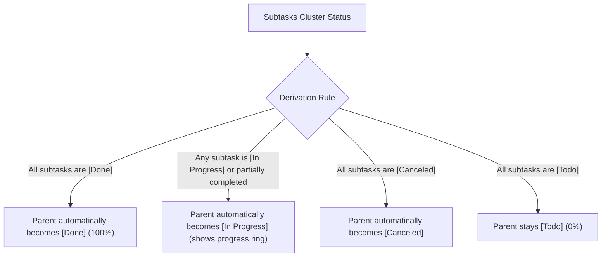

# Ordo (知序) User Manual

> **"Order and Priority. Know what matters, act with clarity."**  
> Ordo is a minimalist, local-first cross-platform personal task and order management application. Designed for Android, Windows, and Linux, Ordo provides a 3-level hierarchical task tree, an Eisenhower Matrix quadrant view, custom smart views, calendar scheduling with Chinese lunar & statutory holidays, dual-hierarchy background wallpapers with glassmorphic legibility protection, WebDAV/S3 relay synchronization, and offline snapshot backups.

---

## Table of Contents

- [1. Quick Start](#1-quick-start)
  - [1.1 Core Philosophy](#11-core-philosophy)
  - [1.2 Interface Layout & Navigation](#12-interface-layout--navigation)
  - [1.3 Create Your First Task in 3 Minutes](#13-create-your-first-task-in-3-minutes)
- [2. Core Concepts & Task Management](#2-core-concepts--task-management)
  - [2.1 The 4-State Task Lifecycle](#21-the-4-state-task-lifecycle)
  - [2.2 3-Level Hierarchical Task Tree](#22-3-level-hierarchical-task-tree)
  - [2.3 Derived State Logic: Parent-Child Linkage](#23-derived-state-logic-parent-child-linkage)
  - [2.4 Reordering, Indenting, and Outdenting](#24-reordering-indenting-and-outdenting)
  - [2.5 Task Attributes (Dates, Priority, Notes & Tags)](#25-task-attributes-dates-priority-notes--tags)
- [3. Organization: From Chaos to Order](#3-organization-from-chaos-to-order)
  - [3.1 Inbox: Capture Thoughts & Fleeting Ideas](#31-inbox-capture-thoughts--fleeting-ideas)
  - [3.2 Folders & Projects: Structured Containers](#32-folders--projects-structured-containers)
  - [3.3 Moving Tasks Across Projects & Folders](#33-moving-tasks-across-projects--folders)
  - [3.4 Tag System: Multidimensional Categorization](#34-tag-system-multidimensional-categorization)
  - [3.5 Today View: The Power of Focus](#35-today-view-the-power-of-focus)
- [4. Calendar & Scheduling](#4-calendar--scheduling)
  - [4.1 Month, Week, and Day Views](#41-month-week-and-day-views)
  - [4.2 Chinese Lunar Calendar & Solar Terms](#42-chinese-lunar-calendar--solar-terms)
  - [4.3 Statutory Holidays & Shift Workday Badges](#43-statutory-holidays--shift-workday-badges)
  - [4.4 Quick Scheduling from Calendar Cells](#44-quick-scheduling-from-calendar-cells)
- [5. Quadrant View (Eisenhower Matrix)](#5-quadrant-view-eisenhower-matrix)
  - [5.1 Core Methodology: Eisenhower Matrix & Energy Allocation](#51-core-methodology-eisenhower-matrix--energy-allocation)
  - [5.2 Dual View Modes: 2x2 Matrix & Focused List](#52-dual-view-modes-2x2-matrix--focused-list)
  - [5.3 Cross-Quadrant Drag & Drop and Pure Attribute Mutation](#53-cross-quadrant-drag--drop-and-pure-attribute-mutation)
  - [5.4 Multi-Level Scope Filter (Lists & Folders Cascade)](#54-multi-level-scope-filter-lists--folders-cascade)
  - [5.5 Quick Task Creation Inside Quadrants](#55-quick-task-creation-inside-quadrants)
- [6. Custom Views (Smart Lists)](#6-custom-views-smart-lists)
  - [6.1 What are Custom Views?](#61-what-are-custom-views)
  - [6.2 Combining Multiple Filters](#62-combining-multiple-filters)
  - [6.3 Pinning Views to the Sidebar](#63-pinning-views-to-the-sidebar)
- [7. Multi-Device Relay Synchronization](#7-multi-device-relay-synchronization)
  - [7.1 Relay Sync Architecture (LWW & Merging)](#71-relay-sync-architecture-lww--merging)
  - [7.2 Configuring WebDAV (Nutstore / Nextcloud, etc.)](#72-configuring-webdav-nutstore--nextcloud-etc)
  - [7.3 Configuring S3 Compatible Storage (MinIO / Cloudflare R2 / OSS)](#73-configuring-s3-compatible-storage-minio--cloudflare-r2--oss)
  - [7.4 Credential Security & Hardware Protection](#74-credential-security--hardware-protection)
- [8. Data Safety & Offline Backups](#8-data-safety--offline-backups)
  - [8.1 Auto-Snapshot Pool](#81-auto-snapshot-pool)
  - [8.2 Single-Point Rollback to Historical Snapshots](#82-single-point-rollback-to-historical-snapshots)
  - [8.3 Full Offline Backup (.ordobak format)](#83-full-offline-backup-ordobak-format)
  - [8.4 Full Replace vs. Incremental Merge](#84-full-replace-vs-incremental-merge)
- [9. Personalization & Settings](#9-personalization--settings)
  - [9.1 8 Curated Theme Palettes & Dark Mode](#91-8-curated-theme-palettes--dark-mode)
  - [9.2 Dual-Hierarchy Background Wallpapers & Glassmorphism](#92-dual-hierarchy-background-wallpapers--glassmorphism)
  - [9.3 Multi-Language Support (Simplified Chinese / English)](#93-multi-language-support-simplified-chinese--english)
  - [9.4 Gestures & Desktop Shortcuts](#94-gestures--desktop-shortcuts)
- [10. Frequently Asked Questions (FAQ)](#10-frequently-asked-questions-faq)

---

## 1. Quick Start

### 1.1 Core Philosophy

"Ordo" is the Latin root of the English word "Order". The application is built on four core principles:
* **Order & Priority**: Instead of drowning in endless to-do lists, gain control over your life and work through clear hierarchical breakdown and priority distinctions;
* **Local-First, Total Control**: All your tasks, lists, tags, and settings are stored locally in an embedded SQLite database. Even completely offline, queries and updates occur with sub-millisecond response times;
* **Pure & Unobtrusive**: No advertisements, no spam notifications, no cloud account lock-in. Your focus belongs to you;
* **Minimalist Aesthetics & Smooth Haptics**: Combines Squircle (continuous curvature continuous rounded corners) design with elastic motion to deliver a natural, comfortable tactile experience across both desktop and mobile.

### 1.2 Interface Layout & Navigation

Ordo automatically adapts to your screen size:

* **Desktop / Large Tablets**:
  * **Persistent Sidebar (AppSidebar)**: Quick navigation for Today, Inbox, Calendar, Quadrant, All Tasks, Custom Views, Folders, Lists, and Settings;
  * **Main Content Area**: Shows selected tasks, projects, calendar grid, or the 4-quadrant matrix. On wide screens, task editing opens in an integrated side sheet (Dual-Pane Side Sheet).
* **Mobile Phones**:
  * **Top Navigation Bar & Scope Switcher**: Tap the top title to reveal the panoramic Scope Switcher sheet to toggle between Today, Inbox, Calendar, Quadrant, and individual projects;
  * **Interactive Task List**: Full touch gesture support (swipe left for quick tags & priority, swipe right for completion);
  * **Floating Action Button (FAB)**: Prominent `+` button in the bottom right corner for immediate task creation.

### 1.3 Create Your First Task in 3 Minutes

1. Click or tap the **`+` (New Task)** floating button;
2. **Enter Title**: E.g., `Prepare slides for tomorrow morning's meeting`;
3. **Pick Schedule**: Choose start date/time and due date/time;
4. **Assign Project**: Keep it in the default **Inbox**, or assign it to an existing project;
5. Click **Save** (or press `Ctrl + Enter` / `Cmd + Enter`);
6. Your new task appears immediately! Check the circle icon on the left to mark it done.

---

## 2. Core Concepts & Task Management

### 2.1 The 4-State Task Lifecycle

Ordo replaces binary "checked / unchecked" states with an expressive **4-state lifecycle**:

| State | Visual Badge | Usage & Meaning |
| :--- | :--- | :--- |
| **Todo** | Gray dashed circle ⚪ | Planned task that has not started yet. |
| **In Progress** | Amber partial ring 🟡 | Active task currently being worked on. |
| **Done** | Emerald solid check circle 🟢 | Task successfully completed; title is struck through. |
| **Cancelled** | Muted red cross circle 🔴 | Abandoned due to external changes; kept for review. |

> [!TIP]
> Tap the circle icon to toggle between **Todo** and **Done**. To switch to **In Progress** or **Cancelled**, swipe right on the task card or edit the task details.

### 2.2 3-Level Hierarchical Task Tree

To help you decompose major milestones into actionable steps, Ordo supports up to **3 hierarchical levels**:
* **Level 1 (Root Task)**: High-level goal or milestone (e.g., `Release Ordo v1.0`);
* **Level 2 (Subtask)**: Sub-module or core phase (e.g., `Write User Manual`);
* **Level 3 (Leaf Task)**: Atomic execution unit (e.g., `Draft Calendar Section`).

> [!IMPORTANT]
> **Why 3 Levels?**  
> Based on cognitive load research, arbitrary nesting beyond 3 levels introduces management paralysis and leads to severe clutter on mobile screens. A 3-level tree provides sufficient depth for GTD workflows while maintaining crystal-clear visibility.

### 2.3 Derived State Logic: Parent-Child Linkage

In Ordo, **a parent task's state and progress are derived dynamically from its subtasks**, ensuring logical consistency:

* **Progress Ring Indicator**: The status indicator in front of the parent task displays a circular progress ring (e.g., if 2 of 4 subtasks are completed, the parent displays a 50% emerald green ring);
* **Auto-completion & Awakening**: When you check off the final remaining subtask, the parent task is automatically marked as completed; when you uncheck any subtask back to todo, the parent task automatically re-awakens into the in-progress state.

### 2.4 Reordering, Indenting, and Outdenting

Ordo offers flexible tree structuring:
1. **Drag & Drop**: Long press the drag handle on the right of any task card to move it up or down;
2. **Indent (Demote)**: Indenting makes the current task a subtask of the task directly above it (level + 1);
3. **Outdent (Promote)**: Outdenting moves a subtask one level to the left, promoting it to a higher rank (level - 1);
4. **Cycle Prevention**: The database layer enforces topological safety; parent tasks cannot be moved inside their own descendant branches.

### 2.5 Task Attributes (Dates, Priority, Notes & Tags)

Inside the task editor:
* **Title**: Clear, concise goal summary (required, max 100 characters);
* **Project / Folder**: Assign to Inbox or any designated project;
* **Start & Due Timestamps**: Exact date and optional time. Overdue tasks are highlighted with alert indicators;
* **Priority**: `None`, `Low`, `Medium`, and `High` with color-coded side indicators;
* **Tags**: Connect one or multiple tags;
* **Notes**: Rich plain text notes, checklists, or reference URLs.

---

## 3. Organization: From Chaos to Order

### 3.1 Inbox: Capture Thoughts & Fleeting Ideas

* **Role**: The Inbox is your unorganized temporary capture pool;
* **Recommendation**: Throw random thoughts, errands, and requests into the Inbox immediately without categorizing. Perform regular "Inbox Zero" triage at the end of each day or week by assigning items to specific projects and applying tags.

### 3.2 Folders & Projects: Structured Containers

* **Projects**: Collections of tasks with concrete outcomes (e.g., `Home Renovation`, `Fitness Plan 2026`).
  * Customize with **dedicated icons** and **8 theme colors**;
  * Assign a **dedicated background wallpaper**, giving each list a unique visual ambiance or inheriting the global app wallpaper;
  * Add custom descriptions and goals.
* **Folders**: Group projects sharing similar domains (e.g., group `Project A` and `Project B` under `Work`; group `Travel` and `Health` under `Personal`).
* Drag and drop projects between folders; swipe left on any project or folder to edit or delete it.

### 3.3 Moving Tasks Across Projects & Folders

1. Open the task edit sheet;
2. Tap the **Project** field;
3. Browse the structured modal showing folders and member projects;
4. Select the new project (or Inbox) and save. All subtasks move along automatically.

### 3.4 Tag System: Multidimensional Categorization

Unlike physical folder hierarchies, tags represent **cross-cutting dimensions**:
* A task belongs to one project, but can have multiple tags (e.g., `#urgent`, `#laptop`, `#review`);
* Tap **Tags** in Settings to view item counts;
* Tap any tag to filter matching tasks across all projects simultaneously.

### 3.5 Today View: The Power of Focus

Today is Ordo's default landing page:
* Automatically aggregates tasks scheduled for **today**, due **today**, or **overdue**;
* Top progress ring displays completed percentage and pending count;
* Keeps you centered on daily execution without distraction.

---

## 4. Calendar & Scheduling

### 4.1 Month, Week, and Day Views

Ordo features an integrated calendar matrix:
* **Month View**: Bird's-eye view of your monthly workload, using colored dots to indicate task density;
* **Day Timeline**: Tap any date to reveal its ordered agenda timeline sorted by start time.

### 4.2 Chinese Lunar Calendar & Solar Terms

Ordo embeds a Chinese traditional calendar engine:
* **Lunar Dates**: Displays lunar months and days below Gregorian dates (e.g., `Aug 15`, `Jul 7`);
* **24 Solar Terms**: Highlights nodes like `Start of Spring`, `Summer Solstice`, etc.;
* **Traditional Holidays**: Recognizes Spring Festival, Mid-Autumn Festival, Dragon Boat Festival, etc.

> [!NOTE]
> You can toggle lunar calendar visibility off anytime in `Settings -> Calendar -> Show Lunar Calendar`.

### 4.3 Statutory Holidays & Shift Workday Badges

* **Holiday Badges**: Green **"Rest" (休)** badge on official public holidays;
* **Shift Workdays**: Orange **"Work" (班)** badge on weekend days adjusted for holiday replacement.

### 4.4 Quick Scheduling from Calendar Cells

1. Tap any date cell in the month or week grid;
2. The selected date highlights;
3. Tap the `+` FAB: the task creation modal opens with **start and due dates prefilled**;
4. Type the title and hit save.

---

## 5. Quadrant View (Eisenhower Matrix)

### 5.1 Core Methodology: Eisenhower Matrix & Energy Allocation

The Eisenhower Matrix is a time-tested strategy for prioritization and energy management. Ordo seamlessly merges this methodology into its hierarchical task model, mapping tasks into four quadrants based on **Importance** (Priority) and **Urgency** (Due Date):

| Quadrant | Name | Criteria | Visual Accent | Core Action Strategy |
| :--- | :--- | :--- | :--- | :--- |
| **Q1** | Urgent & Important | Priority is `High`/`Medium` AND Due $\le$ Today (or Overdue) | Rose Red (`#E11D48`) | **Do First**: Immediate crises, high-stakes deadlines |
| **Q2** | Important & Not Urgent | Priority is `High`/`Medium` AND Due is in future or None | Amber Orange (`#D97706`) | **Schedule**: Long-term goals, self-improvement, health. The high-value growth zone |
| **Q3** | Urgent & Unimportant | Priority is `Low`/`None` AND Due $\le$ Today (or Overdue) | Indigo Purple (`#4F46E5`) | **Delegate / Batch**: Interruptions, minor requests, administrative chores |
| **Q4** | Neither Urgent nor Important | Priority is `Low`/`None` AND Due is in future or None | Slate Gray (`#6B7280`) | **Eliminate / Minimize**: Trivial time-wasters, procrastination traps |

> [!TIP]
> **How to access the Quadrant View?**  
> - **Mobile**: Tap the top title ("Today", "Inbox", etc.) to open the Scope Switcher sheet, then select "Quadrant View" under System Views;  
> - **Desktop**: Click the "Quadrant" icon directly in the persistent left sidebar.

### 5.2 Dual View Modes: 2x2 Matrix & Focused List

Ordo provides two distinct view modes to balance big-picture review with deep execution:
1. **2x2 Matrix View**:
   - Displays all four quadrants equally across the screen for balanced macro assessment;
   - Card headers display quadrant title, color bar, and live task counter badge;
   - Clean, de-carded task rows with 16dp status checkboxes, hairline dividers, and drag handles;
   - Tap the mini **Focus button (22x22dp)** in the quadrant header (or double tap an empty area) to expand into full-screen single-quadrant focus mode, with swipe gestures to switch between quadrants.
2. **Focused List View**:
   - Tap the **Matrix / List view switcher** on the right side of the toolbar to switch to a single-column layout;
   - Horizontal filter tab pills: `All (N)`, `Urgent & Important (N)`, `Schedule (N)`, `Delegate (N)`, `Later (N)`;
   - Ideal for linear scrolling and focused processing when handling large task volumes.

### 5.3 Cross-Quadrant Drag & Drop and Pure Attribute Mutation

Tasks can be moved between quadrants via drag and drop (desktop mouse drag or 180ms long-press on mobile).

> [!IMPORTANT]
> **Strict Hierarchy Preservation**:  
> Cross-quadrant drag-and-drop performs **pure attribute mutation**. It **only updates the task's Priority and Due Date (`endAt`)**. It **never modifies** the task's project affiliation (`projectId`) or parent-child hierarchy (`parentId`). Your underlying project structures remain completely intact!

Attribute mutation rules:
* **Drag into Q1 (Urgent & Important)**:
  - Priority: Upgraded to `High` if currently `None` or `Low`; preserved if already `High` or `Medium`;
  - Due Date: Set to `Today 23:59:59` if currently empty or future; preserved if already today or overdue.
* **Drag into Q2 (Important & Not Urgent)**:
  - Priority: Upgraded to `High` if currently `None` or `Low`;
  - Due Date: Cleared to `None` if currently today or overdue, relieving it of urgency; preserved if already a future date.
* **Drag into Q3 (Urgent & Unimportant)**:
  - Priority: Downgraded to `None` if currently `High` or `Medium`;
  - Due Date: Set to `Today 23:59:59` if currently empty or future.
* **Drag into Q4 (Neither Urgent nor Important)**:
  - Priority: Downgraded to `None` if currently `High` or `Medium`;
  - Due Date: Cleared to `None` if currently today or overdue.

### 5.4 Multi-Level Scope Filter (Lists & Folders Cascade)

Filter quadrant tasks across all projects or restrict analysis to specific domains:
1. **Scope Capsule**: Located on the left side of the Quadrant toolbar (e.g., `All Projects (12) ⌵` or `Work (5) ⌵`);
2. **Multi-Level Filter Sheet**: Tap the capsule to open a cascading scope selector:
   - "Inbox"
   - "Folder Groups" with tri-state checkboxes (select all, partial, deselect all) to toggle all member projects at once;
   - "Ungrouped Standalone Projects";
3. **Hero Progress Ring Linkage**:
   - The large header features an integrated `HeroProgressRing`;
   - The ring dynamically tracks completion percentage for the currently selected project scope in real time.

### 5.5 Quick Task Creation Inside Quadrants

Tap the `+` button in any quadrant header:
* **Prefilled Attributes**: Automatically opens the task creation sheet with priority and due date prefilled to match the target quadrant;
* **Smart Project Assignment**:
  - If the current scope filter is set to exactly one project, the new task is assigned to that project;
  - If the scope is unfiltered or multiple projects are selected, the task defaults to the **Inbox**, with the option to change projects before saving.

---

## 6. Custom Views (Smart Lists)

### 6.1 What are Custom Views?

Custom Views let you build smart lists using queries, saving dynamic results into persistent navigation entries:
* *"All high-priority uncompleted work tasks"*
* *"All tasks tagged #writing sorted by priority"*

### 6.2 Combining Multiple Filters

Tap **New Custom View** in the sidebar:
1. **Name & Icon**: Provide a descriptive title and icon;
2. **Status**: Select included states (e.g., `Todo` + `In Progress`);
3. **Priority**: Filter by High, Medium, or Low;
4. **Date Range**: `Due Today`, `Next 7 Days`, `Overdue`, `No Due Date`;
5. **Projects & Tags**: Include/exclude designated containers or tags.

### 6.3 Pinning Views to the Sidebar

Saved views appear permanently in the navigation drawer and compute matching items in real time.

---

## 7. Multi-Device Relay Synchronization

### 7.1 Relay Sync Architecture (LWW & Merging)

* **Relay Workflow**: Seamlessly alternate between devices (e.g., office PC during the day, mobile phone during commutes, home laptop in the evening);
* **Conflict Resolution**: Uses **Last-Write-Wins (LWW)** with tombstone records for exact deletion propagation;
* **Bandwidth Optimization**: Incremental single-archive Gzip compression syncs tens of thousands of tasks using only a few kilobytes.

### 7.2 Configuring WebDAV (Nutstore / Nextcloud, etc.)

Using **Nutstore** as an example:
1. Generate an **App Password** in Nutstore Account Settings;
2. In Ordo, navigate to `Settings -> Sync Settings` and choose **WebDAV**;
3. Enter parameters:
   * **Server URL**: `https://dav.jianguoyun.com/dav/` (Ordo automatically creates the `/todo/` folder on first sync);
   * **Account**: Registered email address;
   * **Password**: Your generated App Password;
   > [!NOTE]
   > No separate remote directory field is required. For root URLs, Ordo creates `/todo/` automatically via MKCOL. For self-hosted Nextcloud, append your subpath directly to the server URL.
4. Tap **Test Connection**, then turn on **Enable Sync**.

### 7.3 Configuring S3 Compatible Storage (MinIO / Cloudflare R2 / OSS)

> S3 storage sync is under testing

1. Switch service type to **S3 Compatible**;
2. Configure Endpoint, Bucket name, Access Key, Secret Key, Region, and Prefix (`todo/`);
3. Tap **Test Connection & Save**.

### 7.4 Credential Security & Hardware Protection

> [!IMPORTANT]
> Your credentials are **never stored in plaintext databases**. They are protected using system hardware sandboxes (**Android Keystore** on Android, **DPAPI** on Windows) and excluded from all sync files and exports.

---

## 8. Data Safety & Offline Backups

### 8.1 Auto-Snapshot Pool

* **Automatic Triggers**: Pre-sync snapshots, pre-restore backups, and silent daily app-launch snapshots;
* **Retention Settings**: Choose 7, 14, 30, or 90-day retention policies in `Settings -> Data & Backup`. Expired snapshots are cleaned automatically.

### 8.2 Single-Point Rollback to Historical Snapshots

1. Open `Settings -> Data & Backup -> Manage Snapshots`;
2. View timestamped snapshots with task/project counts;
3. Tap **Restore** on the desired snapshot to roll back the entire local database in a single atomic transaction.

### 8.3 Full Offline Backup (.ordobak format)

* **Export**: Generates a `.ordobak` file with binary magic header validation and Gzip compression;
* **Import**: Select a `.ordobak` file to review item counts and verify file integrity before restoring.

### 8.4 Full Replace vs. Incremental Merge

* **Full Replace**: Clears current local database and recreates projects, tags, and tasks from the backup. Ideal for device migrations or disaster recovery (a safety snapshot is automatically created before execution);
* **Incremental Merge**: Merges records using timestamp comparisons, updating older local items while preserving recent local edits.

---

## 9. Personalization & Settings

### 9.1 8 Curated Theme Palettes & Dark Mode

Choose from 8 palettes designed for both Light and Dark themes:
* 🖤 **Obsidian**: Restrained, classic high-contrast;
* 💙 **Klein Blue**: Deep, calm, and focused;
* 💚 **Emerald**: Vibrant, natural, and easy on the eyes;
* 🧡 **Amber**: Warm, energizing, and prominent;
* 💜 **Purple**: Elegant and inspiring;
* 💖 **Rose**: Passionate and distinct;
* 🩵 **Teal**: Crisp, serene, and structured;
* 🩶 **Slate**: Minimalist, muted, and comfortable.

### 9.2 Dual-Hierarchy Background Wallpapers & Glassmorphism

Ordo provides an adaptive wallpaper and frosted glass (Glassmorphism) system to deliver modern aesthetics without sacrificing legibility:

#### 1. Dual-Hierarchy Management & Fallback
* **App-Wide Global Wallpaper**:
  - **Path**: `Settings -> Appearance -> Global Wallpaper`;
  - **Scope**: Serves as the backdrop across all primary views (Today, Inbox, Calendar, Quadrant, All Tasks, Settings) and lists without custom wallpapers.
* **List-Specific Wallpaper**:
  - **Path**: Edit any project/list -> tap **Background Wallpaper**;
  - **Scope**: Applies exclusively when viewing that specific list. Customize separate ambiances for Work, Reading, Travel, etc.
* **Priority Rule**:
  - `List-Specific Wallpaper > Global Wallpaper > Solid Surface Theme`
  - Setting a list to "Follow App Default" smoothly restores the global wallpaper.

#### 2. Curated Presets & Custom Uploads
* **Built-in Presets**: High-definition, low-saturation gradients and natural textures tuned for dark and light surfaces;
* **Local Custom Uploads**:
  - Tap "Custom Upload" to pick any photo from your system album or file manager;
  - **Sandbox Isolation**: Images are safely copied to the app's sandboxed storage directory, remaining fully intact even if the original photo is deleted from the gallery;
  - **Device Independence**: Wallpaper configs remain strictly local, preventing broken cross-platform file paths during WebDAV/S3 synchronization.

#### 3. Legibility Protection & Anti-Glare Controls
* **Overlay Opacity Slider (0% ~ 85%)**:
  - Blends an adaptive protective layer (soft white in light mode, deep black in dark mode) over the image to maintain WCAG text contrast;
* **Gaussian Blur Slider (0 ~ 20px)**:
  - Smooths out busy or high-detail background photos into a soft, calming color gradient;
* **Adaptive Glassmorphism**:
  - When a wallpaper is active, task cards, quadrant grids, and toolbars transition into frosted semi-transparent containers with hairline borders and anti-reflective shadows.

### 9.3 Multi-Language Support (Simplified Chinese / English)

Switch anytime in `Settings -> Appearance -> Language`. The entire interface, dialogs, and date formats adapt dynamically.

### 9.4 Gestures & Desktop Shortcuts

* **Mobile Gestures**:
  - **Long swipe right**: Toggle task completion status;
  - **Short swipe left**: Reveal action sheet (Tags, Priority, Edit, Delete).
* **Desktop Shortcuts**:
  - `Ctrl / Cmd + N`: Create new task;
  - `Ctrl / Cmd + F`: Global search;
  - `Ctrl / Cmd + Enter`: Save current dialog/sheet;
  - `Esc`: Close open modal or drawer.

---

## 10. Frequently Asked Questions (FAQ)

#### Q1: Does Ordo upload my tasks to third-party servers?
**No**. Ordo is strictly **local-first**. There are no centralized vendor servers and no telemetry tracking. Data only leaves your device if you explicitly configure your personal WebDAV or S3 cloud storage.

#### Q2: Why are subtasks limited to 3 levels?
To prevent micro-management paralysis. If a subtask at level 3 requires further breakdown, it is a strong signal that it should be converted into an **independent Project**.

#### Q3: Can I recover deleted tasks or projects?
**Yes**. Open `Settings -> Data & Backup -> Manage Snapshots`, locate a snapshot created before the deletion, and tap "Restore".

#### Q4: What should I do if WebDAV / S3 sync reports a network timeout?
1. Verify the server URL includes `https://`;
2. If using Nutstore, make sure you generated an **App Password** rather than using your login password;
3. Tap "Test Connection" to inspect the detailed status code.

#### Q5: Does dragging a task between quadrants alter its original project or parent-child hierarchy?
**No, absolutely not**. Cross-quadrant dragging is a pure attribute transition. Ordo strictly updates only the task's Priority and Due Date (`endAt`). Its parent container (`projectId`) and parent task (`parentId`) remain completely unchanged.

#### Q6: Will custom background wallpapers sync across devices via WebDAV/S3?
**No, and this is intentional**. Screen aspect ratios, resolutions, and file paths vary drastically between mobile, tablet, and desktop operating systems. Keeping wallpaper configurations local guarantees zero broken image paths and lets you choose wide desktop wallpapers on PC while enjoying vertical wallpapers on your phone.

---

> May Ordo bring clarity, focus, and order to your daily life!
