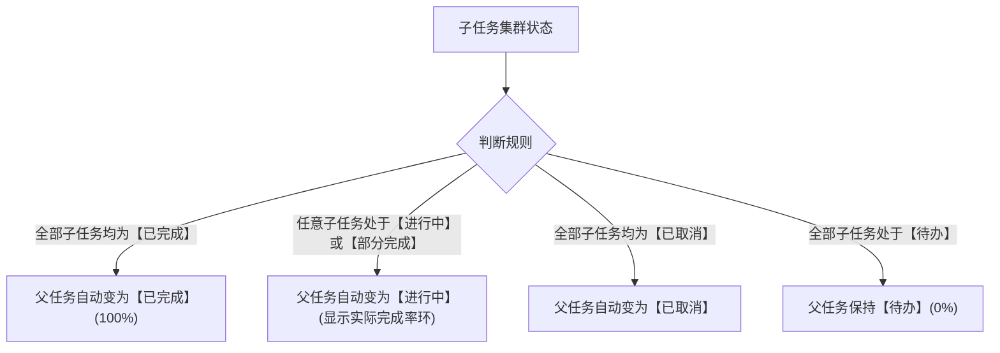

# 知序 Ordo 用户使用手册

> **“知其轻重，行止有序。”**  
> 知序（Ordo）是一款专注于个人任务与秩序管理的跨平台待办应用。应用坚持**本地优先（Local-First）**、**纯净无扰**与**极简美学**设计理念，支持 Android、Windows、Linux 等多端平台，具备三级层级任务树、艾森豪威尔四象限矩阵、智能清单、中国农历节假日日程、多层级背景壁纸与毛玻璃防花屏系统、WebDAV/S3 接力同步与本地安全快照等强大特性。

---

## 目录（Table of Contents）

- [1. 快速入门](#1-快速入门)
  - [1.1 核心设计理念](#11-核心设计理念)
  - [1.2 界面布局与导航概览](#12-界面布局与导航概览)
  - [1.3 3 分钟创建第一条待办](#13-3-分钟创建第一条待办)
- [2. 核心概念与任务管理](#2-核心概念与任务管理)
  - [2.1 四态任务生命周期](#21-四态任务生命周期)
  - [2.2 三级层级任务树](#22-三级层级任务树)
  - [2.3 派生计算法则：父任务如何随子任务联动](#23-派生计算法则父任务如何随子任务联动)
  - [2.4 层级调整与排序技巧（缩进、缩出、拖拽）](#24-层级调整与排序技巧缩进缩出拖拽)
  - [2.5 任务属性详解（时间、优先级、描述与备注）](#25-任务属性详解时间优先级描述与备注)
- [3. 组织体系：从收集到秩序](#3-组织体系从收集到秩序)
  - [3.1 收件箱（Inbox）：捕捉灵感与零散事务](#31-收件箱inbox捕捉灵感与零散事务)
  - [3.2 文件夹与项目（Projects）：结构化目标容器](#32-文件夹与项目projects结构化目标容器)
  - [3.3 任务跨项目与文件夹移动](#33-任务跨项目与文件夹移动)
  - [3.4 标签体系（Tags）：多维交叉管理](#34-标签体系tags多维交叉管理)
  - [3.5 今日聚焦（Today）：专注当下的力量](#35-今日聚焦today专注当下的力量)
- [4. 日历视图与日程规划](#4-日历视图与日程规划)
  - [4.1 视图切换（月视图、周视图与日清单）](#41-视图切换月视图周视图与日清单)
  - [4.2 中国农历、二十四节气与传统节日](#42-中国农历二十四节气与传统节日)
  - [4.3 法定节假日与调休（班/休）智能标注](#43-法定节假日与调休班休智能标注)
  - [4.4 点击日历快速排程与时间轴](#44-点击日历快速排程与时间轴)
- [5. 四象限视图（艾森豪威尔矩阵）](#5-四象限视图艾森豪威尔矩阵)
  - [5.1 核心理念：四象限法则与精力分配](#51-核心理念四象限法则与精力分配)
  - [5.2 2x2 矩阵与聚焦列表双视图模式](#52-2x2-矩阵与聚焦列表双视图模式)
  - [5.3 跨象限拖拽与纯属性流转规则](#53-跨象限拖拽与纯属性流转规则)
  - [5.4 多层级范围筛选（清单与文件夹联动）](#54-多层级范围筛选清单与文件夹联动)
  - [5.5 象限内快捷创建新任务](#55-象限内快捷创建新任务)
- [6. 自定义视图（智能清单）](#6-自定义视图智能清单)
  - [6.1 什么是自定义视图](#61-什么是自定义视图)
  - [6.2 多维度复合过滤配置](#62-多维度复合过滤配置)
  - [6.3 保存并固定到侧边栏](#63-保存并固定到侧边栏)
- [7. 多端接力同步](#7-多端接力同步)
  - [7.1 同步机制解析：什么是“接力同步”](#71-同步机制解析什么是接力同步)
  - [7.2 配置 WebDAV 同步（坚果云 / Nextcloud 等）](#72-配置-webdav-同步坚果云--nextcloud-等)
  - [7.3 配置 S3 兼容对象存储（MinIO / Cloudflare R2 / OSS 等）](#73-配置-s3-兼容对象存储minio--cloudflare-r2--oss-等)
  - [7.4 凭据安全与隐私保护](#74-凭据安全与隐私保护)
- [8. 数据安全与本地备份](#8-数据安全与本地备份)
  - [8.1 本地安全快照池（自动生成与保留周期）](#81-本地安全快照池自动生成与保留周期)
  - [8.2 历史快照单点安全回滚](#82-历史快照单点安全回滚)
  - [8.3 全量离线备份导出与导入（.ordobak 格式）](#83-全量离线备份导出与导入ordobak-格式)
  - [8.4 覆盖还原 vs 增量合并的选用场景](#84-覆盖还原-vs-增量合并的选用场景)
- [9. 个性化与系统设置](#9-个性化与系统设置)
  - [9.1 8 种主题色彩与深浅模式自适应](#91-8-种主题色彩与深浅模式自适应)
  - [9.2 多层级图片背景（壁纸）与毛玻璃防花屏设置](#92-多层级图片背景壁纸与毛玻璃防花屏设置)
  - [9.3 多语言切换（简体中文 / English）](#93-多语言切换简体中文--english)
- [10. 常见问题与排错指南（FAQ）](#10-常见问题与排错指南faq)

---

## 1. 快速入门

### 1.1 核心设计理念

知序（Ordo）的品牌取名自拉丁语中的“秩序与条理”（Order）。我们奉行以下核心原则：
* **知其轻重，行止有序**：告别杂乱无章的待办堆积，通过科学的优先级、四象限决策和层级分解理清生活与工作脉络；
* **本地优先，绝对掌控**：你的所有数据保存在本地 SQLite 数据库中，即便完全断网，所有浏览、增删改查均毫秒级响应；
* **纯净无扰，专注当下**：没有开屏广告、没有强制推送干扰、没有商业账号注册门槛，你的专注力只属于你自己；
* **极简美学与顺滑触感**：结合 Squircle（连续曲率连续圆角）设计与弹性动效，无论在手机还是桌面均拥有自然舒适的操作手感。

### 1.2 界面布局与导航概览

知序针对不同屏幕尺寸做了智能响应式自适应布局：
* **桌面端 / 大屏平板**：
  * **常驻侧边栏（AppSidebar）**：集中呈现「今日」、「收集箱」、「日历」、「四象限」、「全部任务」等核心系统视图，以及自定义文件夹、清单分组和智能标签；
  * **主内容区域**：呈现选中的任务树、日程网格或四象限矩阵。在宽屏下支持右侧无缝展开任务详情侧边抽屉（Dual-Pane Side Sheet）；
* **移动端 / 窄屏手机**：
  * **顶部导航栏与视图切换器**：点击标题区域即可呼出全景视图切换面板（ScopeSwitcherSheet），在「今日」、「收集箱」、「日历」、「四象限」及各项目间即时切换；
  * **列表主区域**：任务卡片支持全手势滑动（左滑快捷标记标签与优先级、右滑快速切换完成状态）；
  * **悬浮新建按钮（FAB）**：醒目的彩色 `+` 按钮，随时轻触开启新任务录入。

### 1.3 3 分钟创建第一条待办

1. 点击界面右下角的 **`+`（新建任务）** 悬浮按钮，系统将弹出新建任务表单；
2. **输入标题**：例如输入 `整理明天上午会议讲义`；
3. **设置起止时间**：选择开始时间与截止时间（支持设置具体时间点或仅日期）；
4. **指定所属项目**：可选择保留在默认的「收件箱」，或直接分配至某一项目；
5. 点击右上角 **保存**（或按快捷键 `Ctrl + Enter` / `Cmd + Enter`）；
6. 任务立即出现在你的任务列表中！点击任务前方的圆形复选框，即可将其快速标记为已完成。

---

## 2. 核心概念与任务管理

### 2.1 四态任务生命周期

知序摒弃了单一的“完成/未完成”二元对立，引入符合现实工程与生活规律的 **四态任务生命周期**：

| 状态 | 标识与视觉 | 含义与适用场景 |
| :--- | :--- | :--- |
| **待办（Todo）** | 灰色虚线圆圈 ⚪ | 任务已规划，尚未正式着手开展。 |
| **进行中（In Progress）** | 琥珀黄色半圆环 🟡 | 任务正在处理中，用于突出当前聚焦的焦点事务。 |
| **已完成（Done）** | 翠绿色对勾实心圆 🟢 | 任务已顺利达成目标，标题会自动添加删除线并淡化。 |
| **已取消（Cancelled）** | 柔和红色叉号圆 🔴 | 任务因外部需求变更或不可抗力已作废，保留作为历史归档复盘。 |

> [!TIP]
> 在任务列表中，点击圆形复选框（或向右滑动任务行）可以在「待办」与「已完成」之间快速切换；向左滑动任务行可以快速设置标签和优先级。

### 2.2 三级层级任务树

为了帮助用户将宏大目标拆解为可落地的具体行动，知序支持**任务树状层级分解**：
* **1 级任务（根任务）**：代表核心目标或阶段性成果（例如：`发布知序 v1.0 版本`）；
* **2 级子任务**：代表支撑核心目标的模块或行动项（例如：`编写用户使用手册`）；
* **3 级叶子任务**：代表最小可执行动作单元（例如：`撰写日历章节`、`校对双语词条`）。

> [!IMPORTANT]
> **关于 3 级深度限制的说明**：  
> 知序严格限制子任务最大层级为 **3 级**。经过人机工程学与认知负荷研究，超过 3 级的无限嵌套往往会导致层级失控、管理成本剧增并在移动端小屏幕上产生严重的排版挤压。3 级结构既能满足复杂的 GTD 分解，又能保持整体视角的清晰直观。

### 2.3 派生计算法则：父任务如何随子任务联动

在知序中，**含有子任务的父任务状态是由所有子任务状态派生推导而出的**，严禁人工孤立篡改，以确保逻辑自洽：

* **进度环指示**：父任务前方的状态指示器会显示环形进度（例如：4 个子任务完成了 2 个，父任务显示 50% 翠绿色环）；
* **自动封顶与唤醒**：当你打勾完成最后一个子任务时，父任务自动标记为已完成；当你重新将某个子任务勾回待办时，父任务自动重新激活为进行中。

### 2.4 层级调整与排序技巧（缩进、缩出、拖拽）

知序提供极其顺滑的层级重构与排序能力：
1. **拖拽重排（Drag & Drop）**：长按任务卡片右侧的拖拽手柄即可自由上下拖动调整顺序和层级；
2. **快捷缩进（降级）**：
   * 在任务操作菜单中点击 **缩进（Indent）**，当前任务将自动作为紧邻其上方的任务的子任务（层级加 1）；
3. **快捷缩出（升级）**：
   * 点击 **缩出（Outdent）**，当前子任务将向左跳出一级，提升为更高一级的任务（层级减 1）；
4. **防循环移动保护**：系统底层具备严格的拓扑校验，禁止将父任务移动或拖拽至其自身的子任务节点之下，杜绝死循环错误。

### 2.5 任务属性详解（时间、优先级、描述与备注）

在任务编辑页面中，你可以配置以下丰富属性：
* **任务标题**：简明扼要的一句话目标（必填，上限 100 字符）；
* **所属项目 / 文件夹**：选择任务归属的项目或收件箱；
* **起止时间**：
  * **开始时间（Start At）**：任务预计启动或可执行的起点时刻；
  * **截止时间（Due At）**：任务必须交付的红线时间点（截止前系统会提供倒计时，逾期任务将高亮警示红标）；
* **优先级（Priority）**：分为 `无`、`低`、`中`、`高` 4 档，卡片边缘带有明显的标识色彩；
* **标签关联**：自由勾选或添加多个关联标签；
* **描述与备注（Notes）**：记录背景上下文、任务验收标准或参考信息。

---

## 3. 组织体系：从收集到秩序

### 3.1 收件箱（Inbox）：捕捉灵感与零散事务

* **定位**：收件箱是所有未经整理思考的“临时收集池”；
* **使用建议**：任何突如其来的灵感、临时交代的事情，先统统丢进收件箱，不要在灵感闪现的时刻纠结分类。每天工作结束前或每周固定时间，对收件箱进行“清空（Inbox Zero）整理”，为其分配所属项目或打上标签。

### 3.2 文件夹与项目（Projects）：结构化目标容器

* **项目（Project）**：具有明确交付目标的一组任务集合（例如：`智能家居改造`、`2026 年度健身计划`）。
  * 每个项目支持设置**专属图标**与 **8 种精选主题色彩**；
  * 支持自定义**专属背景壁纸**，每个项目可独立拥有专属氛围视觉或跟随应用全局壁纸；
  * 支持自定义项目说明描述。
* **文件夹（Folder）**：用于将多个同维度的项目归组（例如将 `项目 A`、`项目 B` 归入 `工作` 文件夹；将 `旅行`、`健身` 归入 `生活` 文件夹）。
* 可以拖动项目（或清单）到不同的文件夹，此外，文件夹和项目条目均可以左滑进行编辑或删除。

### 3.3 任务跨项目与文件夹移动

清单（或项目）内部的任务关系调整可以拖动，对于想要在不同清单间移动任务的需求：
1. 打开任务编辑页面；
2. 点击 **所属项目** 选项行；
3. 系统将弹出层次分明的项目选择弹层（清晰列出文件夹及其下属项目）；
4. 点选新的目标项目（或选择收件箱），保存后任务即刻完成归属迁移，其所有子任务也将随之整体迁移。

### 3.4 标签体系（Tags）：多维交叉管理

不同于项目的“树状物理归属”，标签（Tags）是**网状多维属性**：
* 一个任务只能属于一个项目，但可以贴上多个标签（如 `#紧急`、`#需电脑`、`#会议`）；
* 点击设置页的 **标签** 入口，可查看所有标签及其关联任务数量；
* 点击单个标签即可快速筛选出跨越所有项目的相关待办。

### 3.5 今日聚焦（Today）：专注当下的力量

「今日聚焦」是知序默认的首页启动入口：
* 自动汇集**今天需要执行**、**截止日期为今天**以及**已逾期未完成**的所有关键事项；
* 顶部卡片直观显示今日完成进度比与剩余事项总数；
* 帮助你摒弃外界杂音，全身心专注于今天的执行清单。

---

## 4. 日历视图与日程规划

### 4.1 视图切换（月视图、周视图与日清单）

知序内置全功能日历矩阵，支持在月维度与周/日维度自由切换：
* **月视图**：纵览全月负荷，每一天网格内以色彩小圆点标记任务密度，便于评估工作节奏；
* **日清单/时间轴**：选中某一天后，下方即时展开当天的详细排程清单，按开始时间自然排序。

### 4.2 中国农历、二十四节气与传统节日

针对华人用户的生活作息规律，知序深度集成了**中国传统历法引擎**：
* **农历日期**：公历日期下方精致排布农历月日（如 `八月十五`、`七月初七`）；
* **二十四节气**：自动标注 `立春`、`清明`、`夏至`、`冬至` 等节气节点，字体采用品牌主色调优雅呈现；
* **传统节日**：自动识别 `除夕`、`春节`、`端午`、`中秋`、`重阳` 等重要传统节日。

> [!NOTE]
> 若你不需要历法显示，可在 `设置 -> 日历设置 -> 显示农历` 中随时一键关闭。

### 4.3 法定节假日与调休（班/休）智能标注

* **法定休假标注**：在法定放假日历的右上角显示精致的绿色 **「休」** 徽标；
* **周末调休补班标注**：在因节假日需要周六/周日调休上班的日期右上角显示橙色 **「班」** 徽标；

### 4.4 点击日历快速排程与时间轴

1. 在月历或周历网格中，轻触点击任意你想要安排工作的日期格子；
2. 日期格高亮选中；
3. 点击右下方浮动新建按钮，弹出的新建页面将**自动预填选中的开始时间与截止时间**；
4. 快速输入任务标题即可完成排程，无需手动反复拨动时间选择器滚轮。

---

## 5. 四象限视图（艾森豪威尔矩阵）

### 5.1 核心理念：四象限法则与精力分配

四象限法则（艾森豪威尔矩阵，Eisenhower Matrix）是高效能人士必备的战略级精力分配方法。知序将这一经典法则与内部任务树深度融合，依据**「重要度」**（由任务优先级 Priority 判定）与**「紧急度」**（由截止时间 End At 判定）两个正交维度，将待办事项清晰划分为四个象限：

| 象限 | 英文标识 | 核心判定条件 | 视觉标识色 | 核心行动准则 |
| :--- | :--- | :--- | :--- | :--- |
| **第一象限** | 重要且紧急 (Q1) | 优先级为`高`或`中`，且截止时间 $\le$ 今日或已逾期 | 玫瑰红 (`#E11D48`) | **立即去做 (Do First)**：突发危机、当日高优截止事务 |
| **第二象限** | 重要不紧急 (Q2) | 优先级为`高`或`中`，且无截止时间或为未来到期 | 琥珀橙 (`#D97706`) | **计划去做 (Schedule)**：长远目标、技能提升、健康规划，高价值核心区 |
| **第三象限** | 不重要但紧急 (Q3) | 优先级为`低`或`无`，且截止时间 $\le$ 今日或已逾期 | 靛蓝紫 (`#4F46E5`) | **授权或快办 (Delegate)**：琐碎催办、突发杂事、非核心即时响应 |
| **第四象限** | 不急不重要 (Q4) | 优先级为`低`或`无`，且无截止时间或为未来到期 | 沉稳灰 (`#6B7280`) | **减少或剔除 (Eliminate)**：消遣娱乐、拖延无价值琐事 |

> [!TIP]
> **如何快速进入四象限？**  
> - **移动端**：点击顶部页面大标题「今日」或「收集箱」，呼出全景切换器（ScopeSwitcherSheet），在系统视图区域选择「四象限」；  
> - **桌面端**：在左侧常驻导航栏直接点击「四象限」图标即可进入。

### 5.2 2x2 矩阵与聚焦列表双视图模式

知序四象限支持双重视图形态，兼顾宏观全局掌控与单象限纵深聚焦：
1. **2x2 矩阵视图（田字格全景）**：
   - 屏幕四等分呈现四个象限卡片，全景对照各象限的任务负载比重；
   - 象限头部清晰标注象限名称、特征色条与实时任务数量徽标；
   - 象限内采用精炼去卡片化设计，配备 16dp 状态复选框、发丝级分割线与拖拽手柄，视觉干净通透；
   - 点击象限头部的「聚焦」微型按钮（22x22dp），可将该象限平滑放大为全屏专注模式（Focus Mode），支持横向滑动在四个象限间轮转浏览。
2. **聚焦列表视图（纵向单列卡片）**：
   - 点击顶部工具栏右侧的「2x2 矩阵 / 聚焦列表」胶囊切换器，即可平滑切换至聚焦列表；
   - 顶部提供横向滚动 Tab 切换胶囊：`全部 (N)`、`重要紧急 (N)`、`计划去做 (N)`、`授权去做 (N)`、`稍后去做 (N)`；
   - 在任务量较大的清单或复杂项目中，单列纵向无限滚动浏览更加从容高效。

### 5.3 跨象限拖拽与纯属性流转规则

在四象限中，支持通过拖拽（桌面端直接鼠标拖曳，移动端长按 180ms 触发）将任务从一个象限移动至另一象限。

> [!IMPORTANT]
> **严格的从属隔离保证**：  
> 跨象限拖拽属于**纯属性状态流转**，系统**仅修改任务自身的「优先级（Priority）」与「截止时间（End At）」**，**绝不改变**任务原有的所属清单（`projectId`）与父子层级关系（`parentId`）。无论怎样在四象限中拖动，原有的项目归属始终保持稳定！

具体属性流转规则如下：
* **拖入 Q1（重要且紧急）**：
  - 优先级：若当前为`无`或`低`，自动升级为`高`；若原本已为`高`或`中`，保持不变；
  - 截止时间：若原本无截止时间或为未来日期，自动设为`今日 23:59:59`；若原本已逾期或今日到期，保持原时间不变。
* **拖入 Q2（重要不紧急）**：
  - 优先级：若当前为`无`或`低`，自动升级为`高`；
  - 截止时间：若原本处于今日或逾期（紧急），自动清除截止时间为`无`，使其从紧急状态中解脱；若原本为未来日期，继续保留。
* **拖入 Q3（不重要但紧急）**：
  - 优先级：若当前为`高`或`中`，自动降级为`无`；
  - 截止时间：若原本无截止时间或为未来日期，自动设为`今日 23:59:59`。
* **拖入 Q4（不急不重要）**：
  - 优先级：若当前为`高`或`中`，自动降级为`无`；
  - 截止时间：若原本处于今日或逾期，自动清除截止时间为`无`。

### 5.4 多层级范围筛选（清单与文件夹联动）

四象限不仅支持全库全局待办，还能精准限定分析范围：
1. **范围筛选胶囊**：四象限顶部工具栏左侧设有范围胶囊（如 `全部项目 (12) ⌵` 或 `工作清单 (5) ⌵`）；
2. **多层级筛选抽屉**：点击胶囊展开筛选面板，以结构树完整呈现：
   - 「收集箱（Inbox）」
   - 「文件夹分组」：文件夹头部支持三态复选框（全选、半选、取消全选），可一键级联勾选该文件夹下的全部清单；
   - 「未分组独立清单」
3. **范围与环形进度条联动**：
   - 顶部大标题配备标准尺寸的环形完成度进度条（`HeroProgressRing`）；
   - 进度条与四象限统计数据完全联动——当你勾选特定的文件夹或清单时，进度条实时反映该选定范围内的任务完成比例。

### 5.5 象限内快捷创建新任务

点击每个象限卡片头部的「+」按钮（或象限为空时的快捷新建按钮）：
* **属性预填**：系统将自动调起全局成熟的任务创建弹层（`TaskCreateSheet`），并依据目标象限自动预填对应的优先级与截止时间预设；
* **所属清单智能推断**：
  - 若当前范围筛选器恰好仅选定了单个清单，新建任务自动归入该清单；
  - 若当前未筛选（全量范围）或勾选了多个清单，新建任务默认归入「收集箱（Inbox）」，用户也可在弹层内自由重新选择所属清单。

---

## 6. 自定义视图（智能清单）

### 6.1 什么是自定义视图

「自定义视图」是高级用户的得力助手。它允许你像编写查询条件一样，自由组合多种过滤维度，将动态筛选结果保存为一个持久的视图入口。例如：
* *“所有高优先级的未完成工作”*
* *“所有带有 #写作 标签的任务按优先级分列展示”*

### 6.2 多维度复合过滤配置

在侧边栏点击 **新建自定义视图**：
1. **命名与图标**：为视图赋予具有明确语义的名字，并挑选代表性图标；
2. **状态筛选**：勾选包含的状态（如仅看 `待办` + `进行中`）；
3. **优先级过滤**：过滤高、中、低优先级；
4. **时间范围过滤**：
   * `今天截止`、`未来 7 天内`、`已逾期`、`无截止日期`；
5. **项目与标签过滤**：限定特定项目池，或必须包含/排除某些标签。

### 6.3 保存并固定到侧边栏

保存后的自定义视图将常驻在导航弹窗中。只要你的任务发生变更，自定义视图会自动实时计算并呈现最新的结果，无需手动刷新。

---

## 7. 多端接力同步

### 7.1 同步机制解析：什么是“接力同步”

知序采用**基于快照与增量合并的“接力同步（Relay Sync）”机制**：
* **核心理念**：满足个人用户在不同设备之间的无缝工作流交接（例如：白天在办公室 Windows 电脑上使用，下班通勤在 Android 手机上勾选，晚上在家里笔记本上整理）；
* **冲突化解算法**：系统采用经过业界严密验证的 **LWW（Last-Write-Wins，以最新时间戳胜出）** 合并引擎与墓碑（Tombstone）机制，保证任意一台设备上的删除与修改能够精准传播到其他设备，杜绝幽灵任务复活；
* **流量与性能优化**：单文件增量 Gzip 压缩打包，数万条任务同步仅耗费数 KB 流量，极速完成。

### 7.2 配置 WebDAV 同步（坚果云 / Nextcloud 等）

以国内常用的**坚果云（Nutstore）**为例：
1. 打开坚果云官网，在「账户信息」->「安全选项」中生成一个**应用专用密码**；
2. 打开知序的 `设置 -> 同步设置`，选择服务类型为 **WebDAV**；
3. 填入参数：
   * **服务器地址**：例如坚果云填写 `https://dav.jianguoyun.com/dav/`（知序会自动适配并在云端自动创建 `/todo/` 目录；若使用自建 NAS 或 Nextcloud，可在地址后直接加上专用路径如 `https://example.com/dav/todo/`）；
   * **账户**：你的坚果云注册邮箱（或自建 WebDAV 用户名）；
   * **密码**：刚才生成的应用专用密码（非登录密码）；
   > [!NOTE]
   > WebDAV 配置无需单独填写“远程目录”。针对坚果云根路径，知序会在首次同步时通过 MKCOL 自动建立 `/todo/` 云端目录；对于其他 WebDAV 服务，直接在服务器地址末尾包含目标子目录路径即可。
4. 点击 **测试连接**，连接成功后开启 **启用同步**。

### 7.3 配置 S3 兼容对象存储（MinIO / Cloudflare R2 / OSS 等）

> S3存储同步尚未测试

如果你拥有自己的私有云存储或使用 Cloudflare R2 等廉价对象存储：
1. 在 `设置 -> 同步设置` 中切换为 **S3 兼容存储**；
2. 填入相关配置：
   * **Endpoint（端点地址）**：如 `https://<account_id>.r2.cloudflarestorage.com` 或自建 `http://192.168.1.100:9000`；
   * **Bucket（存储桶名称）**：例如 `my-ordo-data`；
   * **Access Key / Secret Key**：对象存储访问密钥对；
   * **Region（区域）**：如 `auto` 或 `us-east-1`；
   * **Prefix（对象前缀）**：默认为 `todo/`（数据将自动存储在该前缀下的 `data.json.gz`）；
3. 点击 **测试连接并保存**。

### 7.4 凭据安全与隐私保护

> [!IMPORTANT]
> 知序对个人隐私采取最高级别的防护手段：  
> 你的 WebDAV 密码或 S3 访问密钥**绝对不会存入明文数据库**，而是使用系统级硬件安全沙盒存储（在 Android 上使用 **Android Keystore** 硬件级加密，在 Windows 上使用 **DPAPI** 数据保护加密）。这些敏感凭据也永远不会包含在同步快照或本地导出的备份文件中。

---

## 8. 数据安全与本地备份

### 8.1 本地安全快照池（自动生成与保留周期）

针对因误操作、设备异常或多端意外覆盖导致的数据风险，知序内置了强大的**本地安全快照池（Auto-Snapshot Pool）**：
* **自动快照时机**：
  * 每次发起网络同步前，系统自动在本地保存一份前置安全快照；
  * 每次执行“覆盖恢复备份”前，系统自动强制备份一份；
  * 应用每日首次启动时静默生成安全快照；
* **留存周期配置**：在 `设置 -> 数据与备份` 中，你可以自定义快照保留天数（支持 7 天、14 天、30 天、90 天等），过期快照自动回收，绝不冗余占用存储空间。

### 8.2 历史快照单点安全回滚

1. 进入 `设置 -> 数据导入导出与安全备份`；
2. 点击 **管理本地安全快照**；
3. 列表中清晰列出历史所有快照的时间戳、触发原因（如同步前保护、手动生成）以及快照内包含的任务数与项目数；
4. 点击目标时间点的 **还原** 按钮；
5. 系统在二次确认后，即刻在单事务内将整库数据秒级无损回滚至对应历史时刻！

### 8.3 全量离线备份导出与导入（.ordobak 格式）

即使在没有任何网络连接的环境下，你也可以将所有任务安全迁移：
* **数据导出**：
  * 点击 **导出备份文件**；
  * 系统调起系统原生保存文件窗口，生成扩展名为 `.ordobak` 的专用安全备份文件；
  * 该文件采用专有魔数校验 + Gzip 紧凑压缩，安全可靠；
* **数据导入**：
  * 点击 **导入备份文件**，选取你的 `.ordobak` 文件；
  * 系统会自动解析文件完整性，并弹出确认窗口展示备份中的任务数、项目数及生成时间。

### 8.4 覆盖还原 vs 增量合并的选用场景

导入备份时，系统提供两种策略：
1. **覆盖恢复（Full Replace）**：
   * *适用场景*：新设备迁移初始化，或发生严重失误时的彻底重置；
   * *逻辑*：在单事务内清空当前本地活跃数据，并严格按拓扑顺序全量重建备份中的所有项目、标签和任务。执行前系统会自动额外抓取一份前置快照，确保万无一失；
2. **增量合并（Merge）**：
   * *适用场景*：将另一台脱网设备上的零散修改合并回当前设备；
   * *逻辑*：复用冲突合并引擎，按修改时间戳取较新者安全合流，不丢失本地既有数据。

---

## 9. 个性化与系统设置

### 9.1 8 种主题色彩与深浅模式自适应

知序提供 8 种精心调配的自然主题色板，完全兼容深色与浅色模式：
* 🖤 **曜石黑（Obsidian）**：经典克制，黑白分明；
* 💙 **克莱因蓝（Klein Blue）**：深邃冷静，专注首选；
* 💚 **翡翠绿（Emerald）**：生机盎然，护眼自然；
* 🧡 **琥珀橙（Amber）**：温暖醒目，活力充沛；
* 💜 **罗兰紫（Purple）**：优雅高贵，富有灵感；
* 💖 **玫瑰红（Rose）**：热烈浪漫，强调聚焦；
* 🩵 **松石青（Teal）**：清爽透彻，平和有序；
* 🩶 **烟雨灰（Slate）**：极简低调，舒适耐久。

在 `设置 -> 外观 -> 主题模式` 中，支持选择「浅色」、「深色」或「跟随系统自动切换」。

### 9.2 多层级图片背景（壁纸）与毛玻璃防花屏设置

为了让待办管理兼具沉浸感、现代美感与个性化视觉氛围，知序构建了完整的多层级背景壁纸与自适应毛玻璃系统（Glassmorphism）。

#### 1. 双层级壁纸管理与回退机制
知序支持「应用级」与「清单级」双层级壁纸设定，并遵循清晰的优先级回退规则：
* **应用级全局壁纸**：
  - **设置路径**：进入底部导航栏「设置」->「外观」-> 点击「全局背景壁纸」卡片；
  - **作用范围**：作为整个应用的全局底色，在所有一级视图（今日、收集箱、日历、四象限、全部任务、设置页等）以及未单独设定专属壁纸的清单中生效。
* **清单专属壁纸**：
  - **设置路径**：在侧边栏或清单列表中左滑/长按目标清单 -> 点击「编辑」-> 在弹层中点击「背景壁纸」行；
  - **作用范围**：仅在该清单的任务列表页面中生效。你可以为「工作」清单设置沉稳深邃的商务背景，为「旅行」清单设置自然风景，为「读书」清单设置温暖原木质感。
* **优先级与继承法则**：
  - `清单专属壁纸 > 应用级全局壁纸 > 系统原生纯色主题基底`
  - 若某个清单未单独配置壁纸（或设为「跟随应用默认」），系统将自动回退并展现全局壁纸；若全局亦未配置，则保持纯净的主题纯色。

#### 2. 精选预设与本地自定义图片
在壁纸选择弹层（`WallpaperPickerSheet`）中，你可以选择：
* **精选内置预设**：内置多款经过专业色彩调优的高清极简渐变、自然光影与质感纹理壁纸，与 8 种主题色彩天然契合；
* **本地自定义上传**：
  - 点击「自定义上传」，调用系统相册或本地文件管理器挑选任意喜欢的照片（JPG/PNG/WebP 等）；
  - **沙箱安全存储**：所选图片会被安全复制并持久化保存至应用独立的沙箱存储目录，即使日后在系统相册中误删或移动原照片，应用内背景依然稳定可靠；
  - **设备独立保护**：壁纸配置仅保存在本地设备偏好中，跨设备进行 WebDAV/S3 同步时不会将本地文件路径上传，彻底避免跨平台绝对路径不一致引起的报错或闪烁。

#### 3. 视觉防护与防花屏调节（WCAG 可读性保障）
背景图片往往色彩繁杂，为了保证任务文字和交互控件始终清晰易读，知序提供了专业的防花屏调节机制：
* **遮罩暗度/透明度滑块（0% ~ 85%）**：
  - 动态在图片上方叠加自适应保护遮罩（浅色模式叠加高明度遮罩，深色模式叠加深黑遮罩）；
  - 数值可平滑微调，既能隐约透出壁纸的优美光影，又能有效消除杂色干扰；
* **高斯模糊滑块（0 ~ 20px）**：
  - 自由调节背景的高斯模糊半径（$\sigma$）；
  - 遇到细节繁复、高频纹理较多的生活照片或风景照时，适当增加模糊度即可一键虚化为温润柔和的色相氛围光斑；
* **自适应毛玻璃容器（Glassmorphism）**：
  - 当背景壁纸启用时，应用内任务列表卡片、四象限田字格、顶部工具栏均自动切换为半透明磨砂质感容器，搭配发丝级微光边界与抗反光阴影，达到现代工业级的高信噪比与高可读性标准。

### 9.3 多语言切换（简体中文 / English）

知序提供完整的国际化支持：
* 在 `设置 -> 外观 -> 语言` 中，可自由在 **简体中文** 与 **English** 之间即时无缝切换；
* 界面所有按钮、表单、提示框及日历农历配置均完美自适应对应语言。

---

## 10. 常见问题与排错指南（FAQ）

#### Q1：知序会把我的个人隐私与待办事项上传到第三方服务器吗？
**不会**。知序是一款**纯单机本地优先**应用，没有中心服务器，不收集任何用户隐私。除非你主动配置并开启了属于你自己的私有 WebDAV 或 S3 对象存储，否则所有数据绝不离机。

#### Q2：为什么子任务不能创建第 4 级？
为了防止认知负荷过载和过度分解引起的拖延。如果一个任务在拆解到第 3 级后依然过于庞大，通常意味着该任务应该被提升为一个**独立的项目（Project）**，通过项目维度来重新规划组织。

#### Q3：如果不小心删除了任务或项目，还能找回吗？
**完全可以**。你可以前往 `设置 -> 数据导入导出与安全备份 -> 管理本地安全快照`，找到发生误删除操作之前的快照时间点，点击“还原”即可瞬间完整恢复。

#### Q4：WebDAV / S3 同步提示“连接失败”或“网络超时”如何解决？
1. 检查填写的服务器地址是否包含正确的协议前缀（如 `https://`）；
2. 若使用坚果云，请确认使用的是「应用专用密码」而非坚果云的账号登录密码；
3. 若处于公司局域网或受限网络环境，请检查是否需要配置代理服务器；
4. 可先点击「测试连接」按钮查看返回的底层状态码与报错明细。

#### Q5：四象限中拖拽任务会改变它原有的清单或子任务从属关系吗？
**绝对不会**。四象限跨象限拖拽属于「纯属性状态流转」，系统仅会针对目标象限调整任务自身的「优先级（Priority）」和「截止时间（End At）」，严格保证任务原有的所属清单（`projectId`）与父子层级关系（`parentId`）100% 保持不变。

#### Q6：自定义背景壁纸会在手机和电脑之间通过云端同步吗？
**不会，且这是刻意为之的设计**。手机、平板与桌面电脑的屏幕比例、分辨率以及文件系统路径（Android 沙箱 vs Windows/Linux 绝对路径）截然不同。将壁纸偏好完全保留在各设备的本地存储中，不仅杜绝了跨平台路径失效问题，还允许你在办公室电脑上使用沉稳大气的桌面壁纸，而在手机上选用随性轻快的竖屏壁纸。

---

> 愿知序（Ordo）成为你厘清生活与工作轻重缓急的可靠伙伴，知其轻重，行止有序！
