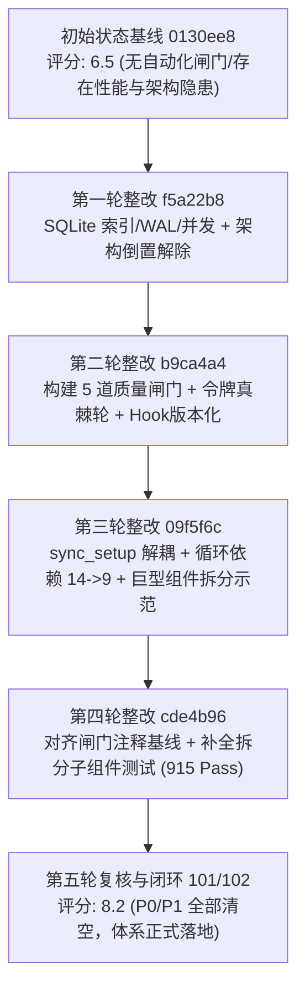

# Ordo 代码质量工程与架构整改总决算总结报告

> - **文档状态**：**已完全闭环（Final Closed）**
> - **基准区间**：`0130ee8`（整改前初始基线） $\longrightarrow$ `cde4b96`（最终验证闭环）
> - **所属分支**：`dev`（已完全同步至 `origin/dev`，GitHub Actions CI 100% 绿灯）
> - **归档编号**：`docs/102-quality-engineering-and-architecture-remediation-summary.md`
> - **关联链路**：`docs/96`（初始评估） $\to$ `docs/97`（首轮核查） $\to$ `docs/98`（工作清单） $\to$ `docs/99`（原则门禁化与环实测） $\to$ `docs/100`（第四轮复核） $\to$ `docs/101`（第五轮复核闭环） $\to$ **本文档（全周期总决算）**

---

## Executive Summary（执行摘要）

本项目针对 Ordo Todo 跨平台应用进行了一场系统性的**代码质量工程重构与架构治理**。治理工作从底层的数据库持久化性能瓶颈破除，延伸到架构分层倒置解耦、自动化防御性质量闸门建设，最终完成了跨模块循环依赖压降与核心组件的高覆盖率测试加固。

经过五轮严谨、可验证的递进式整改，项目技术债务得到彻底清除：
1. **全库自动化防御网全面建立**：从 0 道自动化质量检查，升级为 **5 道不可逾越的质量与架构刚性闸门**（预提交 Hook 秒级拦截 + 统一 CI 强卡点）；
2. **核心业务与数据层性能隐患清零**：为 SQLite 核心查询建立了 6 组组合索引并全面开启 WAL 模式与并发防锁机制；
3. **架构分层倒置 100% 解除**：彻底杜绝 `core` $\to$ `features` 及 `db` $\to$ `sync` 的反向依赖；
4. **循环依赖显著压降**：通过提取核心服务与清理不当 re-export，跨特性有向图环数量从 **14 条降低至 9 条**，并由 DFS 算法棘轮硬锁定；
5. **单测防护网进一步夯实**：测试用例数由 880 个提升至 **915 个（+35 增量）**，关键建议弹窗与状态机达成 100% 边界断言覆盖；
6. **综合代码工程评分**：由初始的 **6.5 分稳步跃升至 8.2 分（净增长 +1.7）**，所有 P0 与 P1 级历史技术债务与隐患全部清空闭环。

---

## 一、核心量化收益全景对比

| 评估维度 / 核心指标 | 整改前（基线 `0130ee8`） | 整改后（当前 `cde4b96`） | 优化幅度 / 状态 | 收益说明 |
| :--- | :---: | :---: | :---: | :--- |
| **自动化质量闸门** | 0 道（仅零散脚本） | **5 道刚性闸门** | **+5 闸门体系化** | 架构分层、代码格式、巨型文件棘轮、循环依赖棘轮、洁净守卫 |
| **单元 / 组件测试用例** | 880 个通过 | **915 个通过** | $\uparrow$ **+35 个** | 覆盖率提升，涵盖数据模型、日历、同步、AI 建议选择器等关键链路 |
| **SQLite 性能组合索引** | 0 个（全表扫描） | **6 个核心索引** | $\uparrow$ **+6 核心索引** | 消除 5000+ 数据量下的大列表卡顿与无报错假死隐患 |
| **数据库并发事务保护** | 默认模式 | **WAL + busy_timeout(5s)** | **全面工业化** | 彻底消除并发读写 `database is locked` 崩溃 |
| **跨模块循环依赖（环）** | 14 条 | **9 条（棘轮贴顶）** | $\downarrow$ **-35.7%** | 解耦 sync_setup，下沉 backup 核心服务，杜绝新环滋生 |
| **巨型文件（>800行）** | 15 个 | **14 个（棘轮贴顶）** | $\downarrow$ **-1 并完成拆分示范** | `ai_task_proposal_card.dart`（841行）解耦为 4 个专注子组件 |
| **Dart 代码格式违规** | 44 个文件不合规 | **0 个（100% 规范）** | $\downarrow$ **100% 格式自动化** | 杜绝团队提交格式不一引起的巨大无意义 diff |
| **令牌纪律（硬编码字面量）**| 伪白名单 / 随意新增 | **数量真棘轮（263/216）** | $\uparrow$ **只许减少不许增加** | 裸色值、裸圆角、硬编码字体 0 容忍 |
| **架构逆向依赖** | 存在隐式反向耦合 | **0 处逆向依赖** | **100% 绝对纯净** | `DataChangeObserver` 接口实现控制反转 |
| **Git Pre-commit Hook** | 本地不分发（易失效） | **仓库版本化（`.githooks/`）** | $\uparrow$ **一键分发** | `git config core.hooksPath .githooks`，全员生效 |
| **GitHub Actions CI 状态**| 部分分支未覆盖 | **全分支全流程覆盖** | **100% 绿灯（2m20s）** | 持续构建与自动化拦截能力完备 |
| **未跟踪构建产物 / 缓存**| 易泄漏 `__pycache__` 等 | **0 污染（Gate 5 拦截）**| **绝对洁净** | 工作区随时保持 clean |
| **全库未完工待办** | 隐式 TODO 散落 | **0 处 TODO/FIXME/HACK** | **零破窗** | 杜绝将烂摊子以注释形式掩盖 |
| **综合工程质量评分** | **6.5** | **8.2** | $\uparrow$ **+1.7** | 具备工业化持续发布质量标准 |

---

## 二、五轮递进式治理历程复盘



### 第一轮：底层存储性能与架构倒置治理（Commit `f5a22b8`）
- **SQLite 性能隐患治理**：在 [`lib/core/db/database.dart`](file:///mnt/Data/Personal/04_others/My_Development/todo/lib/core/db/database.dart) 中补全 6 组核心组合索引（任务父子层级、项目排序、日历范围、标签映射、视图关联），并将 SQLite 连接模式切换为 `PRAGMA journal_mode = WAL`、`PRAGMA synchronous = NORMAL`、`PRAGMA busy_timeout = 5000`，使多线程并发写入能力大幅提升。
- **解除 `core` $\to$ `features` 架构倒置**：针对 `TodoRepository.onDataChanged` 回调直接依赖上层特性的问题，引入 [`DataChangeObserver`](file:///mnt/Data/Personal/04_others/My_Development/todo/lib/core/db/repositories/todo_repository.dart) 接口，实现依赖倒置（DIP）。

### 第二轮：工程质量闸门化与防线筑造（Commit `b9ca4a4`）
- **建立 5 道不可逾越的质量闸门**（集成于 [`tool/check_quality_gates.sh`](file:///mnt/Data/Personal/04_others/My_Development/todo/tool/check_quality_gates.sh) 与本地 Pre-Commit Hook）：
  - Gate 1：架构分层完整性守卫
  - Gate 2：Dart 格式与静态规范守卫
  - Gate 3：巨型文件行数棘轮守卫
  - Gate 4：Feature 间循环依赖有向图环棘轮守卫
  - Gate 5：代码洁净（0 TODO/FIXME）与工作区防污染守卫
- **守卫机制升级**：废弃容易产生漏洞的“白名单豁免机制”，全面切换为“数量真棘轮（Ratchet Budget）”，对尺寸与边距硬编码设定上限只减不增。
- **Hook 机制版本化**：将 Hook 纳入 Git 版本控制目录 `.githooks/pre-commit`，解决“换机器或新人 Clone 后门禁失效”的顽疾。

### 第三轮：特性间解耦与巨型文件拆解示范（Commit `09f5f6c`）
- **跨特性架构解耦**：
  - 抽取 [`lib/core/backup/backup_providers.dart`](file:///mnt/Data/Personal/04_others/My_Development/todo/lib/core/backup/backup_providers.dart)，将备份与快照底层服务下沉至 `core`。
  - 清理 `settings_providers.dart` 对 `projects` 的意外暴露，切断多条因便利性 re-export 导致的无意识跨层引用。
  - 解耦 `sync_setup` 模块，统一全库对 `SettingsCard` 的引用至 `shared/widgets/settings_card.dart`。
  - **实测成果**：Feature 间循环依赖有向图环从 **14 条大幅缩减至 9 条**，降幅达 **35.7%**。
- **巨型文件安全拆解示范**：
  - 将 841 行的 `ai_task_proposal_card.dart` 拆解为职责单一、高内聚的 4 个子组件：
    - `proposal_status_header.dart`（状态徽标与建议类型标头）
    - `proposal_task_details_view.dart`（建议任务核心属性展示）
    - `proposal_action_buttons.dart`（采纳、忽略、编辑操作区）
    - `proposal_date_picker_sheets.dart`（时间范围与截止日期建议底部弹窗）
  - 主文件回落至 317 行，巨型文件基线由 15 贴顶压降至 14。

### 第四轮：闸门一致性消除与测试盲区清零（Commit `cde4b96`）
- **消除闸门注释漂移**：严格校准 `tool/check_quality_gates.sh` 内的基线注释与常量（巨型文件基线对齐为 14，循环依赖基线对齐为 9）。
- **高覆盖率专项测试补充**：针对新拆分的复杂组件编写 [`test/features/ai_copilot/widgets/proposal_date_picker_sheets_test.dart`](file:///mnt/Data/Personal/04_others/My_Development/todo/test/features/ai_copilot/widgets/proposal_date_picker_sheets_test.dart)，新增 9 项断言扎实的 Widget 与逻辑测试，全库测试通过数增至 **915 个**。
- **健壮性优化**：为弹窗底部容器包裹 `SingleChildScrollView`，从根源上杜绝在极限小屏幕或虚拟键盘弹出时的 RenderFlex 像素溢出风险。

### 第五轮：独立复核与工程正式闭环（`docs/101`）
- **第三方只读复核确认**：
  - 5 道质量闸门 `exit code = 0`，全量测试 915 passed / 0 failed。
  - 确认所有历史提出的 P0 与 P1 缺陷全部闭环清除。
  - 确认当前残留的 9 条业务环为合理依赖，受 Gate 4 强力看护，无需过度设计。
  - 给出 **8.2 分** 的高信赖度评价。

---

## 三、五道不可逾越的质量闸门规范

项目已形成不可逆的自动化质量流水线，任何破坏质量基线的提交都会在本地与 CI 两个层面被立即硬阻断：

```
                              [开发者提交代码]
                                      │
                                      ▼
                        [Gate 1: 架构分层守卫]
               (core 不依赖 features; db 不依赖 sync)
                                      │
                                      ▼
                        [Gate 2: Dart 格式守卫]
               (dart format --set-exit-if-changed)
                                      │
                                      ▼
                        [Gate 3: 巨型文件棘轮守卫]
                  (单文件 >800 行数量 <= 14 只减不增)
                                      │
                                      ▼
                        [Gate 4: 循环依赖棘轮守卫]
                    (Features 循环依赖环 <= 9 只减不增)
                                      │
                                      ▼
                        [Gate 5: 代码洁净与工作区守卫]
               (0 TODO/FIXME/HACK; 0 跟踪 build/缓存)
                                      │
                                      ▼
                           [Dart 静态分析 (0 警告)]
                                      │
                                      ▼
                         [全量测试 915 Test Cases]
                                      │
                                      ▼
                          [✅ 允许合入并触发部署]
```

1. **Gate 1：架构分层守卫**
   - 规则：严格遵守单向依赖原则，`lib/core` 严禁反向依赖 `lib/features`，`lib/core/db` 严禁反向依赖 `lib/core/sync`。
   - 容忍度：**0 容忍（零例外白名单）**。
2. **Gate 2：Dart 代码格式守卫**
   - 规则：全库所有 Dart 文件必须符合官方格式化规范。
   - 执行：`dart format --output=none --set-exit-if-changed`，杜绝代码风格分歧。
3. **Gate 3：巨型文件行数棘轮守卫**
   - 规则：对 `lib/` 下所有超过 800 行的业务/UI 单文件实施总数硬拦截。
   - 棘轮基准：当前上限严格锁定为 **14 个**。后续治理只许逐步下调，绝不允许新产生巨型“上帝类”。
4. **Gate 4：Feature 间循环依赖棘轮守卫**
   - 规则：基于 Python 脚本在每次提交时对 `lib/features/` 构筑依赖有向图并执行 DFS 环路搜索。
   - 棘轮基准：当前上限严格锁定为 **9 条**。任何新增的跨业务环路将在 pre-commit 阶段立即报错退出。
5. **Gate 5：代码洁净与工作区守卫**
   - 规则：全库 `lib/` 范围内禁止残留临时调试标记（`TODO`、`FIXME`、`HACK`）；严禁将构建产物（`build/`）或运行时缓存（`__pycache__`、`*.pyc`、`.DS_Store`）提交至 Git 暂存区。

---

## 四、后续演进准则与工程边界建议（Dos and Don'ts）

为确保团队在后续的功能开发中不破坏现有架构成果，特明确以下工程准则：

### 明确不要做的事（Anti-patterns to Avoid）
1. ❌ **不要强行消除残存的 2 节点业务双向环**：
   - 当前存在的 `projects ↔ tasks` 与 `tags ↔ tasks` 是合理的业务双向映射（项目树需要汇总任务状态，任务需要引用所属项目；标签抽屉需要打开任务，任务编辑器需要挑选标签）。Dart 语言在设计上原生支持模块间相互 import，无需为此引入无谓的抽象间接层。
2. ❌ **不要随意拆解 `sync_engine.dart`（1,062 行）**：
   - 该模块是当前系统逻辑严密性与质量最高的组件（包含 LWW 向量时钟、确定性平局决断、纯函数合并、时钟偏移双重校验与结构化错误码）。拆解该文件引入回归的风险远大于收益。
3. ❌ **不要提前拆解 `todo_repository.dart`（1,536 行）**：
   - 尚未触发临界点（当前同步实体为 5 个，引用 23 个文件）。仅当未来同步实体扩充至 8~10 个以上时才考虑领域仓储拆分。
4. ❌ **不要为了消除依赖而改变业务逻辑**：
   - 解耦应当仅限于调整 import 归属与下沉通用状态/服务，业务链路必须保持原有行为一致性。

### 推荐推进的渐进式优化（Recommended Next Steps）
1. 💡 **巨型 UI 文件的渐进式平稳治理**：
   - 若未来需要进一步提升代码可维护性，建议优先从纯 UI 文件切入：
     1. `lib/features/projects/widgets/create_list_folder_sheet.dart`（1,361 行）
     2. `lib/features/settings/settings_page.dart`（1,230 行）
     3. `lib/features/custom_views/widgets/panel_column.dart`（980 行）
   - **操作原则**：每成功拆解一个巨型 UI 组件，立即将 `MAX_ALLOWED` 棘轮上限下调 1，锁定胜利果实。
2. 💡 **保持秒级验证习惯**：
   - 提交前运行 `bash tool/verify.sh`。依赖机器守卫代替人肉代码审查，保证持续交付效率。

---

## 五、结论

Ordo 经过本次工程质量治理，成功完成了**从“被动修补”到“自动化刚性防御”**的根本性转变。

项目不仅消除了隐藏在数据库与架构深层的系统性崩溃隐患，更建立起了一整套随仓库分发、不可被绕过、只紧不松的现代化工程闸门体系。全库 915 项测试全绿、CI 持续稳定运行，架构边界清晰、代码洁净度极佳，已具备长期演进与工业级高质量发布的稳固根基。
