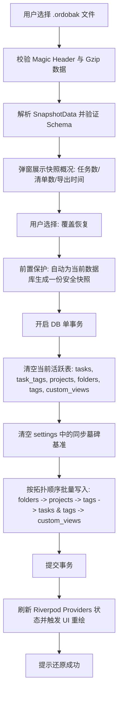

# 数据导入导出与本地安全快照设计与实施计划

> **文档信息**  
> - **创建时间**：2026-09-10 12:05  
> - **文档状态**：待评审（Draft / In Review）  
> - **相关规范**：[CLAUDE.md](file:///mnt/Data/Personal/04_others/My_Development/todo/CLAUDE.md)、[40-data-model.md](file:///mnt/Data/Personal/04_others/My_Development/todo/docs/40-data-model.md)、[60-sync-design.md](file:///mnt/Data/Personal/04_others/My_Development/todo/docs/60-sync-design.md)、[64-local-preferences.md](file:///mnt/Data/Personal/04_others/My_Development/todo/docs/64-local-preferences.md)、[AppTokens](file:///mnt/Data/Personal/04_others/My_Development/todo/lib/core/theme/app_tokens.dart)

---

## 1. 背景与目标

在本地优先（Local-First）与多端同步体系下，网络同步专注于设备间的状态最终一致性。但在网络中断、云端凭据失效、远端文件损坏或用户严重误操作（如批量误删任务）时，单纯依赖同步不仅无法救砖，反而可能将脏状态瞬间广播至所有端。

**本方案目标**：
1. **脱机数据安全性**：提供与网络完全解耦的数据导出与导入能力，支持纯离线环境下的设备间物理迁移和灾难自救。
2. **确定性点对点备份**：生成具有完整语义的数据快照文件，不包含网络凭据与个性化配置，保证隐私安全。
3. **高自由度快照回滚**：在本地建立自动化安全快照池（Auto-Snapshot Pool），支持按快照时间点单点回滚，并允许用户自定义快照保存周期。
4. **防误操作安全兜底**：在任何破坏性操作（覆盖导入、恢复快照）执行前，系统自动捕获前置快照，彻底杜绝数据意外丢失。
5. **视觉一致性与主题自适应**：所有新增的用户界面（设置卡片、导入确认弹窗、快照管理抽屉）严格契合 Ordo 极简设计规范，完全接入动态主题色系统并自适应深浅色模式。

---

## 2. 核心设计决策

| 决策维度 | 确认方案 | 架构考量与权衡 |
| :--- | :--- | :--- |
| **数据范围** | **仅导出业务数据实体，剔除全部设置** | 包含：`projects`、`tasks`、`tags`、`folders`、`customViews` 及任务标签关联 `task_tags`。<br>严格排除：WebDAV/S3 密钥凭据（保密性）、主题/语言/首选项等（避免覆盖目标设备的个性化偏好）。 |
| **文件格式与容器** | **自定义格式 `.ordobak`** | 4 字节魔数 `ORDO` + 2 字节格式版本号 + Gzip 压缩的 JSON Payload。<br>双重校验（魔数合法性 + Gzip 完整性 + Schema 版本），防止用户误选无效文件造成应用解析崩溃。 |
| **导入恢复模式** | **覆盖导入（灾难恢复） + 增量合并（协作归纳） 双模式** | **覆盖模式**：事务内清空现有数据与同步墓碑，全量重建，作为主恢复手段；<br>**增量模式**：复用 `MergeEngine` 基于 LWW（更新时间胜者）进行安全合流。 |
| **本地快照策略** | **按具体快照还原，支持保留天数配置** | 不做粗暴的“按天覆盖”，一天内允许并存多个事件快照（同步前、启动时、还原前、手动）；用户可在 UI 中查看每个快照的详细时间与数据量，任意点选恢复；超过保留天数的旧快照自动清理（但至少兜底保留最新 1 份）。 |
| **系统交互** | **原生文件系统对话框** | 导出时调用系统 `Save File` 对话框，导入时调用 `Pick File` 对话框；跨平台兼容桌面端（Windows / Linux）与移动端。 |
| **视觉与交互风格** | **原生设计令牌接入与主题色响应** | 严格复用 `AppTokens` 设计系统（圆角、间距、微边框、罩染层阶），图标微标、选定状态、进度指示均响应全局 `colorScheme.primary` 动态主题色，深浅色模式无缝切换。 |

---

## 3. 详细架构设计

### 3.1 备份文件格式规范（`.ordobak`）

`.ordobak` 文件采用两层封装：**外层二进制头** + **内层压缩数据**。

```
+------------------+------------------+-----------------------------------------------+
|  Magic (4 bytes) | Version (2 bytes)|                Payload (Gzip)                 |
|   'O','R','D','O'|     0x00, 0x01   | SnapshotData JSON (UTF-8) compressed via Gzip |
+------------------+------------------+-----------------------------------------------+
```

1. **Magic Header**：`[0x4F, 0x52, 0x44, 0x4F]`（ASCII "ORDO"），校验不通过直接拦截，提示「非合法的 Ordo 备份文件」。
2. **Version Header**：大端序 16 位整数，首版固定为 `1`。
3. **Payload**：复用经过严苛测试的 `SnapshotData` 结构，包含字段：
   - `schemaVersion`: 数据实体 Schema 版本（当前为 `3`）
   - `exportedAt`: 备份生成时的 UTC 毫秒时间戳
   - `appVersion`: 导出时应用版本（如 `1.0.0`）
   - `deviceId`: 导出源设备标识
   - `projects`: 清单列表
   - `folders`: 文件夹列表
   - `tags`: 标签列表
   - `tasks`: 任务列表（内嵌 `tagIds`）
   - `customViews`: 自定义视图列表

### 3.2 导入引擎（`BackupRestoreService`）

#### A. 覆盖导入流程（Full Replace）


#### B. 增量合并流程（Incremental Merge）
1. 提取当前本地活动数据：`todoRepository.exportAll()` 组装本地 `localSnapshot`。
2. 将备份文件反序列化为 `remoteSnapshot`。
3. 执行纯函数 `MergeEngine.merge(localSnapshot, remoteSnapshot)`。
4. 执行 `reconcileTagIds` 与 `reconcileFolderIds`。
5. 调用 `todoRepository.applyMerged(ops)` 将变更落库。

---

### 3.3 本地安全快照管理（`SnapshotPoolService`）

#### A. 快照触发时机
1. **应用冷启动（Daily Auto）**：每天首次启动时静默创建一份快照。
2. **执行同步前（Pre-Sync Auto）**：在 `SyncEngine.run()` 开始前自动备份（在网络拉取/合流前形成隔离断点）。
3. **破坏性还原前（Pre-Restore Safety Net）**：无论执行覆盖导入还是快照回滚，强制备份当前状态，确保“误还原”可反向撤销。
4. **用户手动触发（Manual）**：在设置页点击「立即创建快照」。

#### B. 快照元信息与命名规范
快照文件存储在沙盒目录：`{AppSupportDir}/ordo_snapshots/`。  
命名格式：`snap_{yyyyMMdd_HHmmss}_{triggerType}.ordobak`  
- 例如：`snap_20260910_120000_presync.ordobak`
- 例如：`snap_20260910_120530_manual.ordobak`
- 例如：`snap_20260910_121015_prerestore.ordobak`

#### C. 清理规则（Retention Pruning）
- 读取设置中的 `backup_retention_days`（默认 7 天，可选 3/7/15/30/60 天）。
- 每次创建新快照后，触发清理检查：
  - 计算快照文件生成时间与当前时间的差值。
  - 删除超过配置天数的快照文件。
  - **安全红线**：若过滤后剩余快照数为 0，则强制保留最后 1 份快照，绝不全删。

---

## 4. UI/UX 视觉体系与主题色深度规范

所有新界面必须完全融入当前应用的现代化极简风格，严禁任何粗糙的默认 Material 原生组件拼凑。

### 4.1 核心视觉组件与设计语言
1. **容器形态**：
   - 使用与设置页一致的 `_SettingsCard`（圆角 `AppTokens.radiusMd` / 16dp，轻量边框 `AppTokens.borderSubtleLight` / `borderSubtleDark`，内边距 `AppTokens.spaceMd` / 16dp）。
   - 深色模式采用 Linear 风格的容器底色 `AppTokens.surfaceCardDark`（`0xFF16181D`），浅色采用纯白 `AppTokens.surfaceCard`。
2. **主题色联动（Theme Primary Adaptation）**：
   - **图标徽章（`_IconBadge`）**：采用主题色 `colorScheme.primary` 配合 `AppTokens.alphaTintSoft`（10% 透明度）作为底色，图标采用 `colorScheme.primary`。
   - **开关与分段控制器（`ModernSegmentedControl`）**：选中药丸背景采用主题色高亮或对比底色，指示当前选中的快照保留天数（3/7/15/30/60）。
   - **导入方式选择卡片**：选中态的外边框与 Radio 强调色联动当前主题色（如当前主题色选为宝石绿、鸢尾紫或日落橙时，指示高亮色自动同步变化）。
   - **快照状态芯片（Chips）**：不同类型的触发事件采用带语义的微光圆角药丸标签：
     - `日常自动`：`colorScheme.primary` 柔和罩染
     - `同步前`：`colorNavCalendar` / 珊瑚红 柔和罩染
     - `恢复前保护`：`colorNavToday` / 琥珀金 柔和罩染
     - `手动生成`：`colorNavOverview` / 翠绿 柔和罩染

### 4.2 界面交互场景

#### 场景 1：设置页「数据备份与恢复」配置卡片
```
┌─────────────────────────────────────────────────────────────┐
│ 数据安全与备份                                               │
├─────────────────────────────────────────────────────────────┤
│ [图标徽章] 导出数据备份                                 [>] │
│           生成 .ordobak 备份文件（含所有任务与清单）         │
├─────────────────────────────────────────────────────────────┤
│ [图标徽章] 导入数据备份                                 [>] │
│           从文件全新覆盖或智能合并数据                       │
├─────────────────────────────────────────────────────────────┤
│ [图标徽章] 本地快照保留天数                                  │
│           [ 3天 | (7天) | 15天 | 30天 | 60天 ]              │
├─────────────────────────────────────────────────────────────┤
│ [图标徽章] 历史安全快照                                 [>] │
│           5 个快照 · 1.2 MB可用                              │
└─────────────────────────────────────────────────────────────┘
```

#### 场景 2：导入模式确认弹窗（Import Options Modal）
- 顶部清晰显示待导入文件的元数据：生成时间、包含的任务数、清单数、标签数。
- 提供两项卡片式选择器（点击卡片即切换 Radio，高亮带主题色圆角边框与软底色）：
  - **选项 A（全新恢复，推荐）**：完全覆盖当前本地数据，并彻底消除脏数据。
  - **选项 B（增量合并）**：与当前数据按最后修改时间智能合流。
- 底部操作栏：取消按钮（灰阶） + 确认导入按钮（主题色 FilledButton，圆角 12dp）。

#### 场景 3：本地快照历史面板（Snapshot History Sheet / Drawer）
- 顶部右侧提供「+ 立即备份当前」快捷操作。
- 采用平滑流畅的滚动卡片列表，每张快照卡片支持：
  - 触发事件 Tag（带柔和主题微标）
  - 生成时间（如 `2026-09-10 12:00:15`）
  - 快照数据指标（如 `128 任务 · 8 清单 · 240 KB`）
  - 快捷操作图标按钮：
    - **回滚还原（Restore）**：主题色高亮，点击唤起防误触确认。
    - **另存为（Save As）**：导出到用户自选外部位置。
    - **删除（Delete）**：清理不再需要的中间快照。

---

## 5. 模块与文件变更清单

```
lib/
├── core/
│   ├── backup/                                 # [新增] 导入导出与快照核心域
│   │   ├── backup_codec.dart                   # .ordobak 编解码与 Magic Header 校验
│   │   ├── backup_restore_service.dart         # 覆盖与增量导入业务编排
│   │   └── snapshot_pool_service.dart          # 本地自动快照生命周期、触发与滚动清理
│   └── sync/
│       └── sync_engine.dart                    # [适配] 在同步前调用 snapshot_pool_service 保存预备快照
├── features/
│   └── settings/
│       ├── settings_page.dart                  # [适配] 挂载数据备份与恢复配置卡片
│       ├── settings_providers.dart             # [适配] 新增快照保留天数与快照流 Provider
│       └── widgets/
│           ├── backup_section.dart             # [新增] 备份恢复设置卡片组件（严格遵循主题风格）
│           ├── import_confirm_dialog.dart      # [新增] 导入模式确认对话框（主题色高亮单选卡片）
│           └── snapshot_history_sheet.dart     # [新增] 快照历史浏览与回滚抽屉（接入动态主题色）
```

---

## 6. 测试与质量保证计划

依据项目质量规范（`CLAUDE.md` §5），必须编写完整的单元与集成测试：
1. **`test/core/backup/backup_codec_test.dart`**：
   - 验证正常 Snapshot 编码为 `.ordobak` 二进制并成功逆向还原；
   - 验证异常输入：损坏的魔数、无效的版本号、畸形 JSON、截断的 Gzip 流是否均抛出明确异常。
2. **`test/core/backup/backup_restore_service_test.dart`**：
   - 验证「覆盖导入」：验证目标数据完全被替换、旧数据与旧墓碑清除、拓扑外键无悬空；
   - 验证「增量导入」：验证与现存数据的合并效果、LWW 裁决、标签关联正确保留；
   - 验证覆盖导入前的「前置安全快照自动触发」。
3. **`test/core/backup/snapshot_pool_service_test.dart`**：
   - 验证快照创建、扫描列表读取；
   - 验证过期清理算法（超过 retentionDays 的删除，不足或唯一的保底不删）；
   - 验证单点快照还原的准确性。
4. **`test/features/settings/backup_ui_test.dart`**：
   - 验证备份卡片在设置页的正确挂载；
   - 验证主题色变化时，备份组件背景、徽标与高亮态同步响应；
   - 验证快照历史抽屉在深浅色模式下的视觉与交互行为。
5. **本地验证命令**：
   ```bash
   flutter test test/core/backup/
   flutter test
   ```

---

## 7. 实施阶段计划

```
1. 阶段一：核心编码与服务层实现
   - 实现 BackupCodec（魔数+Gzip+SnapshotData 封装）
   - 实现 BackupRestoreService（覆盖恢复与增量合并引擎）
   - 实现 SnapshotPoolService（本地快照池管理与过期清理）
   - 验证：完成底层单元测试，保证编解码与数据库操作零隐患

2. 阶段二：同步引擎联动与前置防护
   - 在 SyncEngine 中接入同步前自动打快照逻辑
   - 在 SettingsDao 中持久化 backup_retention_days 配置
   - 验证：集成测试覆盖同步前自动备份与过期轮询

3. 阶段三：UI 组件与系统文件对话框集成（严格接入主题色）
   - 实现 BackupSection、ImportConfirmDialog、SnapshotHistorySheet
   - 全面绑定 Theme.of(context).colorScheme 与 AppTokens
   - 完善中英文多语言文案（l10n）
   - 验证：端到端交互测试与 Widget 响应主题色验证

4. 阶段四：完整回归与实施记录追溯
   - 运行全部测试集（flutter test）确保 100% 通过
   - 更新实施结果记录至本文档末尾
```

---

## 8. 实施完成报告与交付成果

### 8.1 交付模块清单
1. **编解码底层**：`lib/core/backup/backup_codec.dart`
   - 自定义文件头规范：魔数 `ORDO` (4 字节) + 格式版本 (2 字节大端) + Gzip 压缩序列化载荷。
   - 提供崩溃安全逆向解码与非法魔数、损坏载荷、越界版本严密拦截。
2. **核心业务服务**：
   - `lib/core/backup/backup_restore_service.dart`：支持全量数据导出（不含敏感配置）、覆盖恢复（级联清理旧数据并重建拓扑依赖）与增量合并（基于 LWW 与软删除保护机制）。
   - `lib/core/backup/snapshot_pool_service.dart`：管理本地 `.ordobak` 快照生命周期；自动轮询与清理过期快照；在任何还原前自动打下 `preRestore` 保护快照；提供至少保留 1 份快照的防空保底机制。
3. **同步前置联动**：`lib/core/sync/sync_engine.dart`
   - 在首次联网 pull/merge 前静默生成 `SnapshotTriggerType.preSync` 保护快照，网络异常时不污染本地库。
4. **UI 与系统原生集成**：
   - `lib/features/settings/widgets/backup_section.dart`：挂载于设置页，提供导出、导入、快照入口与天数选择。
   - `lib/features/settings/widgets/import_confirm_dialog.dart`：导入前安全核验，显示备份内实体统计，支持增量合并与全新覆盖两档单选交互。
   - `lib/features/settings/widgets/snapshot_history_sheet.dart`：底部滑出面板，支持查看快照来源彩色 Badge、时间、体积与实体概览，提供即时快照与一键回滚。
   - 导出与导入均接入原生系统文件保存/选取弹窗（`FilePicker` 12.2.0 API），指定 `.ordobak` 扩展名。
   - 界面严格遵循应用统一主题与动态取色（`Theme.of(context).colorScheme`、`AppTokens`）。
5. **国际化多语言**：
   - 补全 `lib/core/l10n/app_zh.arb` 与 `lib/core/l10n/app_en.arb`。

### 8.2 自动化测试与质量指标
- **`test/core/backup/backup_codec_test.dart`**：7/7 passed
- **`test/core/backup/backup_restore_service_test.dart`**：3/3 passed
- **`test/core/backup/snapshot_pool_service_test.dart`**：4/4 passed
- **`test/features/settings/backup_ui_test.dart`**：4/4 passed
- **`test/core/sync/sync_engine_test.dart`**：36/36 passed
- **静态分析**：`flutter analyze` 达成 **No issues found! (0 warnings, 0 errors)**。
