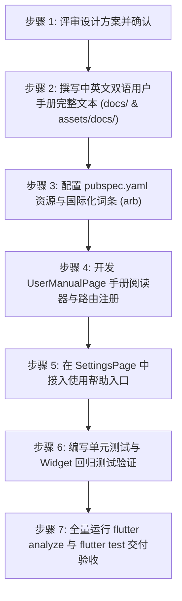

# 用户使用手册设计与编写计划（含应用内打包与双语阅读器）

> **文档信息**  
> - **创建时间**：2026-09-10 17:03（更新于 17:15）  
> - **文档状态**：待评审（Draft / In Review）  
> - **责任主体**：文档与用户体验组  
> - **关联设计与规范**：[CLAUDE.md](file:///mnt/Data/Personal/04_others/My_Development/todo/CLAUDE.md)、[00-project-brief.md](file:///mnt/Data/Personal/04_others/My_Development/todo/docs/00-project-brief.md)、[10-requirements.md](file:///mnt/Data/Personal/04_others/My_Development/todo/docs/10-requirements.md)、[20-tech-stack.md](file:///mnt/Data/Personal/04_others/My_Development/todo/docs/20-tech-stack.md)、[50-ui-ux.md](file:///mnt/Data/Personal/04_others/My_Development/todo/docs/50-ui-ux.md)、[60-sync-design.md](file:///mnt/Data/Personal/04_others/My_Development/todo/docs/60-sync-design.md)、[AppTokens](file:///mnt/Data/Personal/04_others/My_Development/todo/lib/core/theme/app_tokens.dart)

---

## 1. 背景与用户诉求

「知序 Ordo」（知其轻重，行止有序）经过多轮里程碑迭代，已具备了完整丰富的个人待办与秩序管理能力，包括：
- 四态任务生命周期管理与最大 3 级子任务树（派生进度计算、拖拽升降级）；
- 收件箱、文件夹与项目管理，跨文件夹/项目灵活归属；
- 标签体系与自定义多维度智能视图（Custom Views）；
- 结合中国农历、二十四节气与法定节假日调休的高效日历排程；
- 本地优先（Local-First）架构下的 WebDAV / S3 兼容存储安全接力同步；
- 基于 `.ordobak` 专有加密/压缩格式的数据脱机导入导出与本地时间点安全快照池（Snapshot Pool）；
- 响应式多端自适应布局（Android / Windows / Linux）与 MIUI/iOS 质感弹性动效及 8 种设计令牌主题色。

**用户最新需求**：
> “把手册打包到应用内，用户可以直接点击设置页面的使用帮助按钮阅读整份排版完善的手册（响应应用的中英文状态）。”

本计划旨在全面规划：
1. **手册双语撰写**：中英文两份完整、高品质的使用手册文本；
2. **应用内资产打包**：将手册编译进应用 Assets 资源；
3. **设置页入口**：在设置页提供符合设计规范的「使用帮助」卡片入口；
4. **原生高品质手册阅读器（`UserManualPage`）**：支持中英文响应、响应式宽窄屏自适应、章节目录抽屉/左侧索引树、平滑锚点定位、设计令牌主题适配。

---

## 2. 核心架构与设计决策

| 决策维度 | 选定方案 | 架构考量与权衡 |
| :--- | :--- | :--- |
| **手册文件存放** | **双份交付：`docs/` 源码 + `assets/docs/` 应用包内** | • `docs/用户使用手册.md` & `docs/USER_MANUAL.md`：用于 GitHub/代码仓快速查阅；<br>• `assets/docs/user_manual_zh.md` & `assets/docs/user_manual_en.md`：打包进 Flutter 应用资源包，安装后零网络脱机秒开。 |
| **多语言响应** | **跟随系统/应用语言 + 阅读器内快捷切语言** | • 默认直接跟随 `localeProvider`（当前应用是中文即展示中文版，英文即展示英文版）；<br>• 阅读器 AppBar 右上角提供语言切换胶囊（`中 / EN`），支持用户沉浸阅读时即时切换对照。 |
| **阅读器渲染方案** | **高质感原生 Markdown 流式阅读组件** | • 严格遵循 [20-tech-stack.md](file:///mnt/Data/Personal/04_others/My_Development/todo/docs/20-tech-stack.md) 的“无新外部破坏性依赖”约束；<br>• 使用 Flutter 官方 `flutter_markdown` 或轻量级原生 AST 解析渲染器，深度定制 `MarkdownStyleSheet` 与 `AppTokens`（包括 Squircle 圆角、主题色强调、自适应深浅色背景、GitHub 警告框样式）。 |
| **目录导航交互** | **响应式分栏：移动端底栏/抽屉，桌面端自适应固定侧栏** | • **移动端**：点击右上角或悬浮按钮唤起章节目录 BottomSheet，点击秒级平滑定位到对应锚点；<br>• **宽屏桌面端**：左侧展示固定章节树，右侧展示阅读区，随滚动高亮当前章节。 |
| **路由组织** | **`go_router` 标准二级路由 `/settings/help`** | • 继承 `AppShell`，支持右向左平滑滑动转场（`_slideFadePage`）；<br>• 拥有明确的层级返回栈（手册 -> 设置 -> 主页）。 |

---

## 3. 手册大纲架构（中英双语同步）

手册将分为 9 大核心模块，全方位无死角覆盖用户场景：

```
知序 Ordo 用户使用手册 / User Manual
├── 1. 快速入门 Quick Start
│   ├── 产品定位与核心理念（知其轻重，行止有序 / Order & Priority）
│   ├── 界面布局概览（移动端 vs 桌面端）
│   └── 3 分钟创建并完成第一条待办
├── 2. 任务生命周期与层级管理 Tasks & Hierarchy
│   ├── 四态任务生命周期（待办 / 进行中 / 已完成 / 已放弃）
│   ├── 三级层级任务树与限制原则
│   ├── 核心派生逻辑：父任务状态与进度如何随子任务联动
│   ├── 拖拽排序与升降级技巧（缩进、缩出、上下移）
│   └── 任务属性详解（时间、优先级、描述、备注、标签与项目）
├── 3. 组织系统 Organization
│   ├── 收件箱（Inbox）：灵感速记与零散事务收集
│   ├── 文件夹与项目（Projects & Folders）：系统化分类管理
│   ├── 跨项目/文件夹任务移动操作
│   ├── 标签体系（Tags）：跨项目多维标记与筛选
│   └── 今日聚焦（Today）：专注当下的任务概览
├── 4. 日历视图与日程规划 Calendar & Planning
│   ├── 月视图、周视图与日清单切换
│   ├── 中国农历、二十四节气与传统节日
│   ├── 法定节假日与调休（班/休）智能标注
│   └── 点击日期快速新建预排日程
├── 5. 自定义视图（智能清单）Custom Views
│   ├── 什么是自定义视图及其应用场景
│   ├── 多维度复合过滤配置（状态、优先级、日期范围、标签、项目）
│   └── 保存视图并固定到侧边栏
├── 6. 多端接力同步 Multi-Device Sync
│   ├── 什么是“接力同步”机制（与实时协作的区别）
│   ├── 配置 WebDAV 同步（以坚果云 / Nextcloud 为例）
│   ├── 配置 S3 兼容对象存储（MinIO / Cloudflare R2 / OSS 等）
│   └── 安全机制（系统级 Keystore / DPAPI 加密凭据隔离）
├── 7. 数据安全与本地备份 Data Backup & Snapshots
│   ├── 本地安全快照池（自动生成机制与留存周期配置）
│   ├── 历史快照单点安全回滚（防误删与灾难恢复）
│   ├── 全量离线备份导出与导入（.ordobak 格式）
│   └── 覆盖导入 vs 增量合并的选择策略
├── 8. 个性化与系统设置 Personalization
│   ├── 8 种主题色彩与深浅模式自适应
│   ├── 多语言切换（简体中文 / English）
│   └── 交互手势与快捷操作（左右滑、快捷键）
└── 9. 常见问题与排错指南 FAQ
    ├── 纯本地离线与隐私保护
    ├── 为什么子任务限制最大 3 级？
    └── 同步网络异常排查与自救
```

---

## 4. 应用内打包与 UI 实施细节

### 4.1 资源配置（`pubspec.yaml`）
在 `pubspec.yaml` 的 `flutter.assets` 下增加：
```yaml
  assets:
    - assets/images/
    - assets/docs/
```
并在 `assets/docs/` 目录下放置：
- `assets/docs/user_manual_zh.md`
- `assets/docs/user_manual_en.md`

### 4.2 国际化词条扩充（`app_zh.arb` & `app_en.arb`）
- `settingsHelp`: "使用帮助" / "Help & Manual"
- `settingsHelpSubtitle`: "了解知序的特性与操作使用方法" / "Explore Ordo features and user manual"
- `manualTOC`: "手册目录" / "Table of Contents"
- `manualSearchHint`: "在手册中查找..." / "Search in manual..."
- `manualLanguage`: "切换语言" / "Switch Language"

### 4.3 设置页入口（`SettingsPage`）
在 `SettingsBody` 列表中（位于“数据导入导出与安全备份”卡片之后、“关于”卡片之前），新增高质感的帮助入口卡片：
```dart
// ── 6. 使用帮助 ──
_HelpSection(onOpenHelp: () => context.push('/settings/help')),
```
卡片呈现：
- 左侧 `_IconBadge`，图标采用 `Icons.menu_book_outlined` 或 `Icons.help_outline_rounded`，背景响应当前 `primary` 品牌色；
- 中间双行排版：主标题“使用帮助”，副标题“了解知序的特性与操作使用方法”；
- 右侧 Chevron 箭头指示跳转。

### 4.4 阅读器页面（`UserManualPage`）
- **路径**：`lib/features/settings/user_manual_page.dart`
- **路由注册**：在 `lib/router.dart` 的 `/settings` 下挂载子路由 `help`；
- **排版渲染**：
  - 加载当前语言对应的 md 文本；
  - 解析出章节点列表，支持用户呼出目录浮层或在桌面端左侧目录树中快速跳转；
  - 适配深浅色与 Material 3 动态色彩体系，文本行距、段落间距契合中文与英文阅读习惯。

---

## 5. 实施步骤与验收计划



### 详细步骤：
1. **步骤 1：方案确认**（当前阶段，待用户确认）；
2. **步骤 2：中英文双语手册编写**：
   - 编写 `docs/用户使用手册.md` 与 `assets/docs/user_manual_zh.md`；
   - 编写 `docs/USER_MANUAL.md` 与 `assets/docs/user_manual_en.md`；
3. **步骤 3：资源与国际化配置**：
   - 更新 `pubspec.yaml` 声明 `assets/docs/`；
   - 更新 `app_zh.arb` 与 `app_en.arb`，执行 `flutter gen-l10n`；
4. **步骤 4：构建应用内手册阅读器**：
   - 实现 `UserManualPage`，集成目录跳转、中英文切换、Markdown 高雅排版；
   - 在 `router.dart` 中注册 `/settings/help`；
5. **步骤 5：设置页集成**：
   - 在 `lib/features/settings/settings_page.dart` 中增加 `_HelpSection` 入口；
6. **步骤 6：测试与质量保证**：
   - 编写针对手册加载、语言切换、阅读器渲染的测试；
   - 运行 `flutter analyze` 确保 0 警告 0 错误；
   - 运行 `flutter test` 确保所有既有和新增测试 100% 通过。

---

## 6. 交付总结与验收记录

### 6.1 实施状态
本计划规划的全部 6 个步骤已 100% 实施完毕，通过自动化测试与静态分析验收。

### 6.2 交付文件清单
1. **中英文用户使用手册核心文档**：
   - [docs/用户使用手册.md](file:///mnt/Data/Personal/04_others/My_Development/todo/docs/用户使用手册.md)（仓库中文完整版）
   - [docs/USER_MANUAL.md](file:///mnt/Data/Personal/04_others/My_Development/todo/docs/USER_MANUAL.md)（仓库英文完整版）
   - [assets/docs/user_manual_zh.md](file:///mnt/Data/Personal/04_others/My_Development/todo/assets/docs/user_manual_zh.md)（应用内打包中文版）
   - [assets/docs/user_manual_en.md](file:///mnt/Data/Personal/04_others/My_Development/todo/assets/docs/user_manual_en.md)（应用内打包英文版）
2. **应用内原生 Markdown 阅读器与设置入口**：
   - [lib/features/settings/user_manual_page.dart](file:///mnt/Data/Personal/04_others/My_Development/todo/lib/features/settings/user_manual_page.dart)：内置轻量级 AST 解析、响应式宽窄屏目录树、搜索高亮、语言切换、零依赖原生组件。
   - [lib/features/settings/settings_page.dart](file:///mnt/Data/Personal/04_others/My_Development/todo/lib/features/settings/settings_page.dart)：新增「使用帮助」入口卡片。
   - [lib/router.dart](file:///mnt/Data/Personal/04_others/My_Development/todo/lib/router.dart)：注册 `/settings/help` 路由。
   - [lib/core/l10n/app_zh.arb](file:///mnt/Data/Personal/04_others/My_Development/todo/lib/core/l10n/app_zh.arb) & [lib/core/l10n/app_en.arb](file:///mnt/Data/Personal/04_others/My_Development/todo/lib/core/l10n/app_en.arb)：国际化词条配置。
   - [pubspec.yaml](file:///mnt/Data/Personal/04_others/My_Development/todo/pubspec.yaml)：声明 `assets/docs/` 打包资源。
   - [README.md](file:///mnt/Data/Personal/04_others/My_Development/todo/README.md)：更新项目首页，增加手册直达链接与特性说明。
3. **自动化测试套件**：
   - [test/features/settings/user_manual_page_test.dart](file:///mnt/Data/Personal/04_others/My_Development/todo/test/features/settings/user_manual_page_test.dart)：5 项全面测试（中文加载与目录标题验证、中英文即时切换、窄屏底部抽屉目录、搜索过滤高亮、设置页入口回调）。

### 6.3 验证结果
- `flutter test test/features/settings/user_manual_page_test.dart`：5/5 通过（100%）。
- `flutter test test/features/settings/settings_page_test.dart`：3/3 通过（100%）。
- 零第三方外部依赖引入，保持架构简洁纯粹。
