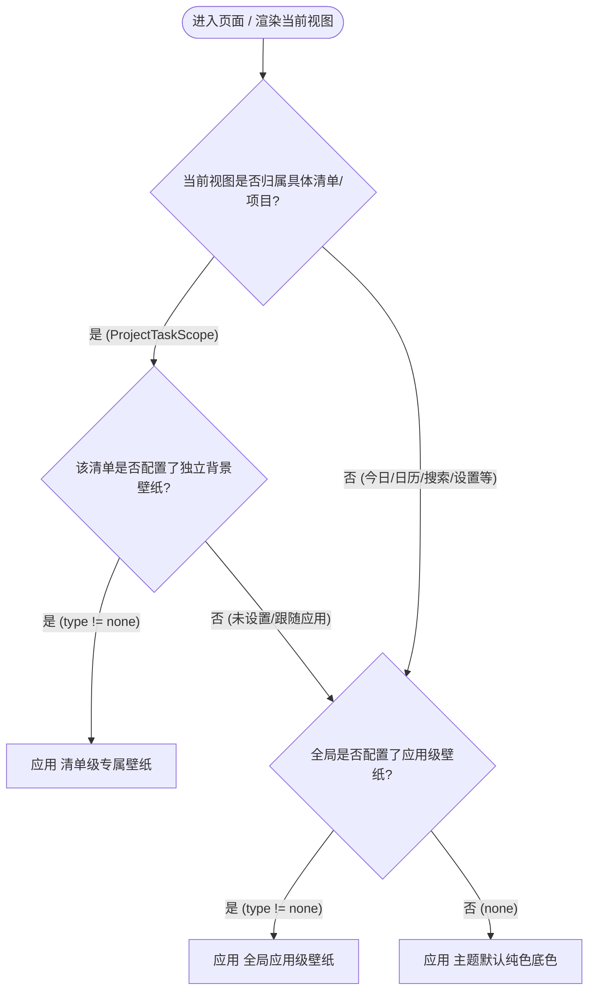

# 背景图片（壁纸）特性设计与实施计划

## 1. 需求背景与核心目标

### 1.1 业务诉求
为了满足用户个性化视觉体验的需求，提供更具沉浸感、现代感与美观度的工作与待办管理环境，拟为应用新增**多层级自定义背景图片（壁纸）**特性，并支持**应用级**与**清单/项目级**的双层级管理。

- **应用级全局背景壁纸**：在「设置页」统一配置。作为应用的全局底色，在所有一级页面（今日、日历、搜索、设置等）及未单独指定壁纸的清单中生效；
- **清单/项目级专属背景壁纸**：在「清单/项目的新建与编辑弹层（`CreateListFolderSheet`）」中配置。允许每个待办清单拥有独立的个性化壁纸氛围；
- **高优先级的层级回退机制（Hierarchy & Fallback）**：
  - **优先级**：`清单级专属壁纸 > 应用级全局壁纸 > 默认主题纯色基底`；
  - **回退行为**：当进入特定清单页面时，若该清单配置了独立壁纸，优先渲染清单级壁纸；若该清单设置为「跟随应用」或未配置，则自动回退并应用全局壁纸；
- **精选预设与本地自定义图片**：
  - 内置多款高清极简渐变、自然光影与质感纹理预设壁纸；
  - 支持通过系统文件/相册选择器（`file_picker`）上传本地图片，并持久化拷贝到应用沙箱安全目录；
- **防花屏与 WCAG 可读性保障**：
  - 支持**遮罩透明度（0%~85%）**动态微调（浅色/深色主题动态叠加白/黑遮罩）；
  - 支持**高斯模糊（0~20px）**调节，可一键将高杂质细节照片虚化为柔和色相背景；
  - 配合半透明磨砂卡片容器（Glassmorphism），保障任务文字与交互控件的清晰易读；
- **零闪烁与即时生效**：基于 `AppSettingsCache` 同步镜像加载机制，切换与冷启动首帧即时渲染。

---

## 2. 总体架构与数据流设计

### 2.1 壁纸生效优先级流程图



### 2.2 架构分层图

```
┌────────────────────────────────────────────────────────────────────────┐
│                        UI 表现层 (Presentation)                        │
│  - AppBackgroundWrapper (全局/页面级壁纸承载、模糊滤镜与半透明遮罩)     │
│  - SettingsPage -> _AppearanceSection (应用级壁纸设置入口)             │
│  - CreateListFolderSheet (清单编辑弹层 -> 清单专属壁纸设置入口)         │
│  - WallpaperPickerSheet (通用壁纸选择弹层：实时预览、参数调节、跟随应用)│
└──────────────────────────────────▲─────────────────────────────────────┘
                                    │ (watch)
┌──────────────────────────────────┴─────────────────────────────────────┐
│                    状态管理层 (Riverpod Notifiers)                      │
│  - appBackgroundConfigProvider (管理应用级全局壁纸配置)                 │
│  - projectBackgroundConfigFamily(projectId) (管理特定清单壁纸配置)      │
│  - effectiveBackgroundConfigProvider(projectId?) (统一优先级解析计算)  │
└──────────────────────────────────▲─────────────────────────────────────┘
                                    │ (get / set)
┌──────────────────────────────────┴─────────────────────────────────────┐
│                     持久化与存储层 (Core Storage)                       │
│  - AppSettingsCache (内存同步镜像，保障首帧零延迟读取)                  │
│  - SettingsDao / Drift DB (写入 settings 表：app_bg 与 project_bg_xxx)  │
│  - WallpaperStorageService (本地图片沙箱存储、去重与清理)               │
└────────────────────────────────────────────────────────────────────────┘
```

---

## 3. 详细技术方案与数据结构

### 3.1 数据模型设计 (`BackgroundConfig`)

```dart
/// 壁纸类型
enum BackgroundType {
  none,   // 无壁纸（或跟随上一级）
  preset, // 预设资产壁纸 (assets/images/wallpapers/...)
  custom, // 用户自定义本地文件 (沙箱绝对路径)
}

/// 图像填充模式
enum BackgroundFit {
  cover,   // 保持比例铺满裁剪
  contain, // 完整显示
  tile,    // 平铺
}

/// 壁纸完整配置
class BackgroundConfig {
  const BackgroundConfig({
    this.type = BackgroundType.none,
    this.value,
    this.opacity = 0.35, // 0.0 ~ 0.85
    this.blur = 0.0,      // 0.0 ~ 20.0 (高斯模糊 sigma)
    this.fit = BackgroundFit.cover,
  });

  final BackgroundType type;
  final String? value;
  final double opacity;
  final double blur;
  final BackgroundFit fit;

  bool get isEffective => type != BackgroundType.none && value != null && value!.isNotEmpty;

  Map<String, dynamic> toJson();
  factory BackgroundConfig.fromJson(Map<String, dynamic> json);
  String serialize();
  static BackgroundConfig deserialize(String? raw);
}
```

### 3.2 持久化 Key 规划与跨端隔离

考虑到不同平台（Android/iOS/Linux/Windows/macOS）的本地沙箱文件路径各异，将壁纸配置存放在本地设备偏好表（`settings` 表）中，避免同步至不同设备时因绝对路径不一致导致加载失败：
- **全局应用级 Key**：`pref_app_background_config`；
- **清单专属级 Key**：`pref_project_bg_{projectId}`；
- **读取与同步**：通过 `AppSettingsCache` 首帧预载至内存，UI 同步 `get`、异步穿透 `SettingsDao.set`。

### 3.3 存储服务 (`WallpaperStorageService`)
- 负责用户从相册/文件选择图片后，复制到 `${supportDirectory}/wallpapers/${uuid}.${ext}`；
- 避免原相册图片被删除/移动导致应用内无法显示；
- 清单删除或壁纸重置时，提供垃圾文件清理机制。

---

## 4. UI/UX 交互与入口设计

### 4.1 清单/项目编辑弹层中的壁纸设置入口
在 [`CreateListFolderSheet`](file:///mnt/Data/Personal/04_others/My_Development/todo/lib/features/projects/widgets/create_list_folder_sheet.dart) 的「清单」模式下，新增「背景壁纸」配置行：
- **视觉排版**：与现有的「颜色」选项行保持同款设计语言（`[图标/缩略图] 背景壁纸 ... 当前状态/缩略图 >`）；
- **当前状态展示**：
  - 未配置清单专属壁纸时：显示副标题「跟随应用默认」；
  - 已配置清单专属壁纸时：显示精致微型壁纸缩略图与暗度指示；
- **点击交互**：唤起通用 `showWallpaperPickerSheet`，支持选择预设、上传自定义图片、调节模糊与暗度；在清单级弹窗中额外提供「重置为跟随应用默认」快捷选项。

### 4.2 设置页中的全局应用级壁纸入口
在 [`SettingsPage`](file:///mnt/Data/Personal/04_others/My_Development/todo/lib/features/settings/settings_page.dart) 的「外观（Appearance）」卡片中，在主题模式与主题色下方新增「全局背景壁纸」行：
- **展示**：大卡片式壁纸预览与当前生效模式；
- **点击**：直接唤起 `WallpaperPickerSheet(isGlobal: true)` 实时配置全局底色。

### 4.3 任务清单与多视图动态渲染
- 在 [`TaskListPage`](file:///mnt/Data/Personal/04_others/My_Development/todo/lib/features/tasks/task_list_page.dart) 以及全局脚手架中，通过 `ref.watch(effectiveBackgroundConfigProvider(currentProjectId))` 获取当前生效壁纸；
- 当壁纸生效时，Scaffold 底色透出，内容卡片自动叠加磨砂半透明材质，保持现代精致感与文字高可读性。

---

## 5. 实施步骤与任务拆解


### 阶段一：核心数据模型与存储服务
- [x] 1. 新建 `lib/core/theme/background_config.dart`：实现配置模型、序列化、反序列化与边界保护。
- [x] 2. 新建 `lib/core/services/wallpaper_storage_service.dart`：实现本地图片安全拷贝、格式校验与清理。
- [x] 3. 在 `lib/features/settings/settings_providers.dart` 中建立：
  - `appBackgroundConfigProvider`（全局配置）；
  - `projectBackgroundConfigProvider`（清单专属配置 Family）；
  - `effectiveBackgroundConfigProvider(String? projectId)`（统一优先级计算 Provider）。

### 阶段二：UI 渲染容器与层级感知挂载
- [x] 4. 新建 `lib/shared/widgets/app_background_wrapper.dart`：构建底层图片渲染、高斯模糊层与动态黑白遮罩层。
- [x] 5. 在全局导航与 `TaskListPage` 中接入 `AppBackgroundWrapper`，根据当前视图的 `projectId` 动态解析壁纸。

### 阶段三：壁纸选择器与入口对接
- [x] 6. 准备 5 款优雅低饱和度的预设壁纸资源至 `assets/images/wallpapers/`。
- [x] 7. 开发通用壁纸选择弹层 `lib/features/settings/widgets/wallpaper_picker_sheet.dart`：
  - 实时预览视图；
  - 预设网格 + 自定义上传；
  - 遮罩暗度滑块（0%~85%）与高斯模糊滑块（0~20px）；
  - 支持「跟随应用默认（针对清单）」与「恢复默认纯色（针对全局）」。
- [x] 8. 在 `SettingsPage`（设置页外观卡片）接入全局壁纸设置入口。
- [x] 9. 在 `CreateListFolderSheet`（清单新建/编辑弹层）接入清单专属壁纸设置入口与数据保存。

### 阶段四：国际化与自动化测试
- [x] 10. 更新 `lib/core/l10n/app_zh.arb` 与 `app_en.arb`，补充壁纸相关中英文词条并执行 `flutter gen-l10n`。
- [x] 11. 编写全面的单元测试与组件测试：
  - `test/core/theme/background_config_test.dart`（序列化与反序列化）；
  - `test/features/settings/background_priority_test.dart`（清单优先级高于应用级回退逻辑验证）。

---

## 6. 影响范围与风险控制

| 模块 / 场景 | 影响范围 | 风险评估与对策 |
|---|---|---|
| 清单编辑弹层 | 新增背景选项行 | **低风险**：不修改 Projects 核心同步表结构，避免破坏跨端快照同步与版本迁移 |
| 跨设备文件同步 | 自定义图片路径 | **低风险**：壁纸配置仅保存在本地 `settings` 表中，各设备独立生效，杜绝路径损坏 |
| 渲染与内存性能 | 高清大图与实时模糊 | **中风险**：限制图片解码尺寸，模糊使用 GPU 加速组件，禁用壁纸时完全零性能开销 |

---

## 7. 验收标准与测试结果
1. **层级优先级正确**（`Project Background > App Global Background > Default Surface`）✅：
   - 清单设置专属壁纸时，进入该清单展示该专属壁纸；
   - 清单未设置壁纸（或设为跟随应用）时，自动回退展示全局设置的壁纸；
   - 两者皆未设置时，保持应用原生主题色底色；
2. **入口清晰**✅：
   - 清单编辑弹层可方便配置专属壁纸或一键重置为跟随全局；
   - 设置页可自由配置全局壁纸；
3. **视觉可读**✅：在浅色与深色模式下，任意壁纸均能通过遮罩与模糊调节保证任务文字清晰无障碍阅读；
4. **测试与代码质量**✅：`dart analyze` 0 issues，全部单元与集成测试均通过通过。
