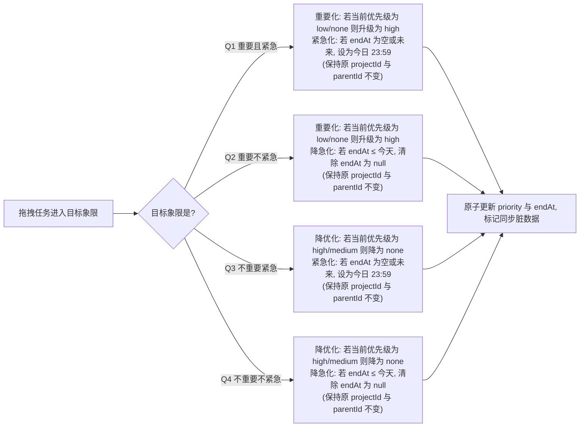

# 四象限（艾森豪威尔矩阵）功能设计与实施计划

> **文档规范**：本计划遵循 `CLAUDE.md`《自定义工程质量规范》与 `AGENTS.md` 工作指引。先设计后实现，明确架构分层、数据流向、UI/UX 交互规范、测试策略与分阶段验证步骤。

---

## 1. 需求背景与业务目标

### 1.1 需求背景
四象限法则（艾森豪威尔矩阵，Eisenhower Matrix）是时间管理与待办规划的核心方法论，将待办事项依「重要」与「紧急」两个正交维度划分为四个象限：
1. **第一象限（重要且紧急，Q1）**：突发危机、今天截止的高优工作，需立即处理；
2. **第二象限（重要不紧急，Q2）**：长远规划、技能提升、健康成长，是高效人士聚焦的核心价值区；
3. **第三象限（不重要但紧急，Q3）**：琐碎催办、突发打扰、临时杂事，宜授权或快速批处理；
4. **第四象限（不重要不紧急，Q4）**：消遣娱乐、拖延无价值事项，宜减少或剔除。

在待办清单中引入四象限能力，能够帮助用户跳出单一时间流与清单维度的视野局限，从全局战略视角进行精力分配与优先级决策。

### 1.2 核心目标与技术准则
- **业务诉求**：提供独立的全局四象限视图，支持 2x2 响应式田字格与单象限聚焦，支持跨象限拖拽交互与象限内快捷创建；
- **右上角多层级范围筛选器（清单与文件夹）**：
  - 在四象限页面右上角设置筛选入口（Filter Action）；
  - 呼出底部范围筛选面板，以「收集箱 + 文件夹分组 $\to$ 清单 + 未分组清单」的树形层级展示；
  - 支持多选、文件夹级联选择（全选/全不选该文件夹下的所有清单）、一键全部重置；
  - 仅对用户勾选的目标清单范围内的任务执行四象限归类与展示，且筛选器带激活态角标反馈；
- **拖拽与归属权严格隔离（关键准则）**：
  - **跨象限拖拽已有任务**：属于**纯状态/属性流转**，**绝对不改变**任务原有的所属清单（`projectId`）与父子层级关系（`parentId`），仅且只允许调整任务自身的 `priority` 与 `endAt`；
  - **象限内点击「+」新建全新任务**：预设该象限的优先级与到期日；清单归属规则为：若当前筛选器精确只选中了单个清单，新任务默认归入该清单；若当前未筛选或勾选了多个清单，默认归入收集箱（`inbox`），且可在创建弹窗中自由指定；
- **零魔法值与设计规范彻底对齐（Design Tokens & Theme System）**：
  - 严格杜绝硬编码裸数字（魔数尺寸、魔数色值、裸透明度）；
  - 全量引用 `AppTokens` 设计令牌（间距 `space*`、圆角 `radius*`、透明度 `alpha*`、阴影与动效 `motion*`）；
  - 完美融入当前主题系统（深色/浅色模式自适应，支持壁纸磨砂半透明 Glassmorphism 适配）；
- **智能映射（双维度计算）**：
  - **重要度**由任务现有的 `priority` 驱动（`high` / `medium` 判定为重要；`low` / `none` 判定为不重要）；
  - **紧急度**由任务截止时间 `endAt` 驱动（截止时间 $\le$ 今日 23:59:59 或已逾期判定为紧急；未来到期或无截止时间判定为不紧急）；
- **零数据表迁移与零破坏**：完全复用现有 `Tasks` 数据表的 `priority` 与 `endAt` 字段，不增加 SQLite 字段，无需升级 Drift 模式版本，天然 100% 兼容现有 WebDAV/本地快照同步协议；
- **无缝导航整合**：作为一级系统视图挂载于全局导航体系，整合进顶部大标题呼出的 `ScopeSwitcherSheet`，与「今日、收集箱、日历、总览」平级并列；
- **质量保证**：核心判定与变换算法具备 100% 单元测试覆盖，UI 遵循 `AppTokens` 统一视觉规范。

---

## 2. 核心判定规则与拖拽转换矩阵

### 2.1 任务分类判定算法

定义当前参考时间基准 `now`，今日结束时刻 `endOfToday = DateTime(now.year, now.month, now.day, 23, 59, 59, 999).millisecondsSinceEpoch`。

| 象限 | 英文标识 | 标题 | 核心判定条件 | 主题特征色 (Token) |
|---|---|---|---|---|
| **第一象限** | `urgentImportant` | 重要且紧急 | `priority ∈ {high, medium}` **且** `endAt != null && endAt <= endOfToday` | `AppTokens.colorPriorityHigh` (`#E11D48`) |
| **第二象限** | `notUrgentImportant` | 重要不紧急 | `priority ∈ {high, medium}` **且** `(endAt == null \|\| endAt > endOfToday)` | `AppTokens.colorPriorityMedium` (`#D97706`) |
| **第三象限** | `urgentUnimportant` | 不重要但紧急 | `priority ∈ {low, none}` **且** `endAt != null && endAt <= endOfToday` | `AppTokens.colorPriorityLow` (`#4F46E5`) |
| **第四象限** | `notUrgentUnimportant` | 不重要不紧急 | `priority ∈ {low, none}` **且** `(endAt == null \|\| endAt > endOfToday)` | `AppTokens.textMutedLight` (`#6B7280`) |

> **边界处理说明**：
> 1. 已逾期未完成任务：`endAt < now`，自动落入「紧急」范畴（Q1 或 Q3），符合真实管理认知；
> 2. 无截止时间任务：`endAt == null`，落入「不紧急」范畴（Q2 或 Q4）；
> 3. 已完成任务：默认不显示在四象限中（避免干扰当前精力规划），但顶部提供「显示已完成」开关供复盘查看；
> 4. 清单范围过滤：仅纳入满足 `projectId ∈ selectedProjectIds` 的任务（若未限定则为全部未删除清单）。

### 2.2 跨象限拖拽（Drag & Drop）变换矩阵

> **重要约束**：跨象限拖拽**只调整当前任务的 `priority` 与 `endAt`**，绝不触碰任务所属清单 `projectId`、父任务 `parentId`、子任务树或标签列表。



具体字段变换规则表：
- **目标为 Q1（重要且紧急）**：
  - 优先级：若原本就是 `high` 或 `medium`，保持不变；若为 `none` 或 `low`，升级为 `high`；
  - 截止时间：若原本 `endAt <= endOfToday`（已紧急），保持原时间；若原本无日期或为未来日期，设为今日 23:59:59；
  - 清单与层级：严格保持任务原有 `projectId` 和 `parentId` 不变。
- **目标为 Q2（重要不紧急）**：
  - 优先级：若原本就是 `high` 或 `medium`，保持不变；若为 `none` 或 `low`，升级为 `high`；
  - 截止时间：若原本 `endAt <= endOfToday`（原本紧急），将 `endAt` 置为 `null`（或保留未来日期）；若原本就是未来或无日期，保持不变；
  - 清单与层级：严格保持任务原有 `projectId` 和 `parentId` 不变。
- **目标为 Q3（不重要但紧急）**：
  - 优先级：若原本就是 `none` 或 `low`，保持不变；若为 `high` 或 `medium`，降级为 `none`；
  - 截止时间：若原本 `endAt <= endOfToday`，保持原时间；若原本无日期或未来日期，设为今日 23:59:59；
  - 清单与层级：严格保持任务原有 `projectId` 和 `parentId` 不变。
- **目标为 Q4（不重要不紧急）**：
  - 优先级：若原本就是 `none` 或 `low`，保持不变；若为 `high` 或 `medium`，降级为 `none`；
  - 截止时间：若原本 `endAt <= endOfToday`，将 `endAt` 置为 `null`；若原本就是未来或无日期，保持不变；
  - 清单与层级：严格保持任务原有 `projectId` 和 `parentId` 不变。

### 2.3 象限内快捷新建全新任务规则（点击「+」）

在具体象限卡片内点击「+」是**新建一个全新任务**，与上述「已有任务拖拽」完全区分：
- **属性注入**：
  - **Q1 新建**：默认注入 `priority = high`，`endAt = endOfToday`；
  - **Q2 新建**：默认注入 `priority = high`，`endAt = null`；
  - **Q3 新建**：默认注入 `priority = none`，`endAt = endOfToday`；
  - **Q4 新建**：默认注入 `priority = none`，`endAt = null`；
- **新建时的初始所属清单**：
  - 若当前右上角筛选器**刚好只勾选了 1 个具体清单**：该新任务默认归入该勾选的清单；
  - 若当前右上角筛选器**未筛选（全量范围）或多选了多个清单**：该新任务默认归入系统默认收集箱（`inbox`），用户在新建弹窗中依然可以随时手动更改所属清单。

---

## 3. 总体架构与多层级筛选数据流

### 3.1 架构分层图

```
┌───────────────────────────────────────────────────────────────────────┐
│                     UI 表现层 (lib/features/quadrant)                  │
│  - QuadrantPage (主页面容器、PageHeroHeader、筛选按钮、2x2 / 聚焦切换)   │
│  - QuadrantScopeFilterSheet (右上角呼出的多层级清单/文件夹筛选面板)       │
│  - QuadrantGrid (2x2 田字格布局器、分发四个象限卡片)                    │
│  - QuadrantCard (单个象限卡片容器、DragTarget 拖拽落点响应、计数器、添加)  │
│  - QuadrantTaskTile (象限内任务轻量卡片、LongPressDraggable 拖拽源)    │
│  - QuadrantFocusView (单象限沉浸式全屏模式视图，支持返回网格)              │
└───────────────────────────────────▲───────────────────────────────────┘
                                    │ (watch / dispatch)
┌───────────────────────────────────┴───────────────────────────────────┐
│               业务逻辑与状态管理层 (quadrant_providers.dart)           │
│  - quadrantFilterProvider:                                            │
│      * selectedProjectIds: Set<String>? (null 表示全部范围)             │
│      * showCompleted: bool (是否展示已完成)                            │
│  - quadrantTasksProvider (根据范围与完成状态过滤，纯函数分类派发四象限)   │
│  - quadrantActionController (仅更新 priority/endAt 的纯净原子控制器)    │
└───────────────────────────────────▲───────────────────────────────────┘
                                    │ (query / watchTasks / updateTask)
┌───────────────────────────────────┴───────────────────────────────────┐
│                     数据核心与基础设施层 (Core Layer)                   │
│  - TaskDao (Drift 流式数据源 watchTasksWithTags)                       │
│  - ProjectGrouping (projectsByFolderProvider 提供文件夹与项目树)        │
│  - TodoRepository (原子更新任务、维护 updatedAt 与同步脏标记)           │
│  - ScopeSwitcherSheet (注册全局系统导航入口)                            │
│  - appRouter (注册 /matrix 独立系统路由)                               │
└───────────────────────────────────────────────────────────────────────┘
```

### 3.2 多层级范围筛选器详细设计（`QuadrantScopeFilterSheet`）

1. **状态模型**：
   ```dart
   class QuadrantFilterState {
     const QuadrantFilterState({
       this.selectedProjectIds, // null = 全选/全量；非 null = 指定勾选的清单 id 集合
       this.showCompleted = false,
     });

     final Set<String>? selectedProjectIds;
     final bool showCompleted;

     bool get isCustomScoped => selectedProjectIds != null;
   }
   ```
2. **层级渲染与级联交互**：
   - **顶栏（AppBar / SheetHeader）**：
     - 标题「筛选任务范围」；
     - 左侧快捷动作「全选 / 重置」；
     - 右侧「完成」按钮关闭弹层并生效；
   - **内置收集箱**：带单独的复选框与收件箱图标；
   - **文件夹分组（Folders）**：
     - 文件夹头部具备三态复选框（Check / Minus / Empty）：
       - 勾选：将该文件夹下所有项目 id 批量加入 `selectedProjectIds`；
       - 取消勾选：将该文件夹下所有项目 id 批量移除；
       - 部分选中：显示半选中图标；
     - 展开/折叠箭头，展开后缩进列出包含的项目清单；
   - **未分组清单（Ungrouped Projects）**：
     - 列出未挂载在任何文件夹下的独立项目。
3. **右上角按钮呈现与指示**：
   - 若处于全量状态（`isCustomScoped == false`）：展示常规 `Icons.filter_list_rounded` 图标；
   - 若处于自定义筛选状态（`isCustomScoped == true`）：展示激活高亮色（`AppTokens.colorNavQuadrant`），并在右上角带有徽标（显示已选清单数，如 `3`），告知用户当前为局部范围视图。

---

## 4. UI/UX 详细设计与主题规范（零魔法值原则）

### 4.1 设计令牌与主题接入规范（严禁硬编码）

严格对齐 `docs/66-ui-visual-polish-proposal.md` 与 `lib/core/theme/app_tokens.dart`，所有视觉要素全部调用语义令牌：

| 维度 | 规范准则与调用方式 | 禁止做法（违规） |
|---|---|---|
| **主题色彩** | • 导航特征色：`AppTokens.colorNavQuadrant`（`#0284C7`）<br/>• Q1 色：`AppTokens.colorPriorityHigh`<br/>• Q2 色：`AppTokens.colorPriorityMedium`<br/>• Q3 色：`AppTokens.colorPriorityLow`<br/>• Q4 色：`isDark ? AppTokens.textMutedDark : AppTokens.textMutedLight`<br/>• 文本与图标：`colorScheme.onSurface` / `colorScheme.onSurfaceVariant` | 严禁裸写 `Color(0xFF...)`<br/>严禁写死 `Colors.black` / `Colors.white` |
| **容器背景与壁纸** | • 浅色卡片底：`AppTokens.surfaceCardLight`<br/>• 深色卡片底：`AppTokens.surfaceCardDark`<br/>• 沉浸壁纸磨砂底：`colorScheme.surface.withValues(alpha: isDark ? AppTokens.alphaCardFrostedDark : AppTokens.alphaCardFrostedLight)`<br/>• 磨砂滤镜模糊度：`AppTokens.blurFrostedGlass`（16.0） | 严禁自定义随机透明度<br/>严禁纯色卡片生硬覆盖壁纸 |
| **间距系统** | • 微边距：`AppTokens.spaceMicro` (2)<br/>• 极小间距：`AppTokens.spaceXxs` (4)<br/>• 控件内距：`AppTokens.spaceXs` (8)<br/>• 紧凑间距：`AppTokens.spaceSm` (12)<br/>• 标准容器内距：`AppTokens.spaceMd` (16)<br/>• 大间距：`AppTokens.spaceLg` (20) / `AppTokens.spaceXl` (24) | 严禁出现 `EdgeInsets.all(13)`、`SizedBox(height: 7)` 等魔数 |
| **圆角系统** | • 卡片容器圆角：`AppTokens.radiusCard` (12dp)<br/>• 内部条目圆角：`AppTokens.radiusItem` (10dp)<br/>• 按钮圆角：`AppTokens.radiusButton` (12dp)<br/>• 弹层顶部圆角：`AppTokens.radiusSheet` (22dp)<br/>• 胶囊与角标：`AppTokens.radiusPill` (999) | 严禁自定义孤立的 `BorderRadius.circular(15)` |
| **透明度阶梯** | • 极淡底色：`AppTokens.alphaTintFaint` (0.06)<br/>• 柔和底色/高亮底：`AppTokens.alphaTintSoft` (0.10)<br/>• 描边边框：`AppTokens.alphaBorderSubtle` (0.12)<br/>• 拖拽放置激活高亮：`AppTokens.alphaTintStrong` (0.16)<br/>• 次级弱化内容：`AppTokens.alphaContentMuted` (0.55) | 严禁写死 `withOpacity(0.3)`、`withValues(alpha: 0.17)` |
| **动效曲线** | • 转场时长：`motionNormal(context)` (250ms)<br/>• 快速微交互：`motionFast(context)` (150ms)<br/>• 加减速曲线：`motionCurve(context)`（支持减弱动画无障碍模式） | 严禁裸写 `Duration(milliseconds: 200)` 与固定 `Curves.easeIn` |

### 4.2 响应式田字格与单象限聚焦交互
1. **多端自适应布局**：
   - **移动端（宽 < 600px）**：主视图呈现 2 行 2 列田字格，每个象限高度等分屏幕主体区域；象限卡片右上角配备「聚焦放大」图标按钮；
   - **平板/桌面端（宽 $\ge$ 600px）**：田字格自动扩展，支持鼠标悬停动效与鼠标拖拽（直接原生 `Draggable`）；
2. **单象限聚焦模式（Focus Mode）**：
   - 用户点击任一象限卡片头部的放大按钮或双击卡片，该象限平滑放大展开为全屏专属列表；
   - 顶部提供返回按钮「返回四象限」及象限切换分段器（可以在 4 个象限间横向轻扫或点击切换）；
   - 在聚焦模式下，任务列表支持展开子任务、标签详情与更完整的操作菜单；
3. **流畅触控拖拽（Mobile D&D）**：
   - 手机端采用 `LongPressDraggable`（长按 180ms 触发），避免干扰常规列表上下滚动；
   - 拖拽过程中生成半透明阴影卡片跟随手指；
   - 拖拽释放时，若落于其他象限卡片（`DragTarget`），触发展开动画与轻微触觉反馈（HapticFeedback）。

---

## 5. 详细文件改动清单

### 5.1 新增文件清单
1. `lib/features/quadrant/models/quadrant_models.dart`：
   - 象限枚举 `enum QuadrantType { urgentImportant, notUrgentImportant, urgentUnimportant, notUrgentUnimportant }`；
   - 象限配置与元数据模型 `QuadrantMetadata`（标题、副标题、图标、主题色、快捷新建默认值）；
   - 核心纯逻辑判定函数：`classifyTask(Task task, DateTime now)` 与 `calculateQuadrantMutation(...)`（纯净修改 priority 与 endAt，不修改 projectId/parentId）；
2. `lib/features/quadrant/providers/quadrant_providers.dart`：
   - `quadrantFilterProvider`：管理筛选配置（多选项目范围 `selectedProjectIds`、是否显示已完成）；
   - `quadrantTasksProvider`：四象限聚合计算数据流；
   - `quadrantActionController`：任务跨象限移动与快捷操作；
3. `lib/features/quadrant/presentation/quadrant_page.dart`：
   - 四象限主页面，集成 `PageHeroHeader`、大标题、右上角范围筛选入口与 2x2 网格；
4. `lib/features/quadrant/widgets/quadrant_scope_filter_sheet.dart`：
   - 右上角呼出的清单与文件夹多层级多选筛选器弹层；
5. `lib/features/quadrant/widgets/quadrant_grid.dart`：
   - 2x2 响应式田字格容器布局组件；
6. `lib/features/quadrant/widgets/quadrant_card.dart`：
   - 单个象限卡片组件（包含 Header、计数、+ 按钮、任务列表、`DragTarget` 接收器）；
7. `lib/features/quadrant/widgets/quadrant_task_tile.dart`：
   - 象限内精简任务条目组件（支持长按拖拽 `LongPressDraggable`、完成勾选、点击打开编辑页）；
8. `lib/features/quadrant/widgets/quadrant_focus_sheet.dart`：
   - 单象限聚焦全屏视图；
9. `test/features/quadrant/quadrant_classification_test.dart`：
   - 象限分类算法、多范围过滤与跨象限拖拽属性转换的完整单元测试。

### 5.2 修改文件清单
1. `lib/core/theme/app_tokens.dart`：
   - 补充 `colorNavQuadrant` 特征色常量（`#0284C7`，天青色）；
2. `lib/router.dart`：
   - 注册 `/matrix` 路由（挂载在 `ShellRoute` 下，无缝保持极简单屏与全局壁纸体验）；
3. `lib/shared/widgets/scope_switcher_sheet.dart`：
   - 在系统视图分区（viewsSection）中添加「四象限」入口，展示未完成重要紧急任务计数角标；
4. `lib/core/l10n/app_en.arb` & `lib/core/l10n/app_zh.arb`：
   - 补充四象限及筛选器相关本地化文案（四象限、重要且紧急、重要不紧急、不重要紧急、不重要不紧急、筛选任务范围、选择清单、重置全选等）。

---

## 6. 分阶段实施步骤与验证点

```
阶段 1: 核心领域模型与算法开发 (Model & Logic)
  ├── 编写 quadrant_models.dart（纯算法、判定逻辑、范围匹配与纯属性变换）
  └── 编写单元测试 quadrant_classification_test.dart 并验证通过

阶段 2: 状态管理与范围筛选流 (Riverpod Providers)
  ├── 编写 quadrant_providers.dart（支持 selectedProjectIds 过滤与四象限流式聚合）
  └── 编写与 projectsByFolderProvider、TaskDao 联动的筛选测试

阶段 3: 范围筛选器组件与右上角集成 (Scope Filter Sheet)
  ├── 编写 quadrant_scope_filter_sheet.dart（文件夹级联勾选、三态选择、收集箱与独立清单）
  └── 接入 quadrantFilterProvider，验证多选与全选交互

阶段 4: 表现层组件与交互开发 (Presentation & D&D)
  ├── 编写 quadrant_task_tile.dart 与拖拽源（严格遵照 AppTokens 令牌）
  ├── 编写 quadrant_card.dart 与 DragTarget 放置区（支持壁纸磨砂半透明）
  ├── 编写 quadrant_grid.dart（2x2 响应式田字格）
  ├── 编写 quadrant_focus_sheet.dart（单象限聚焦模式）
  └── 组合完成 quadrant_page.dart

阶段 5: 路由、全局导航与多语言集成 (Shell & Navigation)
  ├── 更新 app_tokens.dart、app_en.arb、app_zh.arb
  ├── 运行 flutter gen-l10n 生成本地化代码
  ├── 在 router.dart 中接入 /matrix 路由
  └── 在 scope_switcher_sheet.dart 中增加入口与角标统计

阶段 6: 全量质量门禁与端到端验证 (Verification)
  ├── 运行 dart format .
  ├── 运行 flutter analyze（确保 0 警告 0 错误）
  └── 运行 flutter test（确保全量单测全部通过）
```

---

## 7. 验收标准（Definition of Done）

1. **功能完整性**：
   - [ ] 可以在 `ScopeSwitcherSheet` 点击「四象限」快速进入该视图；
   - [ ] 页面右上角具备「筛选任务范围」按钮，点击能呼出多层级筛选面板；
   - [ ] 筛选面板正确展示「收集箱、各文件夹及下属清单、未分组清单」；
   - [ ] 勾选/取消勾选文件夹时支持子清单级联选择；
   - [ ] 筛选后，四象限精确仅统计并展示所选清单内的任务；
   - [ ] 任意象限内点击「+」新建全新任务，自动携带该象限预设的优先级与日期；
   - [ ] **跨象限拖拽任务**：精准仅更新任务自身的 `priority` 与 `endAt`，**任务所属清单 `projectId` 与父子层级 `parentId` 严格保持不变**；
   - [ ] 点击象限放大按钮可进入聚焦模式，并可无缝返回 2x2 网格；
2. **界面风格与代码工程质量**：
   - [ ] **零魔法值**：100% 使用 `AppTokens` 设计令牌与 `Theme.of(context).colorScheme`；
   - [ ] **主题与壁纸**：浅色/深色主题无缝切换，完美适配全局壁纸磨砂玻璃质感；
   - [ ] **零数据库破坏**：现有数据与同步引擎 100% 兼容；
   - [ ] `flutter analyze` 检查 0 error, 0 warning；
   - [ ] `flutter test` 单元测试全部通过，核心算法与筛选逻辑覆盖率 100%。
