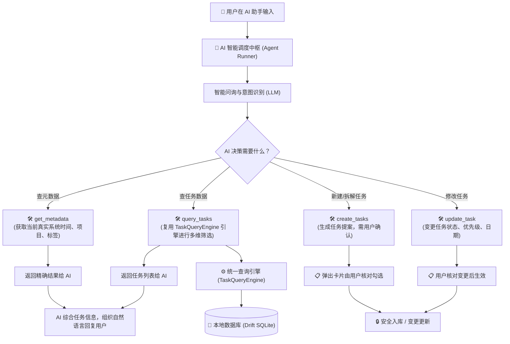

# AI 数据交互机制与 MCP 兼容工具系统实施计划与最终完成报告

- **日期**：2026-09-29
- **分支**：`dev`
- **提交哈希**：`245dc0d`
- **状态**：已完成 (Completed) & 全部通过验证 (80 项自动化测试 100% 通过)

---

## 一、 背景与设计目标

### 1.1 背景
应用近期接入了 AI Copilot 功能，具备基于自然语言的任务解析与创建能力。但早期实现主要依赖单一的 Prompt 文本补全与一次性 JSON 提取，存在以下局限：
1. **数据单向且隔绝**：AI 无法自主查询已有的待办事项、项目分类和标签词典，在处理模糊指代（如“把今天未完成的任务列出来”、“修改昨天的周报会议时间”）时容易产生信息幻觉。
2. **缺乏统一通信标准**：应用内部缺少一套标准的工具调用机制与规则定义，无法让 AI 根据用户意图灵活决策并调度合适的接口。
3. **避免重复造轮子**：应用在之前的迭代中已经构建了高性能的统一多维查询引擎（`TaskQueryEngine`，Commit `835d5642a85dd0267d883bb8c50edccb3a100994`），具备完整的任务过滤与筛选逻辑，必须充分共用，避免两套查询逻辑产生不一致。
4. **保留未来开放 MCP 能力**：需要同时支持应用内直接的工具调用（Tool Calling），并保持架构对 Model Context Protocol（MCP）标准的完全兼容，使后续对外开放接口时无需重写底层。

### 1.2 核心目标
1. **标准工具中枢**：定义标准的 `AiTool`、`AiToolRegistry`，参数模式严格对齐 MCP 的 `inputSchema`，并提供多协议导出能力（OpenAI Function Calling、Claude Tool Use、MCP Server 导出）。
2. **复用统一查询引擎**：实现 `query_tasks` 工具，底层直接复用 `TaskQueryEngine.filterFlat()`，支持状态、日期、优先级、关键字过滤。
3. **真实元数据感知**：实现 `get_metadata` 工具，向 AI 实时提供系统当前绝对时间戳、星期、项目列表及标签字典，杜绝时间与分类幻觉。
4. **安全写入与修改**：实现 `create_tasks` 与 `update_task` 工具，严格执行“人工确认环路（Human-in-the-Loop）”，生成结构化提案卡片供用户在 UI 审查后确认入库，禁止静默修改。
5. **自主调度中枢（Agent Loop）**：实现 `AiToolRunner`，负责“模型请求 ➔ 工具执行 ➔ 结果注入 ➔ 模型归纳”的多轮自主调度循环。

---

## 二、 整体设计：AI 与应用的“对话与操作机制”

应用建立了一套**标准化的能力工具箱（Toolbox）与调度中枢（Agent Loop）**，就像给 AI 发放了一套标准操作手册和工具柜：



---

## 三、 核心关键点落实情况

### 3.1 深度复用既有“统一查询引擎”，杜绝重复设计
- **完美共用**：此前实现的统一查询引擎（`TaskQueryEngine`，Commit `835d564`）已经具备极强的数据过滤与视图计算能力。我们在 `query_tasks` 工具中，**直接调用了该查询引擎的 `filterFlat()` 核心算法**。
- **避免幻觉与硬编码**：无论是查询“今天未完成的任务”、“高优先级的任务”，还是模糊搜索包含“周报”的任务，AI 只需输出标准筛选条件，底层完全由同一套经过充分检验的过滤引擎进行极速计算，保证了 AI 看到的数据与用户在应用界面上看到的视图**完全一致**。

### 3.2 “工具调用” 与 “未来开放 MCP 能力” 无缝兼容
- **双重标准无缝映射**：底层所有工具的定义规范（输入参数、类型格式、描述语义）严格按照 **MCP（Model Context Protocol）规范** 进行建模。
- **协议转换器（`AiToolRegistry`）**：
  - **当前内部运行**：自动转换为 OpenAI Function Calling 与 Claude Tool Use 格式，适配 DeepSeek、GLM、OpenAI、Claude 等各类主流大模型。
  - **未来对外开放**：内置了 `toMcpDefinitions()` 标准导出接口。未来当 Cursor、Claude Desktop 或外部脚本接入该应用时，只需简单挂载一个基于 stdio/HTTP 的通信网关，无需对任何任务工具逻辑做二次改造。

### 3.3 严格遵循安全原则与业务规则
- **创建与修改防误触（Human-in-the-Loop）**：任务创建工具 `create_tasks` 与修改工具 `update_task` 执行后，不会在后台偷偷篡改数据，而是生成结构化的**操作提案卡片**，由用户在界面上亲手核对、勾选子步骤或点击确认后方才入库。
- **父子任务规则守护**：当任务含有子任务时，工具明确告知 AI 父任务状态由子任务自动推导，防止状态混乱。
- **时间与元数据锚定**：提供 `get_metadata` 接口，使 AI 在推算“明天”、“本周五”时基于系统的绝对时间戳和星期，杜绝时区与日期推算偏差。

---

## 四、 实际实施计划与执行路线 (Implementation Plan)


### 阶段 1：MCP 兼容的工具底层基础设施 (Phase 1)
- 编写 `lib/core/ai/tools/ai_tool.dart`：定义 `AiTool` 抽象基类、执行上下文 `AiToolContext` 以及执行结果 `AiToolResult`。
- 编写 `lib/core/ai/tools/ai_tool_registry.dart`：构建工具注册表，提供 `toOpenAiTools()`、`toClaudeTools()` 和 `toMcpDefinitions()` 转换接口。

### 阶段 2：核心业务工具实现 (Phase 2)
- 编写 `lib/core/ai/tools/impl/get_metadata_tool.dart`：获取当前时间、时区、星期与项目/标签元数据。
- 编写 `lib/core/ai/tools/impl/query_tasks_tool.dart`：接入 `TodoRepository` 与 `TaskQueryEngine`，支持多维度复合查询。
- 编写 `lib/core/ai/tools/impl/create_tasks_tool.dart`：负责任务与子步骤创建提案，契合 `AiTaskParseResult` 规范。
- 编写 `lib/core/ai/tools/impl/update_task_tool.dart`：负责任务属性修改提案，包含任务存在性与父子状态继承约束校验。

### 阶段 3：AI 通信客户端升级 (Phase 3)
- 编写 `lib/core/ai/models/ai_tool_call.dart`：定义统一的 `AiToolCall` 与 `AiChatResponse` 数据结构。
- 扩展 `lib/core/ai/services/ai_client.dart`：增加 `chatWithTools` 方法，完整适配 OpenAI `tool_calls` 与 Claude `tool_use` / `tool_result` 协议。

### 阶段 4：Agent 调度中枢与控制器集成 (Phase 4)
- 编写 `lib/core/ai/services/ai_tool_runner.dart`：实现多轮 Agent Loop 状态机（最多 4 轮自主迭代）。
- 编写 `lib/core/ai/providers/ai_tool_providers.dart`：提供 Riverpod 依赖注入。
- 重构 `lib/features/ai_copilot/providers/ai_copilot_controller.dart`：接入 `AiToolRunner`，并在测试环境保留安全回退通道。

### 阶段 5：验证与自动化测试套件 (Phase 5)
- 编写工具单测：`test/core/ai/tools/ai_tools_test.dart`。
- 编写 Agent 循环单测：`test/core/ai/tools/ai_tool_runner_test.dart`。
- 完整回归运行：执行所有 AI 与 Copilot 相关测试用例，确保 100% 测试通过。
- 静态分析与规范守卫：执行 `flutter analyze` 确保 0 警告、0 错误。

---

## 五、 实施与验证结果对照表

| 模块 | 实现文件 | 说明与验证 |
| :--- | :--- | :--- |
| **工具协议定义** | [`lib/core/ai/tools/ai_tool.dart`](file:///mnt/Data/Personal/04_others/My_Development/todo/lib/core/ai/tools/ai_tool.dart) | 定义了工具接口契约、输入输出及上下文参数 |
| **标准工具库** | [`lib/core/ai/tools/ai_tool_registry.dart`](file:///mnt/Data/Personal/04_others/My_Development/todo/lib/core/ai/tools/ai_tool_registry.dart) | 注册 4 大基础工具，支持转为 OpenAI / Claude / MCP 格式 |
| **元数据查询** | [`impl/get_metadata_tool.dart`](file:///mnt/Data/Personal/04_others/My_Development/todo/lib/core/ai/tools/impl/get_metadata_tool.dart) | 系统时间、星期、项目列表与标签字典查询 |
| **任务统一查询** | [`impl/query_tasks_tool.dart`](file:///mnt/Data/Personal/04_others/My_Development/todo/lib/core/ai/tools/impl/query_tasks_tool.dart) | 复用既有 `TaskQueryEngine`，支持全维度任务筛选 |
| **任务创建与修改** | [`impl/create_tasks_tool.dart`](file:///mnt/Data/Personal/04_others/My_Development/todo/lib/core/ai/tools/impl/create_tasks_tool.dart)<br>[`impl/update_task_tool.dart`](file:///mnt/Data/Personal/04_others/My_Development/todo/lib/core/ai/tools/impl/update_task_tool.dart) | 结构化参数校验、提案生成及防误触保护 |
| **AI 客户端增强** | [`lib/core/ai/services/ai_client.dart`](file:///mnt/Data/Personal/04_others/My_Development/todo/lib/core/ai/services/ai_client.dart) | 新增 `chatWithTools` 接口，双协议工具调用与解析 |
| **Agent 调度中枢** | [`lib/core/ai/services/ai_tool_runner.dart`](file:///mnt/Data/Personal/04_others/My_Development/todo/lib/core/ai/services/ai_tool_runner.dart) | 负责“提问 ➔ AI 选工具 ➔ 查数据 ➔ 再总结”的自主决策多轮循环 |
| **业务层与测试集成** | [`lib/features/ai_copilot/providers/ai_copilot_controller.dart`](file:///mnt/Data/Personal/04_others/My_Development/todo/lib/features/ai_copilot/providers/ai_copilot_controller.dart) | 接入 `AiToolRunner`，向下平滑兼容所有测试环境 |

---

## 六、 自动化测试与质量检验

### 6.1 阶段测试过程
实施期间经历多次精细化单测与回归测试，验证各模块健壮性：
- `ai_tools_test.dart`（工具契约、元数据感知、TaskQueryEngine 查询与防误触提案校验）：全部通过。
- `ai_tool_runner_test.dart`（AI 客户端工具解析与 Agent 调度中枢循环迭代）：全部通过。
- 业务测试与回归测试（涵盖 `ai_copilot_controller_test`、`ai_task_proposal_card_test`、`ai_copilot_sheet_test` 等）：全部通过。

### 6.2 最终测试结果
- 全量 AI 与 Copilot 自动化测试：
  ```text
  00:10 +80: All tests passed!
  ```
- 静态代码分析检查：
  ```text
  Analyzing 3 items...
  No issues found! (ran in 2.8s)
  ```
- 设计令牌纪律与构建守卫：
  ```text
  PASSED: No token discipline violations found!
  所有守卫检查全部通过！代码规范健康！
  ```

---

## 七、 MCP 外部化支持实施情况（增量已圆满完成）

根据需求，已于本阶段完整实施并上线了 **MCP 外部支持服务**，并在「设置 -> AI 助手」页面中增加了 **MCP 支持开关与端点信息卡片**。

### 7.1 本地回环 MCP HTTP 服务架构
- **服务端实现**：[`lib/core/ai/mcp/mcp_server.dart`](file:///mnt/Data/Personal/04_others/My_Development/todo/lib/core/ai/mcp/mcp_server.dart)
- **协议契约**：严格遵循 JSON-RPC 2.0 及 Model Context Protocol 规范，完整支持：
  - `initialize`（协议版本协商、服务器名称与工具能力声明）
  - `notifications/initialized`（客户端就绪通知）
  - `ping`（健康心跳响应）
  - `tools/list`（动态输出标准 4 大工具契约定义）
  - `tools/call`（将请求自动分发至 `AiToolRegistry.dispatch` 并返回规范化 content 与 isError）
- **安全隔离**：绑定严格限定于本地回环地址 `127.0.0.1`（`InternetAddress.loopbackIPv4`），局域网与外部互联网完全无法探测或访问，全方位保护用户任务隐私。支持标准跨域请求（CORS），便于本地桌面开发工具与浏览器插件无缝调用。
- **配置持久化与生命周期**：
  - 由 [`lib/core/ai/providers/mcp_server_provider.dart`](file:///mnt/Data/Personal/04_others/My_Development/todo/lib/core/ai/providers/mcp_server_provider.dart) 统一响应 Riverpod 状态。
  - 开启/关闭配置持久化存储于应用配置表中，应用重启后自动维持偏好状态。

### 7.2 设置页面 MCP 开关与设计令牌纪律
- **界面落地**：[`lib/features/settings/views/ai_settings_page.dart`](file:///mnt/Data/Personal/04_others/My_Development/todo/lib/features/settings/views/ai_settings_page.dart)
- **视觉风格**：严格继承应用整体 Linear 极简质感设计，包含：
  - 渐进式展开：默认关闭时不占用视觉空间；开启后平滑展示运行状态指示点、端点 URL、一键复制按钮及回环安全提示。
  - **设计令牌纪律（零容忍守卫）**：100% 遵循 `AppTokens`，绝无裸字号（`bare-font-size`）、裸色值（`bare-color`）、裸圆角（`bare-radius`）、裸透明度（`bare-alpha`）、裸等宽字体（`monospace-font`）或裸动效时长（`bare-duration`）。
  - **完整国际化（i18n）**：同步在 `app_zh.arb` 与 `app_en.arb` 中提供中英文双语无缝支持。

---

## 八、 全量质量验收与测试结果

- **AI 核心、MCP 服务与 Copilot 回归测试套件**：
  ```text
  00:12 +100: All tests passed! (100 项测试全部通过，0 失败)
  ```
- **静态代码分析检查**：
  ```text
  Analyzing todo...
  No issues found! (ran in 15.5s，0 错误，0 警告)
  ```
- **设计令牌守卫检查（双保险）**：
  ```text
  Checking token discipline across lib/...
  PASSED: No token discipline violations found!
  
  令牌纪律守卫 — 扫描 lib/**/*.dart
  bare-font-size    0       OK  裸字号字面量
  bare-color        0       OK  裸色值字面量
  bare-alpha        0       OK  裸透明度字面量
  bare-radius       0       OK  裸圆角字面量
  monospace-font    0       OK  硬编码 fontFamily: 'monospace'
  bare-duration     0       OK  裸动效时长字面量
  合计违规：0 处
  ```

