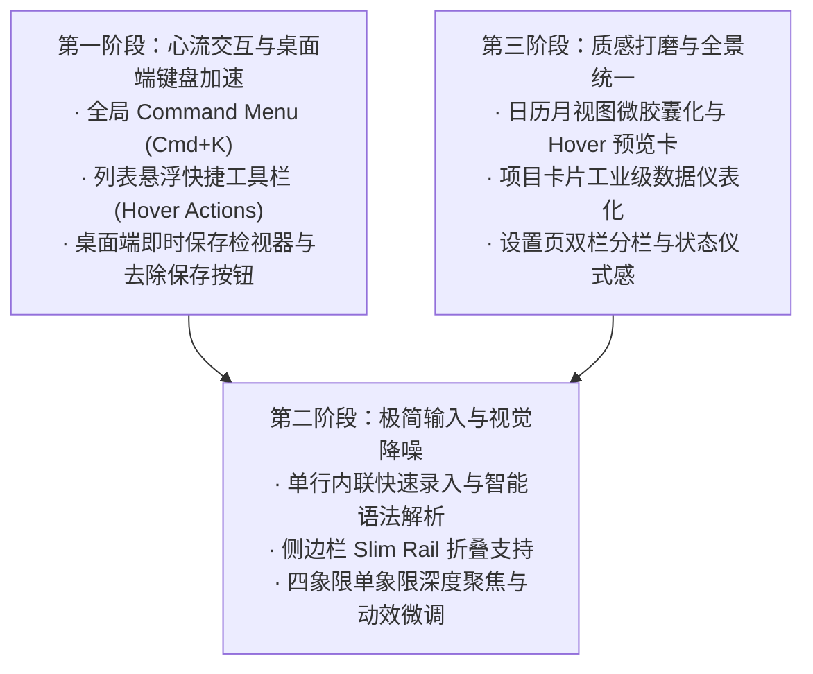

# 乔布斯视角：知序 (Ordo) 全流程界面与交互极致打磨计划

> **“简单可能比复杂更难：你必须努力理清思路，才能让它变得简单。但最终这是值得的，因为一旦你做到了，你就能移山倒海。” —— 史蒂夫·乔布斯**
>
> **设计基石**：以乔布斯式的直觉极简（Pure Intuition & Zero Friction）为灵魂，以 Linear 风格的高密度、极细线条与键盘优先（Linear Aesthetics & Keyboard First）为骨肉，严格恪守已有的统一设计令牌体系（[`AppTokens`](file:///mnt/Data/Personal/04_others/My_Development/todo/lib/core/theme/app_tokens.dart)）。

---

## 0. 总体设计哲学与评审定调

这是一份毫不留情的审视报告。
我看了知序现在的整个产品。底层数据架构和离线同步很扎实，功能也很全面——但作为一款面向追求效率、秩序与心灵平静的人的工具，它现在**依然带着太多的“工程师思维”和“传统手机 App 生搬硬套”的痕迹**。

### 我们的三项铁律：
1. **没有任何一个多余的像素**：如果一个边框、一个图标或一行分割线不能让用户更快理解信息，就立刻删掉它。界面应该像经过阳极氧化打磨的铝合金一样平滑、纯粹。
2. **手不离键盘的光速心流（Linear-grade Speed）**：在桌面端，让用户拿起鼠标去找按钮，是对用户时间的谋杀。搜索、新建、切换清单、标完成、调优先级，全部必须在半秒内通过指尖敲击完成。
3. **呼吸感与精致度（Invisible Craftsmanship）**：设计令牌覆盖不到的地方，全面贯彻 Linear 质感——暗色模式下深邃的炭黑底色（`#0D0E11`）、1px 极微发光描边（`0x0FFFFFFF`）、微物理弹簧回弹（`Curves.easeOutCubic`）、Tabular Figures 等宽数字纵向精准对齐。

---

## 1. 全局导航与应用外壳流程（App Shell & Navigation）

### 1.1 现状审视
- **桌面侧边栏（[`AppSidebar`](file:///mnt/Data/Personal/04_others/My_Development/todo/lib/shared/widgets/app_drawer.dart)）**：固定宽度 260dp 无法折叠。当用户需要专注于当前清单或在小屏笔记本上工作时，它强占了宝贵的横向空间。
- **移动端与桌面端的过渡**：移动端依赖顶部标题点击唤起 [`ScopeSwitcherSheet`](file:///mnt/Data/Personal/04_others/My_Development/todo/lib/shared/widgets/scope_switcher_sheet.dart)，但桌面端将侧边栏常驻后，顶部的交互逻辑没有形成闭环联动。
- **全局缺乏 Command Menu（命令行/快速跳转面板）**：这是现代生产力工具的灵魂，知序目前只有传统的 `/search` 页面。

### 1.2 极致改进方案
1. **侧边栏无级折叠 / Slim Rail 模式**：
   - 增加快捷键 `Cmd/Ctrl + B` 或左上角悬浮微按钮，支持侧边栏平滑折叠为 64dp 极简图标栏（Slim Navigation Rail），仅展示微徽标与色彩点；再次点击或按键展开为 260dp 全功能栏。
   - 动效采用 `AppTokens.motionNormal` (250ms) + `AppTokens.motionSpring`，伴随文字淡出与图标居中对齐，丝滑无卡顿。
2. **全局 Command Menu (`Cmd + K` / `Ctrl + K`)**：
   - 在任何界面按下 `Cmd+K`，屏幕中央平滑浮出居中模糊毛玻璃命令面板（Linear 标志性交互）：
     - 瞬时模糊背景（`BackdropFilter(sigma: 16)` + `AppTokens.alphaScrim`）；
     - 输入关键词即可混合搜索：待办任务、项目清单、标签、自定义视图，甚至是应用操作（“新建任务”、“打开设置”、“同步数据”、“切换深色模式”）；
     - 键盘上下键 `↑/↓` 选中高亮，`Enter` 瞬时执行，`Esc` 消失。彻底消灭在各个界面间穿梭的多余点击。
3. **侧边栏项目树视觉降噪**：
   - 遵循 Linear 风格，系统项（今日、收集箱、日历、概览、四象限）与文件夹清单项采用极细灰阶区分；
   - 选中态：放弃大面积刺眼的背景色块，采用 `primary.withValues(alpha: AppTokens.alphaTintSoft)` 浅透圆角矩形，左侧带有 3px 高亮竖线或微发光边缘；未选中态鼠标悬浮时仅给 `alphaTintFaint` 极淡微反馈。

---

## 2. 核心任务工作流（Core Task Flow）

### 2.1 任务列表与任务行（TaskListPage & TaskRow）
#### 现状审视：
- 任务行在桌面端鼠标悬浮时缺乏快速动作，用户必须“点击进入详情”或者“右键菜单”才能修改日期或优先级。
- 任务勾选的反馈虽然有弹性动画，但完成瞬间的去留逻辑略显生硬（是立即消失还是原地划线？）。
- 桌面端鼠标拖拽需要“长按”（`LongPressDraggable`），这在触屏上是合理的防误触，但在桌面鼠标操作中让人感觉极其迟钝。

#### 极致改进方案：
1. **桌面端鼠标悬浮敏捷工具栏（Hover Actions）**：
   - 当鼠标滑过任何一行 [`TaskRow`](file:///mnt/Data/Personal/04_others/My_Development/todo/lib/features/tasks/widgets/task_row.dart) 时，右侧子任务计数区平滑微淡出，**就地浮现 3 个高频微图标按钮**（仅占 72dp 宽度）：
     - ① 设置日期（快速弹出微型日期浮层）；
     - ② 设置优先级（直接循环切换或弹出微菜单）；
     - ③ 更多操作（`...`）。
   - 鼠标移开时，无缝恢复原来的元数据与展开箭头。列表常态保持极致静谧，互动时瞬现力量。
2. **彻底解决桌面端拖拽迟钝感**：
   - 在桌面端（`!isNarrow`），废除鼠标必须按住 500ms 的长按检测；悬浮时在任务行最左侧呈现 6 点拖拽柄（Drag Handle），或者直接允许直接拖动抓取（`Draggable` 配合延迟 0ms），拖拽时行体轻微倾斜 1.5° 并带有 `AppTokens.cardShadowDarkHoverList` 投影，展现如同物理纸片的灵动。
3. **完成任务的微神迹（The "Done" Micro-Joy）**：
   - 勾选方框 [`ModernCheckbox`](file:///mnt/Data/Personal/04_others/My_Development/todo/lib/shared/widgets/modern_checkbox.dart) 时的弹性缩放（`checkboxBounceScale: 1.15`）保持，但在此刻注入微触感反馈（桌面端轻微动画，移动端 Haptic Feedback `lightImpact`）；
   - 文本划线动效（[`AnimatedStrikethrough`](file:///mnt/Data/Personal/04_others/My_Development/todo/lib/shared/widgets/animated_strikethrough.dart)）从左至右擦过，透明度平滑衰减至 `AppTokens.doneContentOpacity` (0.55)，在原地停留 800ms 后再平滑折叠高度并滑入“已完成”折叠分组中，让用户清晰感知到“我完成了一件事”的成就感，而不是突兀地消失。

### 2.2 任务创建与快速捕获（Quick Capture）
#### 现状审视：
- 目前移动端点击 FAB 弹出 [`TaskCreateSheet`](file:///mnt/Data/Personal/04_others/My_Development/todo/lib/features/tasks/widgets/task_create_sheet.dart)，桌面端在顶栏提供新建按钮。弹出的表单包含了较多的输入项（标题、备注、项目、时间、优先级、标签、子任务），虽然全面，但如果我只想快速记下一句话，这个过程太“重”了。

#### 极致改进方案：
1. **无感内联快速录入（Linear Inline Quick Add）**：
   - 在桌面端任务列表的顶部（或分组顶部），始终保留一行半透明、安静的内联输入框：“*+ 添加待办，按回车保存 (Enter)*”；
   - 用户敲击键盘 `C`（或点击该行），输入框瞬时激活高亮；
   - **智能单行语法（Smart Quick Parsing）**：用户输入 `给产品经理发邮件 明天 !高 #工作`，系统在键入时实时高亮识别，自动提取出：截止时间为明天、优先级为高、标签为工作，按下 `Enter` 瞬间在下方插入一条新任务，同时光标自动留在输入框中准备下一条！
   - 按 `Esc` 退出输入。这种连续输入体验是让重度用户爱不释手的关键。
2. **移动端手势呼出与沉浸弹窗**：
   - 移动端在列表顶部向下拉动超出一定阈值时（Over-scroll pull down），直接触发新建输入条，无需大拇指费力移至屏幕角落找 FAB。

### 2.3 任务编辑与检视面板（TaskEditPage & Dual-Pane Inspector）
#### 现状审视：
- 桌面端目前支持双栏（`isDualPane` 时右侧宽 420dp 展示 [`TaskEditPage`](file:///mnt/Data/Personal/04_others/My_Development/todo/lib/features/tasks/task_edit_page.dart)），但右侧直接套用了移动端全屏页的结构，顶部带有一个大大的 AppBar 和显式的“保存”按钮。
- 用户必须手动点击保存，离开时还要弹窗拦截“是否放弃修改”。在现代桌面应用（如 Linear、Notion、Things）中，这种模式已经过时了。

#### 极致改进方案：
1. **零保存按钮，全字段即时响应（Auto-Save by Nature）**：
   - 彻底干掉检视面板的“保存”按钮和离开拦截弹窗。
   - 用户修改标题、修改描述、勾选子任务、变更截止时间，每一个操作都在失焦或变动 300ms 后静默写入本地数据库。
   - 面板右上角仅保留一个微小的状态微标：同步完毕显示极淡的“已保存”，发生变更瞬间转动一下即变回对勾。
2. **轻量化面板头部**：
   - 移除笨重的 AppBar，改为一行精巧的 Breadcrumb（面包屑），如：`工作 / Q3 迭代 / 任务详情`，右侧仅一个精致的 `Esc` 关闭图标。
3. **属性网格化与高密度排列**：
   - 标题下方使用 Linear 经典的二维属性栅格（Property Grid）：
     - 状态（Todo / In Progress / Done）
     - 负责人/清单
     - 截止日期与提醒
     - 优先级
     - 标签
   - 每个属性项紧凑排布在 32dp 行高的微容器中，点击即呼出悬停小微卡，无需跨层级跳转。

---

## 3. 四象限时间管理矩阵流（Eisenhower Matrix Flow）

### 3.1 现状审视
- 四象限主界面（[`QuadrantPage`](file:///mnt/Data/Personal/04_others/My_Development/todo/lib/features/quadrant/presentation/quadrant_page.dart)）提供了 2x2 网格与单列列表切换，功能非常完整，跨象限拖拽也已经支持纯属性流转。
- 问题在于：在 2x2 模式下，当某一个象限（比如“重要且紧急”）任务特别多时，四个象限高度被锁在同一屏内，容易出现局部频繁滚动、视觉空间拥挤的窘迫感。

### 3.2 极致改进方案
1. **单象限“沉浸式聚焦”（Quadrant Deep Dive）**：
   - 在 2x2 网格的每个象限卡片右上角，增加一个微小的“最大化聚焦”图标（或双击象限头部）；
   - 点击时，当前象限伴随平滑的 Shared Axis 共享元素展开动效，瞬间铺满中间主区域，其他三个象限平滑缩进为边缘指示条；
   - 用户此时进入“紧急重要深度处理状态”，按 `Esc` 或点击还原按钮，平滑缩回 2x2 矩阵。
2. **拖拽悬停时的“磁吸与光晕反馈”**：
   - 当用户抓取一张任务卡片拖动到另一个象限上方时，目标象限的边框不应只是简单的变色，而应呈现类似 Linear / macOS 窗口的微光流动效果（1px 柔和发光描边），底色微亮，下方任务自动平滑让位，释放卡片时带有弹簧落定质感。

---

## 4. 全景日历与日程编排流（Calendar & Timeline Flow）

### 4.1 现状审视
- 日历页面（[`CalendarPage`](file:///mnt/Data/Personal/04_others/My_Development/todo/lib/features/calendar/calendar_page.dart)）融入了农历、二十四节气和法定节假日班休，本土化非常深刻。
- 视觉与交互层面的瑕疵：
  - 月视图格子中的任务仅用彩色圆点或文字截断展示，当某一天有 4-5 个任务时，圆点挤在一起缺乏辨识度；
  - 宽屏下左侧月历 + 右侧议程分栏固定，右侧议程列表与常规任务列表样式不完全统一。

### 4.2 极致改进方案
1. **月视图单元格的信息阶次与微胶囊**：
   - 放弃枯燥的纯小圆点，改用类似 Notion Calendar 的超轻量微条（Micro Task Bars）：
     - 单元格顶部保留日期数字与微小农历（`textCalendarCellMicro: 9`）；
     - 下方最多渲染 2 条带优先级的单行文本微条（高度 16dp，字体 10dp，圆角 3dp）；
     - 多于 2 条时显示 `+2 更多` 微标。
   - 鼠标悬浮在某一单元格时，弹出精致的 Hover Card，悬空预览当日所有任务清单，无需点进去切换。
2. **“今天”的视觉呼吸**：
   - 当天（Today）的单元格数字不只是简单的实色圆圈，在其底层增加极淡的琥珀金/系统主题色微光晕，一眼便能捕捉到当前时间锚点。
3. **日历上的直接交互**：
   - 允许直接将右侧未安排日期的任务拖拽扔到左侧的日历格子里，或者在格子上双击直接原地呼出日期预设好的新建微浮层。

---

## 5. 项目、文件夹与概览流（Projects & Overview Flow）

### 5.1 现状审视
- 概览页面（[`ProjectsPage`](file:///mnt/Data/Personal/04_others/My_Development/todo/lib/features/projects/projects_page.dart)）通过卡片展示文件夹与项目，顶部有全景统计环。
- 问题：项目卡片（[`ProjectCard`](file:///mnt/Data/Personal/04_others/My_Development/todo/lib/features/projects/widgets/project_card.dart)）的视觉语言略显厚重，卡片投影和内部元素比例还可以更克制；多文件夹展开时缺乏整体节奏。

### 5.2 极致改进方案
1. **Linear 工业级指标卡片化**：
   - 废弃厚重的阴影，采用精致的 1px 细发光边框（`borderSubtle`）配合深炭黑背景；
   - 卡片内部布局升级为三段式精密仪表：
     - 上段：项目图标（带有 10dp 质感圆角） + 项目名称 + 快捷操作 `...`；
     - 中段：极细无缝进度条（高度从 4dp 缩减至 2.5dp，带平滑渐变与发光微端）；
     - 下段：左右对齐的元数据——左侧为未完成待办数，右侧为“最近更新时间”或“离最近截止日还有 X 天”。
2. **归档与空文件夹折叠**：
   - 已完成所有任务的项目卡片提供柔和的“归档沉淀态”，整体透明度降为 0.6，避免在日常工作中喧宾夺主。

---

## 6. 自定义视图与看板流（Custom Views & Kanban Flow）

### 6.1 现状审视
- 自定义视图（[`CustomViewPage`](file:///mnt/Data/Personal/04_others/My_Development/todo/lib/features/custom_views/presentation/custom_view_page.dart)）支持看板（Kanban）和列表模式，功能强大。
- 编辑器（[`CustomViewEditorPage`](file:///mnt/Data/Personal/04_others/My_Development/todo/lib/features/custom_views/presentation/custom_view_editor_page.dart)）的筛选规则配置目前偏向表单列表，缺少类似现代数据库工具的连贯筛选表达。

### 6.2 极致改进方案
1. **多栏看板（Kanban）物理质感升级**：
   - 看板各列背景使用 `surfaceSunkenDark`（低于页面层级的下凹槽），列头使用大写等宽 Section Label（`fontSize: 11, fontWeight: FontWeight.w600, letterSpacing: 0.8`）；
   - 卡片在列间拖动时，列高自适应伸缩，放置卡片时伴随轻柔的重力弹簧动效。
2. **胶囊级动态筛选器（Filter Pills Bar）**：
   - 规则编辑器顶部采用“即选即现”的胶囊栏：点击 `+ 规则`，弹出极简微菜单选择字段（状态 / 优先级 / 标签 / 项目），选择后直接在头部生成交互胶囊：`[ 优先级 是 高 × ]`；
   - 点击胶囊随时反选或删除，修改实时反馈在背景预览中。

---

## 7. 全局搜索流（Search Flow）

### 7.1 现状审视
- [`SearchPage`](file:///mnt/Data/Personal/04_others/My_Development/todo/lib/features/search/search_page.dart) 提供了 300ms 防抖的即时搜索和维度过滤条，但作为一个单独的页面跳入跳出，打断了用户当前的工作场景。

### 7.2 极致改进方案
1. **将搜索升华为全局 Omni-Search / 快捷抽屉**：
   - 在桌面端，搜索框不应把用户带到一个全新的空白页面，而是直接在当前页面顶端展开，或者与前述的 `Cmd+K` Command Menu 深度融合；
2. **精准高亮与高密度结果流**：
   - 匹配的文字片段采用柔和的高亮底色（`colorNavToday.withValues(alpha: 0.2)`）；
   - 结果行清晰展示该任务所属的项目面包屑（如 `工作 / 基础设施`），按下方向键可以直接预览内容。

---

## 8. 设置、同步与数据资产流（Settings & Data Infrastructure）

### 8.1 现状审视
- 设置页面（[`SettingsPage`](file:///mnt/Data/Personal/04_others/My_Development/todo/lib/features/settings/settings_page.dart)）采用单一长列表，虽然清晰，但在大屏幕上显得有点单调。
- 同步与数据安全功能（快照回滚、WebDAV/S3 同步）极为强大，但状态展示略显工程化。

### 8.2 极致改进方案
1. **分栏式设置面板（桌面端）**：
   - 宽屏下升级为双栏：左侧为极简导航列表（外观个性化、日历偏好、云端同步、数据与快照、关于），右侧为当前选中的配置卡片，彻底避免滚动长列表带来的迷失感。
2. **同步状态的仪式感**：
   - 同步成功时不只是简单的一行字，而在状态卡片右上角呈现极其精致的脉冲微光绿点（Live Status Pill）；
   - 网络断开或同步异常时，提供明确而有温度的引导，坚决避免暴露出底层未处理的 raw exception 堆栈。

---

## 9. 界面风格未覆盖区域的 Linear 风格落地规范

对于现存代码中尚未完全被 `AppTokens` 覆盖或零星写死的地方，统一制定 Linear 风格补齐法则：

| 元素 | Linear 规范要求 | 设计令牌与实现准则 |
|---|---|---|
| **底色层级** | 严格分为四层深度 | `surfacePageDark` (`#0D0E11`) → `surfaceSunkenDark` (`#12141A`) → `surfaceCardDark` (`#16181D`) → 悬浮卡片 (`#1E2026`) |
| **描边质感** | 1px 极微发光轮廓 | 暗色下使用 `borderSubtleDark` (`0x0FFFFFFF`)，悬浮态使用 `borderSubtleHoverDark` (`0x28FFFFFF`) |
| **投影体系** | 多层漫反射微阴影 | 坚决避免单层粗糙大黑影，采用 `cardShadowDarkList` 双层柔和弥散阴影 |
| **字体排印** | 高度对齐与等宽数字 | 日期、时间、百分比一律声明 `fontFeatures: AppTokens.fontTabular`，字号严格依循七档字阶 |
| **键盘聚焦环** | Linear 标志性光环 | 任何处于键盘聚焦态的控件，外围包裹 2px 半透明种子色发光轮廓（`seedColor.withValues(alpha: 0.4)`） |

---

## 10. 实施优先级与演进路线图

我们将整个打磨规划分为三个节奏紧凑的战役阶段：

- **Phase 1（核心突破）**：主攻桌面端体验短板，立刻引入 Command Menu、悬浮快捷操作和自动保存检视器，让效率直接飙升至 Linear 水平。
- **Phase 2（输入革命）**：攻克单行智能快速输入，让新建任务畅快如流水，同时补齐侧边栏折叠与四象限聚焦。
- **Phase 3（工艺登峰）**：精雕细琢日历微条、项目卡片仪表盘和设置页分栏，将每个界面的视觉品质打磨到如同工业艺术品。
