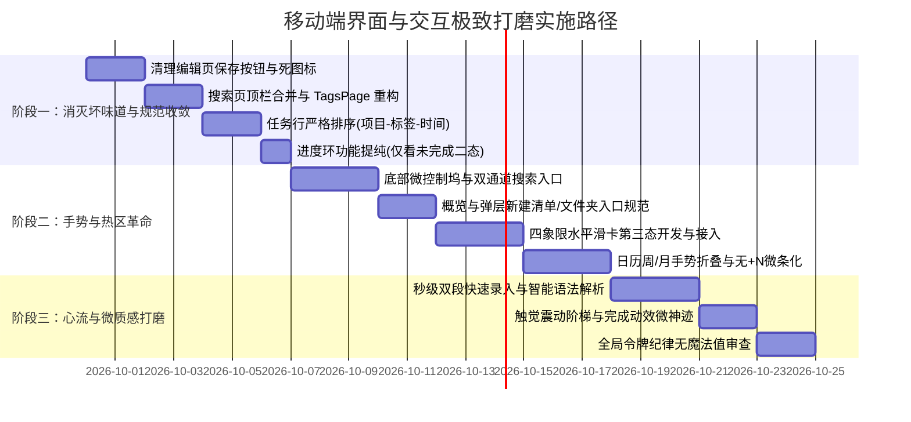

# 乔布斯视角：知序 (Ordo) 移动端全流程界面与极致交互打磨计划（仅针对移动端）

> **“大多数人以为设计只是外表，是给东西包装上一层漂亮的皮。但对于我们，设计远不止于此。设计是事物的核心灵魂，是产品运转的根本方式（Design is not just what it looks like and feels like. Design is how it works）。” —— 史蒂夫·乔布斯**
>
> **设计基石**：以乔布斯式的直觉极简（Pure Intuition & Zero Friction）为灵魂，以 Linear 移动端的高密度、极细线条与微发光描边（Linear Mobile Aesthetics）为骨肉，严格恪守已有的统一设计令牌体系（[`AppTokens`](file:///mnt/Data/Personal/04_others/My_Development/todo/lib/core/theme/app_tokens.dart)）。**严禁任何硬编码魔法值**，未覆盖处一律扩展令牌体系。本文档**仅聚焦移动端体验**，桌面端暂不涉及。

---

## 0. 总体设计哲学与令牌铁律

这是对“知序”在手机端全流程交互、视觉节奏与人体工学的系统审视。

移动端设备的核心物理特征：**屏幕在 6 英寸左右，用户以单手在下半屏大拇指活动区操作，场景多为行进中、碎片化、心智受限的瞬间**。
我们必须坚决剔除任何“桌面端生搬硬套”与“原生 Material 控件拼凑”的痕迹，让产品像一件经过精工雕琢的手持工艺品一样自然。

### 我们的四项移动端铁律：
1. **拇指优先（The Thumb Zone Rule）**：所有高频操作（切换视图、新建待办、搜索、完成与改期）必须能够在单手握持状态下，大拇指无需位移即可自然触达。彻底消灭“单手伸到屏幕最顶端找功能”的反人类操作。
2. **零多余像素（Zero Redundant Pixels）**：不允许出现信息重复（如右侧已有子任务计数，下方又写一遍；AppBar 写“搜索”下方又画搜索框），更严禁任何“置灰且点击提示即将推出”的死按钮。
3. **绝对令牌纪律（Zero Magic Values）**：应用中所有字体大小、字重、色值、不透明度（Alpha）、圆角、间距、动效时长与曲线，**100% 接入设计令牌（[`AppTokens`](file:///mnt/Data/Personal/04_others/My_Development/todo/lib/core/theme/app_tokens.dart)）**。若缺少相应令牌，一律在 `AppTokens` 中新增标准化定义，绝不允许在 UI 代码中书写任何裸数字或硬编码颜色。
4. **呼吸感与触觉微神经（Tactile Micro-delight）**：令牌覆盖之处全面贯彻 Linear 移动端质感——深沉低调的炭黑（`AppTokens.surfacePageDark` / `AppTokens.surfaceCardDark`）、1px 极微发光描边（`AppTokens.borderSubtleDark`）、等宽数字对齐（`AppTokens.fontTabular`）、物理阻尼橡皮筋回弹，配合 iOS 级触觉震动反馈（Taptic Engine），让每一次触控都极具机械精密感。

---

## 1. 全局导航与底壳手势体系（App Shell & Navigation Flow）

### 1.1 现状审视
- **反人体工学的“顶栏下拉”**：目前窄屏移动端（[`AppShell`](file:///mnt/Data/Personal/04_others/My_Development/todo/lib/shared/widgets/app_shell.dart)）将所有视图的切换全部藏在顶部的 [`PageHeroHeader`](file:///mnt/Data/Personal/04_others/My_Development/todo/lib/shared/widgets/page_hero_header.dart) 大标题和小箭头里。大屏手机单手握持时，用户的拇指自然落在屏幕下三分之一。要把拇指费力伸到最顶部状态栏下方去点那个小箭头，唤起占满 85% 屏幕的 [`ScopeSwitcherSheet`](file:///mnt/Data/Personal/04_others/My_Development/todo/lib/shared/widgets/scope_switcher_sheet.dart)，选完再关闭——**切换一个视图需要 3 次跳跃和手部姿态调整，单手心流被完全打断。**
- **浮动操作按钮（FAB）的不一致**：在今日、收集箱、项目页用的是一体化胶囊 [`HomeDoubleFab`](file:///mnt/Data/Personal/04_others/My_Development/todo/lib/features/home/widgets/home_fab.dart)；到了日历页、项目概览页、标签页，却变成了原生的 `FloatingActionButton.extended` 或粗苯的圆形 FAB，视觉形态和操作锚点在跳跃。

### 1.2 极致打磨方案
1. **拇指热区：浮动极简微导航坞（Floating Minimal Dock）**：
   - 在移动端底部中央设计一个悬浮磨砂玻璃微控制坞（Height: 48dp, Radius: `AppTokens.radiusPill`，背景为 `surfaceCard` 配合高斯模糊 `AppTokens.blurFrostedGlass: 16` 与 1px `borderSubtle`）。
   - 核心放置高频核心图标：`今日`、`日历`、`四象限`、`概览/清单`，并在右侧紧凑集成新建待办的 `+` 触控点以及极速搜索位 `🔍`。
   - 点击当前图标直接原地平滑刷新或回滚到顶；向左/向右滑动手势即可在相邻视图间无缝滑动切换（PageView / TabView 联动）。
2. **顶栏 Hero 区域的交互提纯与进度环纯粹化**：
   - 顶栏保留大标题（如“8月31日 今天”），仅作为**当前清单/文件夹的作用域切换器**（例如在项目视图下点击切换同文件夹内的其他项目）。
   - 右侧保留 [`HeroProgressRing`](file:///mnt/Data/Personal/04_others/My_Development/todo/lib/shared/widgets/hero_progress_ring.dart)：**交互功能彻底纯粹化——点击进度环仅用于“快速筛选‘仅看未完成’ / 查看全部”的二态瞬时切换**，绝不弹出沉重的“今日总结”弹窗，零多余心智负担。
3. **“新建清单”与“新建文件夹”的精准安放**：
   - **核心入口一（项目概览页 Header）**：在 `/projects`（概览页）的顶栏右侧或文件夹分组右侧，常驻极简的 `+` 图标按钮。点击触发一个底部轻量 ActionSheet，提供两项清晰选择：
     - 📁 **新建文件夹**（收纳多清单）
     - 📋 **新建清单/项目**（指定所属文件夹、颜色与图标）
   - **核心入口二（清单切换弹层 ScopeSwitcherSheet 内联）**：在打开的作用域切换面板中，各文件夹行右侧常驻微型的 `+` 幽灵按钮，支持在该文件夹下直接“就地新建清单”；分组末尾提供“+ 新建文件夹”，层级清晰可见。

---

## 2. 核心工作流：今日视图与任务列表（Today & Task List Flow）

```
[任务行精密结构示意]
┌────────────────────────────────────────────────────────┐
│ ○  修复用户登录超时令牌失效问题                  (3/5) > │  <- 右侧已有子任务统计与展开
│    ● 核心研发 · #Bug #移动端 · 09:00 - 18:00            │  <- 顺序严格遵循：项目 - 标签 - 时间
└────────────────────────────────────────────────────────┘
```

### 2.1 现状审视
- **列表项（[`SimpleTaskTile`](file:///mnt/Data/Personal/04_others/My_Development/todo/lib/shared/widgets/simple_task_tile.dart) / [`TaskRow`](file:///mnt/Data/Personal/04_others/My_Development/todo/lib/features/tasks/widgets/task_row.dart)）**：
  - 勾选任务时，虽然有弹性动画，但完成后的视觉反馈还不够有“满足感”。
  - 任务划线完成后在列表中去留逻辑不连贯：有时瞬间消失，有时原地置灰，用户缺乏确定感。
  - 元数据信息重叠冗余：标题右侧已经显示子任务计数，下方又重复显示进度。
- **手势滑动（[`TaskSwipeWrapper`](file:///mnt/Data/Personal/04_others/My_Development/todo/lib/features/tasks/widgets/task_swipe_wrapper.dart)）**：
  - 左滑删除/放弃、右滑完成/改期。手势的触发阈值目前偏硬编码，滑动时底部的图标显现缺乏阻尼感与动态缩放。

### 2.2 极致打磨方案
1. **元数据行精密化（严格顺序：所属项目 - 标签 - 开始和截止时间）**：
   - **去除下方子任务进度重复**：任务标题右侧已具备明确的子任务数量指示与展开箭头，正下方坚决**剔除** `(2/5)` 这种重复干扰。
   - **严格按照“项目 - 标签 - 时间”秩序排布**：
     - **第一段：所属项目**：`[ColorDot(7dp)] 项目名称`（项目色彩实心微圆点，字体采用 `textCaptionSize: 11dp`，颜色为 `colorScheme.onSurfaceVariant`）；
     - **第二段：Linear 风格 `#标签`**：以极细微胶囊或微型前缀呈现（如 `#Bug` `#移动端`），背景采用 `AppTokens.alphaTintSoft` 微色底，文字遵循 `AppTokens.colorNavTags` 或标签自定色彩令牌；
     - **第三段：开始与截止时间**：紧随其后显示时间信息（如 `09:00 - 18:00` 或 `截止 8月31日`），逾期时采用 `AppTokens.colorOverdue` 精准微警示；
     - **全等宽对齐**：所有时间与数字强制启用等宽字体（`fontFeatures: AppTokens.fontTabular`），行高统一为 1.25，平整如印刷工模。
2. **“完成”瞬间的微神经愉悦（The "Done" Micro-Joy）**：
   - 当手指点下 [`ModernCheckbox`](file:///mnt/Data/Personal/04_others/My_Development/todo/lib/shared/widgets/modern_checkbox.dart)：
     - **触觉**：触发 iOS 级微触觉 `HapticFeedback.lightImpact()`。
     - **动画**：复选框缩放至 1.15 倍回弹，内部对勾带着弹性路径绘制（Spring 600ms）；文字同时触发 [`AnimatedStrikethrough`](file:///mnt/Data/Personal/04_others/My_Development/todo/lib/shared/widgets/animated_strikethrough.dart) 划线动效。
     - **滞留与归档**：该任务在原地优雅淡化至 `AppTokens.alphaContentMuted` (0.55)，**静止保留 600 毫秒**（给用户确认和撤销的心智缓冲期），随后伴随高度平滑折叠（SizeTransition 200ms）滑入底部的“已完成”区域。
3. **手势滑动的物理真实感**：
   - 优化 [`TaskSwipeWrapper`](file:///mnt/Data/Personal/04_others/My_Development/todo/lib/features/tasks/widgets/task_swipe_wrapper.dart)：滑动位移引入自然橡皮筋阻尼（Rubber-band effect）。
   - 滑动达到阈值瞬间，图标由灰变亮并微弹（`HapticFeedback.selectionClick()`），松手即执行。

---

## 3. 快速录入流：单手灵感捕捉（Quick Capture Flow）

### 3.1 现状审视
- 点击浮动按钮呼出的是完整的大弹窗 [`TaskCreateSheet`](file:///mnt/Data/Personal/04_others/My_Development/todo/lib/features/tasks/widgets/task_create_sheet.dart)。
- 弹窗内一次性塞入了标题、备注、项目选择、时间设置、优先级分段胶囊、标签行、子任务行、关闭时自动保存开关。
- **痛点**：用户走在路上突然想到一件事，只想快速敲一行字回车存下。面对一个占了半屏甚至全屏的密集大表单，认知负荷瞬间过载；软键盘弹起时和底栏容易互相推挤。

### 3.2 极致打磨方案
1. **两段式极简录入流（Linear Inline Capture Mode）**：
   - **第一段：纯粹输入条（Instant Input Bar）**：
     - 点击 `+`，键盘瞬时升起，底部紧贴键盘的是一条极净的单行输入框（无任何多余元素，只有占位符 *“记录新待办...”*）。
     - 输入框上方附带 4 个极小的单手快捷胶囊：`今天`、`明天`、`优先级`、`所属清单`。
     - 键盘右下角动作键为 **“完成 / 添加”**，点击立刻写入并清空，支持连续快速录入多条。
   - **第二段：平滑展开完整属性**：
     - 只有当用户点击“展开更多属性”图标时，才平滑过渡到完整的项目、时间、子任务编辑器。
2. **智能单行自然语义提取（Smart Micro-Parsing）**：
   - 用户随手输入：`下午3点开会 !高 #工作`。
   - 输入框内即时将 `!高` 渲染为红色优先级微胶囊，将 `#工作` 渲染为紫色标签微胶囊，用户点回车即自动分类归档，零多余点击。

---

## 4. 任务全屏编辑流：纯粹专注与无感持久化（Task Edit Page Flow）

### 4.1 现状审视
- 移动端进入编辑页（[`TaskEditPage`](file:///mnt/Data/Personal/04_others/My_Development/todo/lib/features/tasks/task_edit_page.dart)）：
  - **AppBar 上居然保留着显式的“保存”按钮**！离开时若有修改还会弹出确认弹窗拦截。
  - 工具栏 [`TaskEditorToolbar`](file:///mnt/Data/Personal/04_others/My_Development/todo/lib/features/tasks/widgets/task_editor/task_editor_toolbar.dart) 里面有一个**永久置灰、点击显示“即将推出”的附件回形针按钮**（`attachmentComingSoon`）。
  - 选择日期时，点自定义日期居然弹出了 Flutter 默认的原生 Material 3 全屏大日历对话框，紧接着又弹出一个圆盘表盘时钟选择器，体验割裂感极强。
  - 选择优先级和状态时，又弹出了全宽的 Bottom Sheet 列表。

### 4.2 极致打磨方案
1. **消灭“保存”按钮，回归即写即存（Invisible Auto-Save）**：
   - 彻底干掉顶部的“保存”文字按钮和离开拦截弹窗。
   - 用户打字、改时间、勾选子任务，任何改动在失去焦点或停止输入 300ms 后静默写入本地数据库。左上角只有一个优雅的返回箭头 `<`，或者直接支持**全屏边缘向右滑动返回（iOS Interactive Pop Gesture）**。
2. **清除废弃像素（Zero Inert UI）**：
   - **立即从工具栏中移除那个毫无用处的附件占位按钮**。永远不要向用户展示一个坏掉的、不能点击的、写着“即将推出”的工具。如果它还没做好，它就不该出现在屏幕上。
3. **Linear 风格属性微网格（Property Grid）**：
   - 标题下方不再是散乱的输入项，而是紧凑的横向属性条：
     - `[状态: 进行中]` `[优先级: 高]` `[截止: 8月31日 18:00]` `[标签: +]`
   - 点击任何一个属性，直接就地弹出紧凑的微型悬浮面板（Micro Popover），或者单行轮换切换，不弹全屏遮罩。
4. **子任务清单的连续心流体验**：
   - 编辑子任务时，在软键盘上点击“下一项 / 回车”，自动原地生成新一行子任务并把光标聚焦过去；
   - 点击子任务前面的圆圈直接勾选；向左轻滑子任务行直接删除。

---

## 5. 全景日历与日程流：时间韵律与手势折叠（Calendar Flow）

### 5.1 现状审视
- 页面：[`CalendarPage`](file:///mnt/Data/Personal/04_others/My_Development/todo/lib/features/calendar/calendar_page.dart)。
- 顶部是月历视图（含农历、节气、节假日调休），下半部分是选定日期的任务列表。
- **痛点**：在移动端竖屏下，月历占据了屏幕一半以上的高度，留给下方任务列表的空间非常逼仄。当用户想上下滑动查看当天的 8 个任务时，不得不与上方庞大的月历争抢滑动空间。

### 5.2 极致打磨方案
1. **周/月视图自然手势折叠（Interactive Month-to-Week Collapse）**：
   - 引入经典的手势联动：
     - 当用户向上滑动下方的任务列表时，上方的月历视图平滑折叠，仅保留**当前选中的这一周（单行周历条，高度收缩至 44dp）**，将 80% 的屏幕垂直空间释放给任务列表；
     - 当列表回滚到顶、用户继续向下拉动时，周历平滑展开恢复为完整月历。
2. **单元格视觉纯净度（坚决不用 `+N`，仅用极细色条传递时间韵律）**：
   - **彻底废除 `+N` 这类视觉破坏性的数字/英文字符**：字母和数字在狭窄的小格子里极易抢夺注意力，破坏整体月历的宁静感。
   - **微条设计规范**：单元格顶部保留日期与淡灰农历字样（`AppTokens.textCalendarCellMicro: 9dp`）；下方仅支持最多 2~3 条极细彩色微条（高度严格限定为 2dp，圆角 `AppTokens.radiusMicro: 1dp`，色彩严格映射 `priorityColor` / 项目特征色令牌）。
   - **超过阈值时的优雅降噪**：若当天任务超过 2~3 条，**不作任何强突兀的特殊区分**（或最后一条微条右端采用轻微透明渐变淡出），绝不引入文字与加号。用户只需轻点该日期，下方的日程流即完整展现当天所有任务明细。
   - **“今天”的视觉呼吸**：当天的单元格背景采用低饱和度的琥珀金微光（`AppTokens.colorNavToday.withValues(alpha: AppTokens.alphaTintSoft)`），清晰、温润、毫不刺眼。
3. **统一日历界面的操作入口**：
   - 干掉日历页突兀的 `FloatingActionButton.extended`，回归全局统一的悬浮操作胶囊。

---

## 6. 四象限时间管理流：三态布局与水平滑卡（Eisenhower Matrix Flow）

### 6.1 现状审视
- 页面：[`QuadrantPage`](file:///mnt/Data/Personal/04_others/My_Development/todo/lib/features/quadrant/presentation/quadrant_page.dart)。
- 目前提供了 **2x2 矩阵** 与 **单列聚焦列表** 两种模式。
- **痛点**：手机屏幕宽度通常只有 360-410dp。在竖屏下看 2x2 宫格，每个象限的宽度不到 180dp，任务标题极易截断，手指误触率高；而单列列表又丢失了空间维度的象限感。

### 6.2 渐进式三态方案（保留现有 + 新增滑卡）
**不搞一刀切替换，而是在现有的“2x2 矩阵”与“聚焦列表”之外，新增第三种移动端专属形态——“水平聚焦滑卡（Swipeable Focus Cards）”，供实际体验对比**：

```
[四象限工具栏切换器]
┌────────────────────────────────────────────────────────┐
│ [项目筛选 ▾]      [ ⊞ 矩阵  |  ☰ 列表  |  ⧉ 滑卡 (新) ] │
└────────────────────────────────────────────────────────┘
```

1. **新增形态：水平滑动聚焦卡（Swipeable Focus Cards）**：
   - 在移动端竖屏下，每个象限作为一张全宽度的精美卡片横向陈列：
     - **卡片 1**：重要且紧急（烈焰红标，顶部显示任务数与快速新增）
     - **卡片 2**：重要不紧急（琥珀金标）
     - **卡片 3**：紧急不重要（靛蓝标）
     - **卡片 4**：不重要不紧急（板岩灰标）
   - 用户左右轻扫页面无缝切换不同象限；卡片内为完整的纵向任务流，标题不再被强行截断。
   - 顶部提供微缩的 2x2 矩阵指示器（4 个微型方块），高亮当前卡片位置，点击小方块即可直达对应象限。
2. **跨象限流转的手势直觉**：
   - 长按任务卡片触发轻度震动悬浮，顶部即刻浮现 4 个象限的快速投放靶心区（Drop Targets），拖动到对应靶心松手即完成属性修改，干净利落。
3. **三态并存与平滑切换**：
   - 用户可在工具栏中自由切换“2x2 矩阵 / 聚焦列表 / 水平滑卡”三态，充分收集实际使用体验后再决定未来的默认主流布局。

---

## 7. 全局搜索流：双通道入口与层级消除（Search Flow）

### 7.1 现状与入口缺失痛点
- **入口缺失**：目前移动端主界面几乎找不到一个直观自然的“搜索”入口，用户必须进入特定的二级页面（如标签页）才能看到一个不起眼的搜索放大镜，这是严重的发现性缺陷。
- **界面层级冗余**：现有搜索页（[`SearchPage`](file:///mnt/Data/Personal/04_others/My_Development/todo/lib/features/search/search_page.dart)）顶部是一个大大的 AppBar 写着“搜索”，下面又是一个带放大镜图标的输入框，再下面是过滤条，首屏 25% 的宝贵空间被重复的搜索标题浪费。

### 7.2 极致打磨方案
1. **双通道极速搜索入口（Dual-Channel Access）**：
   - **通道一：底部微控制坞（Floating Dock）搜索位**：
     - 在底部常驻微控制坞中，将搜索作为即时快捷图标放置在显眼拇指区（如：`今日 | 日历 | 四象限 | 清单 || 🔍 搜索`），大拇指随时轻点直达。
   - **通道二：iOS Spotlight 级“全列表下拉即搜”（Pull-down to Search）**：
     - 在“今日”、“收集箱”或任何任务清单页，当列表滚动在最顶部时，用户**单手向下轻拉列表超出 60dp 弹性距离**，立刻伴随微触觉震动唤出搜索输入条，无需去屏幕任何角落寻找按钮，完全符合指尖肌肉记忆。
2. **一体化沉浸式搜索顶栏（Integrated Search Bar）**：
   - 取消独立的 AppBar。进入 `/search` 页面后，光标瞬间自动聚焦到屏幕顶部的胶囊搜索框中（软键盘零延迟升起）。
   - 搜索框右侧为优雅的“取消”文字按钮，点击平滑 pop 退出。
   - 搜索框下方紧贴横向滚动的过滤器微胶囊（`全部`、`进行中`、`已逾期`、`按标签`）。
   - 历史搜索记录以极简文字标签呈现，支持一键清空；结果列表输入即搜，关键词自动高亮。

---

## 8. 项目与清单概览流：视觉呼吸与层级秩序（Projects & Folders Flow）

### 8.1 现状审视
- 页面：[`ProjectsPage`](file:///mnt/Data/Personal/04_others/My_Development/todo/lib/features/projects/projects_page.dart)。
- 列表展示文件夹与项目卡片（[`ProjectCard`](file:///mnt/Data/Personal/04_others/My_Development/todo/lib/features/projects/widgets/project_card.dart)），顶部有周完成度条。
- **痛点**：卡片的阴影偏重偏厚，进度条较粗，元数据排版松散；新建清单的弹窗表单缺少现代分段交互。

### 8.2 极致打磨方案
1. **Linear 工业级清单卡片（Precision Project Cells）**：
   - 剔除发脏的多层模糊阴影，改用 1px 微发光边框（`AppTokens.borderSubtleLight` / `AppTokens.borderSubtleDark`）配合哑光容器底色。
   - 进度条精致化：从 6dp 缩减至 2.5dp 极细无缝微条，已完成部分带微渐变与光晕。
   - 标题右侧直接展示完成比例数字（如 `12/15 · 80%`，等宽数字排列）。
2. **新建清单与文件夹的就地直达**：
   - 概览页顶栏右侧设置极简 `+` 菜单（新建清单 / 新建文件夹）。
   - 文件夹标题行支持整行点击折叠/展开，右侧带平滑旋转 90° 的微型 Chevron（`motionFast: 150ms`），并持久化折叠状态。

---

## 9. 标签与设置流：设计规范的统一收敛（Tags & Settings Flow）

### 9.1 现状审视
- [`TagsPage`](file:///mnt/Data/Personal/04_others/My_Development/todo/lib/features/tags/tags_page.dart)：
  - **严重失调**：该页面居然单独使用了 Material 风格的 AppBar，甚至包含了侧边抽屉按钮（`drawer: (narrow && !canPop) ? const AppDrawer() : null`），与整套应用的 `PageHeroHeader` 视觉系统完全割裂！
- [`SettingsPage`](file:///mnt/Data/Personal/04_others/My_Development/todo/lib/features/settings/settings_page.dart)：
  - 功能非常全面（主题、壁纸、日历、同步、备份、使用手册），但卡片之间的边距、分割线粗细和图标底色风格仍有细微不一致。

### 9.2 极致打磨方案
1. **彻底重构 TagsPage 视觉骨架**：
   - 干掉古旧的 Material AppBar 和汉堡抽屉按钮。
   - 统一接入现代沉浸式顶栏；标签项采用 Linear 风格的带微描边彩色胶囊，右侧直接显示挂载任务数。
2. **设置页的 iOS Grouped / Linear 现代卡片化**：
   - 严格采用分段圆角卡片（`AppTokens.radiusCard: 12dp`），深色模式下使用 `#16181D` 纯正炭黑底，行与行之间采用 `AppTokens.borderSubtleDark` 极细分割线。
   - 分段控制器（[`ModernSegmentedControl`](file:///mnt/Data/Personal/04_others/My_Development/todo/lib/shared/widgets/modern_segmented_control.dart)）的滑块位移动画优化为物理阻尼弹性回弹。

---

## 10. “消灭多余元素”行动清单（The "Remove the Junk" List）

乔布斯的设计核心是做减法。以下内容必须立刻从移动端剔除、合并或重构：

| 模块 | 现有冗余/不合理设计 | 改进动作 | 收益 |
| :--- | :--- | :--- | :--- |
| **编辑工具栏** | 置灰且提示“即将推出”的附件回形针图标 | **彻底移除**，不留任何死按钮 | 界面纯粹，无虚假功能 |
| **任务编辑页** | AppBar 顶部的显式“保存”按钮与离开拦截 | **彻底移除**，全面换为静默无感自动保存与右滑返回 | 消除机械确认感，即改即走 |
| **任务列表项** | 标题下方重复显示子任务进度 (2/5) | **移除**，统一依靠右侧计数；严格按 `项目 - 标签 - 时间` 顺序排布 | 信息不打架，秩序井然 |
| **日历单元格** | 试图使用 `+N` 显示超额任务 | **坚决废弃**，不使用任何字母/数字，仅用 2~3 条 2dp 极细色条传递时间韵律 | 保持月历极致纯净与宁静 |
| **四象限布局** | 仅有 2x2（字易断）与单列列表 | **新增**“水平聚焦滑卡”第三态，保留前两者供体验对比 | 兼顾全景与单手沉浸体验 |
| **进度环交互** | 交互定位不清晰 | **精简**为仅触发“快速筛选‘仅看未完成’”，不涉及今日总结 | 单一职责，一触即达 |
| **清单/文件夹新建**| 入口不够明朗 | **明确**安放在概览页顶栏 `+` 及切换弹层各分组内联 | 层级清晰，随处可建 |
| **搜索入口** | 缺乏全局直达通道，入口深埋 | **新增**“底部 Dock 搜索位” + “列表下拉即搜”双通道 | 零找寻成本，极速捕捉信息 |
| **搜索页面** | 上方 AppBar 写“搜索” + 下方重复输入框 | **合并**为一体化沉浸式搜索栏，首屏垂直空间节省 60dp | 视野放大，键起即搜 |
| **标签页面** | 突兀出现的 Material 抽屉菜单入口和旧 AppBar | **重构**，统一收敛进核心设计语言与导航流 | 消除界面割裂感 |
| **日历与概览**| 孤立粗重的 `FloatingActionButton.extended` | **统一**为应用全局的单体微胶囊操作入口 | 视觉秩序高度统一 |
| **时间选择器**| 粗笨的全屏 Material 3 弹窗 + 圆盘时钟表盘 | **重构**为现代紧凑型滚动/微日历联动弹层 | 告别原生表盘的笨拙 |

---

## 11. 分阶段实施演进路线（Implementation Roadmap）



### 阶段一：消灭坏味道与规范收敛（Immediate Polish）
1. 移除 [`TaskEditorToolbar`](file:///mnt/Data/Personal/04_others/My_Development/todo/lib/features/tasks/widgets/task_editor/task_editor_toolbar.dart) 中无用的附件占位图标。
2. 改造 [`TaskEditPage`](file:///mnt/Data/Personal/04_others/My_Development/todo/lib/features/tasks/task_edit_page.dart)：取消 AppBar 上的“保存”文字按钮，接入失焦/防抖自动持久化与全屏右滑返回。
3. 压平 [`SearchPage`](file:///mnt/Data/Personal/04_others/My_Development/todo/lib/features/search/search_page.dart) 结构，消除双重标题；重构 [`TagsPage`](file:///mnt/Data/Personal/04_others/My_Development/todo/lib/features/tags/tags_page.dart) 统一顶栏规范。
4. 优化任务行元数据：去掉正下方重复的子任务进度，严格按照 **“所属项目 - Linear #标签 - 开始和截止时间”** 顺序与令牌排布。
5. 进度环逻辑提纯：各页面 [`HeroProgressRing`](file:///mnt/Data/Personal/04_others/My_Development/todo/lib/shared/widgets/hero_progress_ring.dart) 点击事件收敛为单一职责——瞬时二态切换“仅看未完成”/“查看全部”。

### 阶段二：单手操作热区与手势革命（Ergonomics & Gestures）
1. 实现底部悬浮微导航坞，补齐搜索入口（Dock 位 + 下拉即搜），解放单手拇指。
2. 明确新建清单与文件夹位置：概览页 Header 新增操作入口，切换弹层支持就地新建。
3. 在四象限中新增“水平聚焦滑卡（Swipeable Focus Cards）”，形成“2x2 矩阵 / 聚焦列表 / 水平滑卡”三态切换器供用户对比评估。
4. 升级 [`CalendarPage`](file:///mnt/Data/Personal/04_others/My_Development/todo/lib/features/calendar/calendar_page.dart)：实现跟随列表滚动的手势周/月折叠，单元格严禁使用 `+N`，仅用至多 2~3 条 2dp 极细微条呈现时间韵律。

### 阶段三：心流与微质感（Micro-delight & Heartbeat）
1. 打造秒级快速文本录入条，支持内联自然语言识别（如 `!高` `#工作`）。
2. 全流程校准 iOS 级触觉反馈（Haptic Engine），包括勾选回弹、长按浮动、滑动手势吸附点与边界碰撞。
3. **全局零魔法值终审**：全工程审查，确保所有微调尺寸、间距、微发光描边、字体与透明度 100% 映射至 `AppTokens`，打造无懈可击的工艺品级代码质量。

---

*这就是知序 (Ordo) 移动端专属的全流程极致打磨蓝图。以做减法为核心，以拇指心流为尺度，以严苛的令牌纪律为保障，让它在手机上真正拥有灵魂。*
