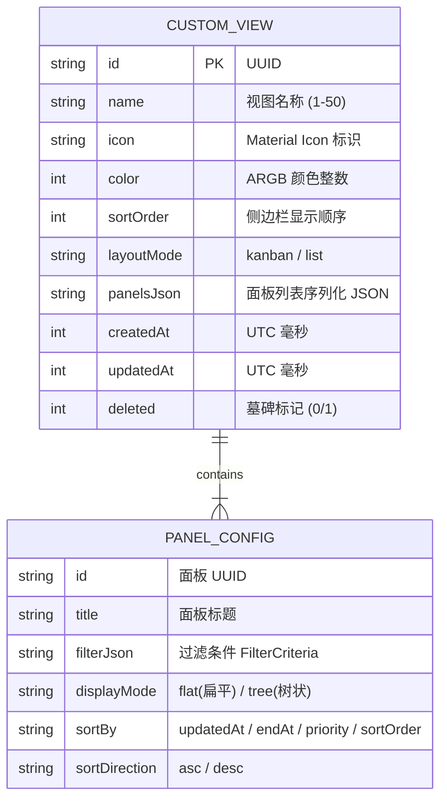

# 65 — 自定义筛选视图与多面板看板规格说明书

> 状态：**定稿（需求已确认 2026-08-24）**  
> 关联文档：`10-requirements.md` / `40-data-model.md` / `50-ui-ux.md` / `60-sync-design.md` / `70-milestones.md`

---

## 1. 背景与业务目标

当前应用支持今日视图、收件箱、单项目列表、标签聚合及全局搜索。随着用户任务规模和复杂度的增加，用户需要更具个性化与灵活性的组织方式。

### 1.1 核心目标
1. **多维度筛选能力**：允许用户自由组合文件夹、项目、标签、优先级、任务状态及起止日期等维度，精准定位目标任务。
2. **多面板看板（Multi-Panel Dashboard）**：一个自定义视图可包含 1 至多个面板（列/分块），各面板可独立配置筛选规则，或一键按维度（如状态三栏：待办/进行中/已完成；优先级四栏：高/中/低/无）自动生成多栏看板。
3. **多端自适应交互**：
   - 宽屏（≥600dp / 桌面/平板）：横向看板多列并排，支持平滑横向滚动。
   - 窄屏（<600dp / 移动端）：顶部 Tab 标签栏 + 左右滑动手势无缝切换各面板。
4. **智能拖拽流转**：支持在看板面板间拖拽任务，自动更新任务属性（如拖入已完成列自动将状态变更为 done）。
5. **固定视图与导航集成**：用户可将筛选结果保存为自定义视图并固定（Pin）在侧边栏抽屉独立分区中，支持自定义图标、颜色、排序与未完成任务数徽标。
6. **完整跨端同步**：自定义视图及面板配置纳入 Drift 数据库与 WebDAV/S3 快照同步协议（遵循 `AGENTS.md` 硬性约束）。

---

## 2. 核心概念与模型设计

### 2.1 实体关系模型



### 2.2 筛选条件规则（Filter Criteria）

每个面板包含独立的 `FilterCriteria`，支持以下筛选维度：

| 维度 | 字段 | 类型 | 匹配逻辑 | 说明 |
|---|---|---|---|---|
| **文件夹** | `folderIds` | `List<String>` | 集合包含 (`IN`) | 筛选指定文件夹下的项目所包含的任务；可包含特殊标识 `'unassigned'`（未分组项目） |
| **项目** | `projectIds` | `List<String>` | 集合包含 (`IN`) | 筛选指定项目的任务，包含内置收件箱 `inboxProjectId` |
| **标签** | `tagIds` | `List<String>` | 集合包含 (`IN` / `ALL`) | 默认任一命中（OR），可选全部包含（AND） |
| **优先级** | `priorities` | `List<TaskPriority>` | 集合包含 (`IN`) | `none(0)`, `low(1)`, `medium(2)`, `high(3)` |
| **任务状态** | `statuses` | `List<TaskStatus>` | 集合包含 (`IN`) | `todo(0)`, `inProgress(1)`, `done(2)`, `cancelled(3)`（含派生状态口径） |
| **起止时间** | `dateScope` | `DateScopeEnum` | 时间区间计算 | `all`, `overdue`, `today`, `tomorrow`, `thisWeek`, `noDate`, `customRange` |
| **层级过滤** | `hierarchyScope` | `HierarchyScopeEnum` | 节点深度计算 | `all`(所有层级), `rootOnly`(仅一级根任务), `subtasksOnly`(仅子任务) |

#### 维度组合逻辑：
- **同维度内部**：多选为 **OR（或）** 逻辑（例如勾选「高优」与「中优」，命中任一即可）。
- **跨维度之间**：多条件为 **AND（且）** 逻辑（例如「项目A」AND「高优先级」AND「待办状态」）。

### 2.3 任务展示形态（Display Mode）
每个面板可独立选择任务展示形态（默认 `flat`）：
1. **扁平列表模式 (`flat`)**：所有命中过滤条件的任务以卡片/列表项渲染，卡片清晰展示所属项目色块、标签胶囊与父任务面包屑路径（如 `项目 > 父任务 > 当前任务`）。
2. **树状层级模式 (`tree`)**：若命中任务存在父子关系，按缩进层级树状展示；若父任务未命中但子任务命中，父任务以虚化/弱化背景作为上下文节点呈现。

---

## 3. UI / UX 规格与多端自适应

### 3.1 宽屏看板布局（Screen Width ≥ 600dp）
- **列布局**：采用横向流式看板（Kanban Board），多列并排展示，每列宽度固定或自适应（默认列宽 `280dp ~ 340dp`）。
- **横向平滑滚动**：当面板列数超出视口宽度时，支持鼠标滚轮（Shift + 滚轮）及触控板平滑水平滚动，列首停靠对齐。
- **列头设计**：展示面板标题、任务命中数徽标、快捷过滤/排序按钮及面板菜单。

### 3.2 窄屏移动端布局（Screen Width < 600dp）
- **顶部 Tab 栏**：多面板映射为顶部紧凑 Tab 切换条（带选中下划线高亮与该列任务计数）。
- **滑动手势**：使用 `PageView` 承载各面板内容，支持跟手的左右滑动无缝切换面板。
- **单面板全屏渲染**：单个面板占满屏幕宽度，操作流畅，避免在小屏上出现横向拥挤。

```
+------------------------------------------+
|  [☰] 🏃 个人效率看板              [⚙] [⋮] |
+------------------------------------------+
|  [ 待办 (5) ]   [ 进行中 (2) ]   [ 已完成 (12) ] |
+------------------------------------------+
|  ☐ 撰写产品需求文档                [项目A] |
|    📅 今天截止  🔴 高优                   |
|                                          |
|  ☐ 修复同步网络超时 Bug             [开发] |
|    🏷️ bugfix   🟡 中优                    |
|                                          |
|  + 点击快速添加待办...                    |
+------------------------------------------+
|  [ 📅 今日 ]     [ 🗓️ 日历 ]     [ ＋ 新建 ] |
+------------------------------------------+
```

### 3.3 跨面板智能拖拽流转（Smart Attribute Drag & Drop）

在多面板视图中，用户可长按任务卡片在不同面板（列）之间拖拽。系统根据源面板与目标面板的筛选差异，自动推断并更新任务属性：

1. **单属性差异自动更新**：
   - 状态看板（面板 A=待办，面板 B=进行中）：将任务从 A 拖入 B，自动触发 `repo.updateTask(id, status: TaskStatus.inProgress)`。
   - 优先级看板（面板 A=低优，面板 B=高优）：拖入自动更新 `priority: TaskPriority.high`。
   - 项目看板（面板 A=项目 1，面板 B=项目 2）：拖入自动更新 `projectId: project2.id`（并重置父级为根级，符合层级安全）。
2. **多属性差异与冲突保护**：
   - 若目标面板涉及多项不兼容过滤条件（如同时要求特定项目且特定标签），拖放落库时弹出快捷确认底栏（BottomSheet）或 SnackBar 确认变更项，防止误修改。
   - 若父任务含有子任务且拖入变更状态面板：遵循 `AGENTS.md` 硬性约束，拦截并提示「父任务状态由子任务派生，不可直接修改」。

### 3.4 侧边栏导航与入口规划

#### 抽屉侧边栏（`AppDrawer`）分区扩展：
1. **系统组**（今日、收集箱、日历、标签）。
2. **自定义视图组（Custom Views）**：
   - 独立分组标题「自定义视图」，右侧提供「+」新建按钮。
   - 视图行展示：自定义 Material 图标 + 自定义颜色圆点 + 视图名称 + 实时全量未完成数徽标。
   - 长按支持拖拽排序（`sortOrder`）及右键/更多菜单（编辑、重命名、更改图标颜色、删除）。
3. **项目组**（文件夹 + 未分组项目）。
4. **底部操作栏**：「新建项目」「新建文件夹」「新建自定义视图」。

#### 筛选结果页快捷保存：
- 在全局搜索页（`/search`）或动态筛选栏（`TaskFilterBar`）调整条件后，右上方常驻「保存为视图」按钮，点击弹出保存对话框（输入名称、选择图标与颜色），一键固定至侧边栏。

---

## 4. 数据模型与数据库设计（Drift SQLite）

### 4.1 新增 `custom_views` 数据表（`lib/core/db/tables.dart`）

```dart
/// 自定义筛选视图与看板表（参与跨设备同步）。
class CustomViews extends Table {
  /// 主键 UUID v4。
  TextColumn get id => text()();

  /// 视图名称（1–50 字符）。
  TextColumn get name => text().withLength(min: 1, max: 50)();

  /// 视图图标（Material Icons identifier 字符串，如 'dashboard_outlined'）。
  TextColumn get icon => text().withDefault(const Constant('dashboard_outlined'))();

  /// 视图强调颜色（ARGB 32位整数，如 0xFF3B82F6）。
  IntColumn get color => integer().withDefault(const Constant(0xFF3B82F6))();

  /// 排序权重（0..n-1，用于侧边栏展示排序）。
  IntColumn get sortOrder => integer().withDefault(const Constant(0))();

  /// 布局模式：'kanban'(看板多列) 或 'list'(单列聚合)。
  TextColumn get layoutMode => text().withDefault(const Constant('kanban'))();

  /// 面板配置列表序列化 JSON 字符串。
  TextColumn get panelsJson => text()();

  /// 创建时间（UTC 毫秒时间戳）。
  IntColumn get createdAt => integer()();

  /// 最后更新时间（UTC 毫秒时间戳，参与同步 LWW 合并）。
  IntColumn get updatedAt => integer()();

  /// 墓碑删除标记（0 = 存活，1 = 已删除）。
  IntColumn get deleted => integer().withDefault(const Constant(0))();

  @override
  Set<Column> get primaryKey => {id};
}
```

### 4.2 `panelsJson` 数据结构规格（JSON Schema）

```json
[
  {
    "id": "panel-uuid-1",
    "title": "待处理",
    "displayMode": "flat",
    "sortBy": "priority",
    "sortDirection": "desc",
    "filter": {
      "folderIds": [],
      "projectIds": [],
      "tagIds": [],
      "priorities": [2, 3],
      "statuses": [0],
      "dateScope": "all",
      "hierarchyScope": "all"
    }
  },
  {
    "id": "panel-uuid-2",
    "title": "进行中",
    "displayMode": "flat",
    "sortBy": "updatedAt",
    "sortDirection": "desc",
    "filter": {
      "folderIds": [],
      "projectIds": [],
      "tagIds": [],
      "priorities": [],
      "statuses": [1],
      "dateScope": "all",
      "hierarchyScope": "all"
    }
  }
]
```

### 4.3 数据库版本迁移（Migration Strategy）
- `schemaVersion` 从当前版本递增（`v3 -> v4`）。
- 迁移步骤：调用 `m.createTable(customViews)` 创建新表，写入默认的预设视图（如「进行中看板」示例）。

---

## 5. 同步协议扩展（WebDAV / S3 Sync）

遵循 `60-sync-design.md` 与 `AGENTS.md` 硬性约束，自定义视图配置完整纳入跨设备同步。

### 5.1 快照协议版本扩展
- 快照结构体 `SnapshotData` 增加 `List<CustomView> customViews`。
- 快照 `schemaVersion` 升级（v2 → v3），保证向后兼容性（旧版客户端读取新快照时自动忽略未知字段）。

### 5.2 LWW（Last-Write-Wins）合并规则
- `MergeEngine.merge` 对比本地与远程的 `custom_views` 记录：
  - 基于 `id` 匹配，比较 `updatedAt`（UTC 毫秒时间戳）。
  - 若一端存在墓碑（`deleted = 1`）且 `updatedAt` 较新，应用删除。
- **孤立引用自动对齐（Reconciliation）**：
  - 若面板中引用的 `projectIds` / `folderIds` / `tagIds` 在同步后已被其他设备物理删除，`reconcileCustomViews` 算法自动剥离已失效的 ID 过滤项，避免出现永远查不出任务的脏筛选条件。

---

## 6. 状态管理与路由设计

### 6.1 路由规划（`lib/router.dart`）

| 路由路径 | 页面组件 | 功能说明 |
|---|---|---|
| `/views/:id` | `CustomViewPage` | 渲染指定的自定义多面板视图/看板 |
| `/views/new` | `CustomViewEditorPage` | 新建自定义视图与面板配置器 |
| `/views/edit/:id` | `CustomViewEditorPage` | 编辑已有视图（名称、图标、颜色、面板规则） |

### 6.2 Riverpod 状态提供者（Providers）

- `customViewsStreamProvider`: 监听 `custom_views` 表全量存活记录（按 `sortOrder` 升序排列）。
- `customViewDetailProvider.family<CustomView?, String>`: 根据视图 ID 监听单条视图配置。
- `panelTasksProvider.family<List<Task>, FilterCriteria>`: 响应式过滤引擎，监听全量任务流、项目流与标签流，纯内存高效计算符合条件的任务集（复用 `derivedStatus` 派生状态）。

---

## 7. 里程碑划分与验收标准（DoD）

### 里程碑 M9: 自定义筛选视图与多面板看板（DoD 逐条对照）

- [ ] **M9-1 数据层与迁移**：
  - `custom_views` 表落库并完成 Drift 代码生成与迁移单测。
  - 增删改查 DAO / Repository 方法测试覆盖率 100%。
- [ ] **M9-2 筛选计算引擎**：
  - `FilterCriteria` 纯函数过滤算法单测通过（涵盖同维度 OR、跨维度 AND、文件夹级联、派生状态计算）。
- [ ] **M9-3 视图渲染与多端自适应**：
  - 宽屏（≥600dp）多列看板横向平滑滚动；窄屏 Tab + PageView 左右滑动手势流畅无卡顿。
  - 支持任务展示模式切换（扁平卡片列表 vs 树状层级）。
- [ ] **M9-4 智能拖拽流转**：
  - 面板间拖拽自动流转状态/优先级/项目属性，防环与派生状态保护无漏洞。
  - 父任务派生状态修改保护与错误处理完善。
- [ ] **M9-5 侧边栏与导航**：
  - 抽屉侧边栏「自定义视图」分区完整集成，支持自定义图标、颜色、排序与未完成数。
  - 搜索/筛选结果一键保存为视图。
- [ ] **M9-6 同步与数据一致性**：
  - 快照编码/解码单测通过；跨设备 WebDAV/S3 增删改同步测试全绿。
- [ ] **M9-7 静态检查与国际化**：
  - `flutter analyze` 0 error，`flutter test` 全部通过，所有文案严格走 ARB 多语言。