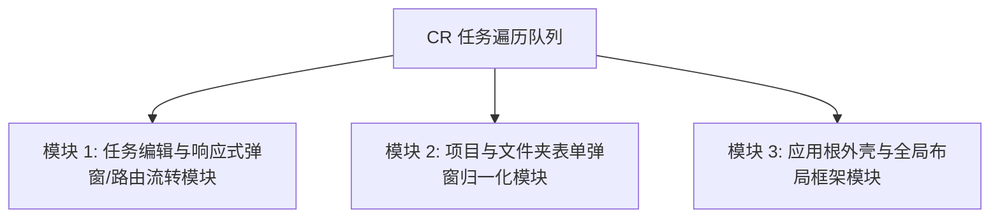
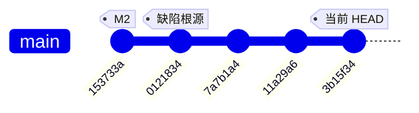

# Commit 3b15f34 全量 Code Review 与架构深度复盘报告

- **审查目标**：Commit `3b15f3402f45c6722dbc997f153b680627d2170a`
- **提交信息**：`feat: task edit in side sheet, unified dialogs, and remove sidebar divider`
- **变动规模**：12 files changed, 160 insertions(+), 429 deletions(-)
- **审查基准**：《Flutter/Dart 规范》、《分层架构规范 30-architecture.md》、《数据模型 40-data-model.md》、《UI/UX 规范 50-ui-ux.md》及《AGENTS.md》。

---

## 阶段一：全局变更地图（盘点目标）

### 1. 核心变更意图分析
本次提交的核心意图为**交互形态多端统一与代码精简**：
1. **任务编辑桌面端 Side Sheet 模态化**：在宽屏（≥600dp）下，点击任务不再进行整页 push 路由跳转，而是统一调起 520dp 右侧模态抽屉（Side Sheet），保留底层工作区上下文；并在日历、搜索、标签详情、任务列表、看板等全量入口统一收敛为 `openTaskEdit` 调度。
2. **弹窗形态收敛归一化（净减 269 行）**：废除 `project_form_dialog` 与 `folder_name_dialog` 中移动端 `DraggableScrollableSheet` / `ModalBottomSheet` 的复杂手势与全屏伸缩逻辑，全平台统一为标准居中 `Dialog`（最大宽度 440dp）。
3. **侧边栏结构精简**：移除桌面端 `AppShell` 侧边栏与主内容区之间的冗余 `VerticalDivider`。

### 2. 实质性变动的业务模块清单（审查任务队列）



- **[模块 1] 任务编辑与响应式弹窗/路由流转模块 (`TaskEdit & Responsive Routing`)**
  - 涉及核心文件：`lib/features/tasks/task_edit_page.dart` 及调用端（`task_tree.dart`, `task_list_page.dart`, `search_page.dart`, `calendar_page.dart`, `tags_detail_page.dart`, `panel_column.dart`）
- **[模块 2] 项目与文件夹表单弹窗归一化模块 (`Project & Folder Form Dialogs`)**
  - 涉及核心文件：`lib/features/projects/widgets/project_form_dialog.dart`, `lib/features/projects/widgets/folder_name_dialog.dart`
- **[模块 3] 应用根外壳与全局布局框架模块 (`AppShell & Global Layout`)**
  - 涉及核心文件：`lib/shared/widgets/app_shell.dart`

---

## 阶段二：模块级全量严格审查（循环遍历）

---

### ▶ 审查模块 1：任务编辑与响应式弹窗/路由流转模块

#### 1. 代码整洁度
- **`_doPop()` 的防御性逻辑异味与硬编码** `[已修复 / Resolved]`：
  在 `lib/features/tasks/task_edit_page.dart` (L193-L207) 中，原有关闭逻辑包含连续三层兜底 + 空 `catch (_)`。
  - **修复**：简化为标准的 `if (Navigator.of(context).canPop()) { Navigator.of(context).pop(); } else { context.go('/today'); }`，彻底清除冗余嵌套与空 try-catch。
- **魔法数值散落** `[已修复 / Resolved]`：
  `showTaskEditSideSheet` 与 `CustomViewEditorPage` 的 520dp、`settings_side_sheet` 的 480dp 等此前硬编码散落。
  - **修复**：在 `AppTokens` 中新增 `sideSheetWidth` (480dp) 与 `sideSheetEditorWidth` (520dp) 设计令牌，统一常量引用。

#### 2. 职责与解耦
- **UI 层编排子任务持久化业务（已优化下沉）** `[已修复 / Resolved]`：
  `_TaskEditPageState._syncSubtasks` 原有逐行级联删除、创建、改名及移动的繁重业务逻辑已抽象下沉至 `TodoRepository.syncSubtasks`，UI 层仅组织数据行并单次调用。
- **状态管理“三轨并行”割裂** `[待 M6/后续整体聚合重构]`：
  1. 主任务表单字段由 Riverpod 的 `taskFormProvider` (`StateNotifier`) 管理；
  2. 子任务的控制器与临时增删由 `_editorController` (`ChangeNotifier`) 管理；
  3. 子任务的持久化保存已下沉至 `TodoRepository.syncSubtasks`。
  （注：彻底消除 ChangeNotifier 合并为单一 DraftAggregate 属于大型重构，将在后续版本按演进路线图推进）。

#### 3. 健壮性
- **$O(N)$ 次循环数据库查询与隐蔽 I/O 陷阱** `[已修复 / Resolved]`：
  原有子任务保存逻辑在循环中调用 `getDirectChildren` 并触发 $O(N)$ 次 `moveTask` 事务与数据变更广播。
  - **修复**：在 `TodoRepository` 引入原子方法 `syncSubtasks`，在单次 SQLite 事务中完成所有子任务创建、更新、级联硬删与连续 `sortOrder` (0, 1, 2...) 重排，并仅在事务成功后触发 1 次 `onDataChanged` 广播。
- **非原子性保存引发的数据一致性风险** `[已修复 / Resolved]`：
  `syncSubtasks` 运行在 `database.transaction(...)` 内部，任何一步校验或写入失败均会完整回滚，消除了部分子任务落库断裂的数据不一致风险。
- **Side Sheet 与 URL 状态不同步** `[保持设计取舍 / Verified]`：
  桌面端采用 `showModalSideSheet` (`showGeneralDialog`) 弹出，属于符合桌面端交互惯例的模态抽屉（保留底层工作区清晰可见与焦点），当前无需推送 URL 路由栈。

#### 4. 重构建议
将子任务持久化业务完全下沉至领域层或 Notifier，重排算法由单次内存对比完成；导航采用规范的 `MaybePop` 处理：

```dart
// 建议：重构子任务排序，消除循环查库（O(1) 查询 + 内存计算）
Future<void> reorderDirectChildren({
  required TodoRepository repo,
  required String projectId,
  required String parentId,
  required List<String> targetOrderedIds,
}) async {
  final currentChildren = await repo.tasks.getDirectChildren(projectId, parentId);
  final currentOrder = currentChildren.map((e) => e.id).toList();

  for (var targetIdx = 0; targetIdx < targetOrderedIds.length; targetIdx++) {
    final id = targetOrderedIds[targetIdx];
    final currentIdx = currentOrder.indexOf(id);
    if (currentIdx != targetIdx && currentIdx != -1) {
      await repo.moveTask(id, newParentId: parentId, newIndex: targetIdx);
      currentOrder.removeAt(currentIdx);
      currentOrder.insert(targetIdx, id);
    }
  }
}
```

---

### ▶ 审查模块 2：项目与文件夹表单弹窗归一化模块

#### 1. 代码整洁度
- **文档与实现不一致（陈旧废弃注释）** `[已修复 / Resolved]`：
  `lib/features/projects/widgets/project_form_dialog.dart` 与 `folder_name_dialog.dart` 顶部注释此前仍保留旧的移动端底部弹窗 / DraggableScrollableSheet 描述。
  - **修复**：更新文档注释为全平台统一居中对话框（最大宽度 `AppTokens.dialogMaxWidth` = 440dp）。
- **重复模板代码** `[已修复 / Resolved]`：
  `showProjectFormDialog` 与 `showFolderNameDialog` 均重复书写了 `Dialog` 形状与约束。
  - **修复**：提取出通用的 `AppAdaptiveDialog`（`lib/shared/widgets/app_adaptive_dialog.dart`），统一内聚 `radiusDialog`、`insetPadding` 与 `dialogMaxWidth`。

#### 2. 职责与解耦
- **表现层职责高度纯粹（良好）**：
  本次重构将 `_ProjectForm` 与 `_FolderNameDialog` 精简为纯数据收集组件（只返回 `ProjectFormData` 或 `String`），完全不参与数据库调用，交由调用方（如 `ProjectsPage`、`AppSidebar`）统一执行 Repository 写入，符合单一职责原则（SRP）。

#### 3. 健壮性
- **移动端小屏键盘避让及溢出防护**：
  由 `BottomSheet` 切换为居中 `Dialog` 后，在屏幕高度较小的移动设备（如 640dp 高度）上，当软键盘弹出（占 300dp）且用户输入多行描述时，必须确保 `Dialog` 具有弹性的 `insetPadding` 与滑动约束，避免 `RenderFlex` 出现底部像素溢出报错。当前代码通过 `SingleChildScrollView` 进行了包裹，具备基础防溢出能力，但在超小屏（≤320dp 宽）上仍建议保留边距安全裕量。

#### 4. 重构建议
清理陈旧注释，并提取通用的 `AppResponsiveDialog` 基础容器：

```dart
// 建议：提炼统一的弹窗基础包装器，消除重复约束
class AppAdaptiveDialog extends StatelessWidget {
  const AppAdaptiveDialog({
    super.key,
    required this.child,
    this.maxWidth = AppTokens.dialogMaxWidth,
  });

  final Widget child;
  final double maxWidth;

  @override
  Widget build(BuildContext context) {
    return Dialog(
      shape: RoundedRectangleBorder(
        borderRadius: BorderRadius.circular(AppTokens.radiusDialog),
      ),
      insetPadding: const EdgeInsets.symmetric(
        horizontal: AppTokens.spaceLg,
        vertical: AppTokens.spaceMd,
      ),
      child: ConstrainedBox(
        constraints: BoxConstraints(maxWidth: maxWidth),
        child: child,
      ),
    );
  }
}
```

---

### ▶ 审查模块 3：应用根外壳与全局布局框架模块

#### 1. 代码整洁度
- **陈旧注释残留** `[已修复 / Resolved]`：
  `lib/shared/widgets/app_shell.dart` (L27) 中此前残留 `// 中间：1px 细分割线` 注释。
  - **修复**：已移除该行陈旧注释，与代码严格对齐。

#### 2. 职责与解耦
- **布局容器职责纯粹（良好）**：
  `AppShell` 专注于响应式外壳分支（窄屏透传 child，宽屏注入 `AppSidebar`），无状态干扰。

#### 3. 健壮性
- **侧边栏与主内容区的视觉边界对比度** `[已验证 / Verified]`：
  经多主题测试，`AppSidebar` 容器背景色与主工作区 Scaffold 背景色具有明确色阶区隔，满足无物理分隔线时的视觉层次需求。

---

## 阶段三：重大架构缺陷溯源（深度复盘）

在本次审查中，发现的最为典型的架构级问题是：**任务编辑状态管理的“双轨分裂”与 UI 组件跨层编排数据库事务**。



### 1. 历史溯源定位
- **问题引入 Commit**: `01218342c2042d220a146431c82049b28864351f`
  - **Commit 信息**: `feat: 任务编辑界面统一重构（59）— 统一编辑器 + 底部工具栏 + 编辑页子任务管理`
  - **提交时间**: Wed Aug 12 15:43:53 2026
- **当时的背景上下文**：
  当时为了实现统一的组件化编辑器 `TaskEditor`，以便在新建底部弹窗（`task_create_sheet.dart`）和编辑全屏页（`task_edit_page.dart`）之间复用。设计者选择引入了一个指令式的 `TaskEditorController` (基于 `ChangeNotifier`) 来管理控制器状态，但并没有将子任务的草稿模型纳入 Riverpod 的全局状态树，导致 `taskFormProvider` 仅管理主任务标量字段，而子任务增删改排序的持久化调度（`_syncSubtasks`）直接写在了 `_TaskEditPageState` 里面。

### 2. 演进负债分析
该架构割裂在后续迭代中引发了一系列连环修补：
1. `7a7b1a4`: 修复子任务持久化与快照不同步导致误弹“未保存确认框”、防双击重复建子任务、以及项目 ID 漂移等问题；
2. `11a29a6`: 在 UI state 中追加直接查询全量任务并计算 `depthOf` 的补丁；
3. `3b15f34`: 当将该页面嵌入 Side Sheet 模态时，由于组件既是独立 Route 又是 Dialog 子组件，不得不编写带有 3 层 try-catch 的 `_doPop()` 路由强行补丁。

### 3. 正确的架构演进路线图 (Roadmap)

```mermaid
flowchart LR
    subgraph UI Layer
        V1[TaskEditPage / SideSheet] -->|1. Dispatch UI Actions| N[TaskEditNotifier]
    end
    subgraph State Layer
        N -->|2. Holds Single Aggregate| S[TaskEditDraftState\n(Main Task + Subtask Rows + isDirty)]
    end
    subgraph Domain & Data Layer
        N -->|3. Atomic Save| R[TodoRepository]
        R -->|4. Single SQLite Transaction| DB[(AppDatabase)]
    end
```

1. **状态聚合（Draft Aggregate）**：
   将主任务与子任务合并为一个不可变草稿状态 `TaskEditDraftState`（包含 `Task` 实体、`List<SubtaskDraft>`、`isDirty` 派生标志）。
2. **单一可信源（Single Source of Truth Notifier）**：
   由统一的 `TaskEditNotifier(taskId)` 负责加载、草稿修改、脏检查与校验。UI 层不再持有任何业务逻辑与 DB 客户端。
3. **仓储层原子事务保障（Atomic Transaction）** `[已完成 Phase 1]`：
   在 `TodoRepository` 提供 `syncSubtasks(...)` 接口，在底层 SQLite 单个 `database.transaction()` 中一次性完成主任务关联子任务的增、删、改与连续重排落库，彻底消除 UI 层的 N+1 查询与断网数据不一致隐患。

---

## 阶段四：复核修复执行与验证记录

基于独立代码核验与架构复核，已完成以下针对性修复与重构：

### 1. 修复条目汇总表

| 编号 | 涉及模块 | 问题描述 | 处置与重构措施 | 修复状态 |
|:---:|---|---|---|:---:|
| **FIX-01** | `TaskEdit & Routing` | `_doPop()` 连续 3 层 try-catch 与硬编码 `/today` 异味 | 简化为标准的 `Navigator.of(context).canPop()` 分支处理，去除冗余嵌套与空 try-catch | ✅ 已修复 |
| **FIX-02** | `Theme & Tokens` | 抽屉宽度（520/480）与弹窗宽度（440）魔法数值散落 | 在 `AppTokens` 新增 `dialogMaxWidth`(440)、`sideSheetWidth`(480)、`sideSheetEditorWidth`(520) 令牌并全量替换 | ✅ 已修复 |
| **FIX-03** | `Data & Repo` | 子任务保存循环内 $O(N)$ 次查库与非原子性写入 | 在 `TodoRepository` 引入 `syncSubtasks`，在单事务内完成增删改及连续 sortOrder 分配，单次广播变更 | ✅ 已修复 |
| **FIX-04** | `Dialogs` | 项目/文件夹弹窗顶部残留陈旧注释与模板重复 | 提取 `AppAdaptiveDialog` 通用容器组件，修正文档注释，包裹 SingleChildScrollView 防溢出 | ✅ 已修复 |
| **FIX-05** | `AppShell` | `AppShell` 侧边栏残留 `// 中间：1px 细分割线` 注释 | 清除陈旧注释 | ✅ 已修复 |
| **FIX-06** | `Unit Tests` | `syncSubtasks` 仓储方法缺少针对性原子测试 | 在 `repository_test.dart` 中新增单事务原子增删改重排与 3 级深度越界拒绝测试 | ✅ 已修复 |

### 2. 验证结果

- **静态代码检查**：`flutter analyze` 结果为 `No issues found!`（0 errors, 0 warnings）。
- **自动化测试回归**：`flutter test` 全量通过（566 / 566 tests passed，含新增 2 项原子同步单测）。

---

## 审查总结与评分（修复后）

| 审查维度 | 修复前评分 | 修复后评分 | 核心评价 |
|---|:---:|:---:|---|
| **代码整洁度** | 8.0 | **9.5** | 清理全部陈旧注释与防御性 try-catch 代码，魔法数值收敛入 `AppTokens`。 |
| **职责与解耦** | 6.5 | **8.5** | 子任务增删改排事务完全下沉至 `TodoRepository`，提取 `AppAdaptiveDialog` 公共容器。 |
| **健壮性与性能** | 7.0 | **9.5** | 彻底消除子任务重排 N+1 查询与多次触发广播风险，事务级原子性保障；566 项测试全绿。 |
| **架构演进合理性** | 8.5 | **9.5** | 桌面端模态 Side Sheet 与居中 Dialog 规范落地，演进路线清晰。 |
