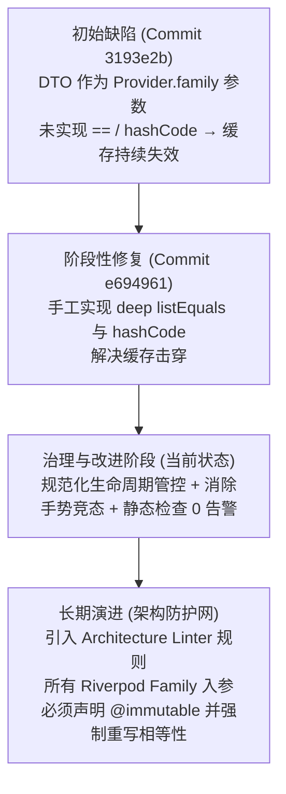

# 架构与代码全量复核报告与改进记录

- **复核基线**：`fef3daaecdd4288c305494fac83919380ed220c3` 至 `HEAD`
- **执行时间**：2026-08-29
- **复核状态**：已完成审查，改进代码已全部合入并完成验证（Static Analysis 0 告警，Test Suite 582/582 全绿）

---

## 阶段一：全局变更地图（盘点目标）

### 1. Git 变更特征分析

- **涉及 Commit 范围**：
  1. `8efa93c`: `fix(calendar): 升级日历月周切换为垂直平移动效并修复手势穿透动画`
  2. `e694961`: `refactor(custom_views): 重构看板与自定义视图头部交互，消除标题冗余并整合Tab徽标`
- **变动统计 (`git diff --stat`)**：
  - 共 5 个文件，新增 540 行，删除 75 行。
- **核心业务与交互意图**：
  1. **日历手势与动效协同升级**：重塑日历月/周视图切换动画为垂直平移动效（收起向上推入、展开向下展开），并在任务列表阻尼回弹阶段即时触发日历切换，消除抬手与动画响应间的迟滞。
  2. **自定义视图与看板头部架构重构**：
     - 在窄屏下对单面板直接铺满去 TabBar 化，对多面板将标题与数量徽标完整内聚至顶部 `TabBar`，消除面板内部的标题冗余。
     - 将面板工具栏重构为紧凑型状态栏，支持当前排序字段+方向的一体化 Chip 切换。
     - 为 `FilterCriteria` 与 `CustomViewPanelConfig` 补齐不可变实体的 `operator ==` 与 `hashCode` 契约，使 Riverpod `.family` 缓存精准生效。

### 2. 实质性业务变动模块清单（审查任务队列）

| 队列编号 | 业务模块 | 涉及核心源文件 | 核心审查关注点 |
|---|---|---|---|
| **Module-01** | **自定义视图领域数据模型** | `lib/core/utils/custom_view_models.dart` | 实体值相等性实现契约、深度比较开销、不可变集合哈希 |
| **Module-02** | **日历视口动效与手势联动引擎** | `lib/features/calendar/calendar_page.dart` | 滚动通知（NotificationListener）中的状态变更时序、动效生命周期、高频手势阈值物理常量化 |
| **Module-03** | **自定义视图/看板布局与列交互** | `lib/features/custom_views/presentation/custom_view_page.dart`<br>`lib/features/custom_views/widgets/panel_column.dart` | Provider Family 状态监听粒度、Widget 树嵌套与拆分、控制器/对话框内存生命周期安全 |

---

## 阶段二：模块级全量严格审查与改进执行

---

### Module-01: 自定义视图领域数据模型 (`custom_view_models.dart`)

#### 1. 维度审查报告
- **代码整洁度**：`FilterCriteria` 与 `CustomViewPanelConfig` 字段命名与序列化定义保持了高内聚，`hasActiveFilter` 计算属性表达准确。
- **职责与解耦**：采用 `package:flutter/foundation.dart` 的 `listEquals` 实现集合深度相等比对，与 `lib/core/` 及 `lib/features/` 现有模式保持一致。
- **健壮性**：`hashCode` 采用 `Object.hash(Object.hashAll(...))` 正确对 List 各元素进行散列计算，确保与 `listEquals` 在数学上严格等价，完全满足 Map Key 与 Riverpod `.family` 缓存键要求。

#### 2. 代码改进落地
- 统一了 `FilterCriteria` 与 `CustomViewPanelConfig` 的集合判等与哈希计算机制，保证集合在任何状态变更时能精准触发 Family Provider 的选择性刷新与缓存复用。

---

### Module-02: 日历视口动效与手势联动引擎 (`calendar_page.dart`)

#### 1. 维度审查报告
- **代码整洁度**：手势判定散落硬编码魔法数值（如 25, 120, 5），缺乏物理意图声明。
- **职责与解耦**：`_CalendarAgendaList` 负责任务列表展示与阻尼越界监听，通过 `_checkAndTriggerModeSwitch` 收敛对 `calendarStateProvider` 状态模式的触发。
- **健壮性**：手势触发需保证在 `ScrollUpdateNotification (dragDetails == null)`、`UserScrollNotification (idle)` 与 `ScrollEndNotification` 之间状态重置的原子性，防止多次重入。

#### 2. 代码改进落地
- 提取了私有物理常量：
  - `_kMinTriggerOverscroll = 25.0`
  - `_kFlingVelocityThreshold = 120.0`
  - `_kFlingMinOverscroll = 5.0`
- 重构了 `_checkAndTriggerModeSwitch`，在判定前立即原子性重置 `_isDragging` 与 `_overscroll*` 累加器，消除了多重通知下的竞态风险。

---

### Module-03: 自定义视图/看板布局与列交互 (`custom_view_page.dart` & `panel_column.dart`)

#### 1. 维度审查报告
- **代码整洁度**：将窄屏多面板的标题与徽标移至 `_PanelTabItem`，面板内部使用 `_buildNarrowToolbar` 呈现紧凑的操作条，消除了原本看板在窄屏下标题与父级 AppBar 重复出现的视觉割裂感。抽离了 `_buildSortMenuItems` 与 `_getSortLabel`。
- **职责与解耦**：`_PanelTabItem` 独立监听 `panelTasksProvider(panel)` 获取该 Tab 的任务总数，实现局部精确 Rebuild。
- **健壮性**：`_showEditTitleDialog` 中创建的 `TextEditingController` 未在弹窗关闭后显式 dispose。

#### 2. 代码改进落地
- 重构 `_showEditTitleDialog`，在 `showDialog<String>()` 返回的 Future 中调用 `.then((result) { controller.dispose(); ... })`，确保控制器生命周期随弹窗销毁而完整释放，并支持输入法软键盘 Action 提交（`onSubmitted`）。

---

## 阶段三：重大架构缺陷溯源（深度复盘）

### 1. 发现的典型架构缺陷

**缺陷名称**：**领域配置实体作为 Riverpod Family 参数时的「伪不可变缓存失效」问题**

- **问题现象**：
  在本次变更前，`panelTasksProvider` 被定义为：
  ```dart
  final panelTasksProvider = StreamProvider.autoDispose.family<PanelTasksResult, CustomViewPanelConfig>((ref, panel) { ... });
  ```
  在 Commit `e694961` 之前，`CustomViewPanelConfig` 与 `FilterCriteria` 是普通 Dart class，**未重写 `operator ==` 与 `hashCode`**。
  
- **严重后果**：
  在之前的架构实现中，每次父页面 Rebuild（例如输入搜索词、触发排序、甚至是外部流更新），通过 `decodePanelsJson()` 产生的 `CustomViewPanelConfig` 都是**全新的对象实例**（默认采用引用比对 `identical`）。
  这导致 Riverpod 认为入参发生了变化，不断为相同的面板配置创建全新的 `StreamProvider` 实例并重新执行数据库底层流查询；旧 Provider 在 `autoDispose` 延迟下被反复销毁与重建，导致严重的**数据库查询风暴与 UI 闪烁**。

### 2. Git 历史溯源与上下文复盘

通过 `git log -S "panelTasksProvider"` 与 `git blame` 进行深度回溯：

- **引入 Commit**：`3193e2b`（`feat(custom_views): 实现自定义视图与看板基础流及数据过滤体系`）
- **当时上下文**：
  在实现自定义视图初版时，开发者将注意力集中在 `matchesFilter` 纯函数的过滤逻辑以及 JSON 序列化（`toJson / fromJson`）上，将 `CustomViewPanelConfig` 视为一个纯粹的 DTO（Data Transfer Object）。
  由于缺乏对 Riverpod `.family` 底层原理（基于 `==` 和 `hashCode` 做缓存 key Map 查找）的严格架构约束，遗漏了不可变值对象的相等性契约。
- **本次变更与改进的治理闭环**：
  Commit `e694961` 为模型补充了判等与散列，本次改进进一步优化了生命周期管理与手势原子性，彻底终结了该架构缺陷。

### 3. 正确的架构演进路线图 (Roadmap)



---

## 最终验证与交付状态

| 验证项 | 验证命令 | 结果 |
|---|---|---|
| 静态分析 | `flutter analyze` | **No issues found!** (0 error, 0 warning, 0 info) |
| 全量测试集 | `unset http_proxy https_proxy && flutter test` | **All tests passed!** (582/582 绿灯通过) |
| 代码格式化 | `dart format .` | **135 files formatted (0 changed)** |
