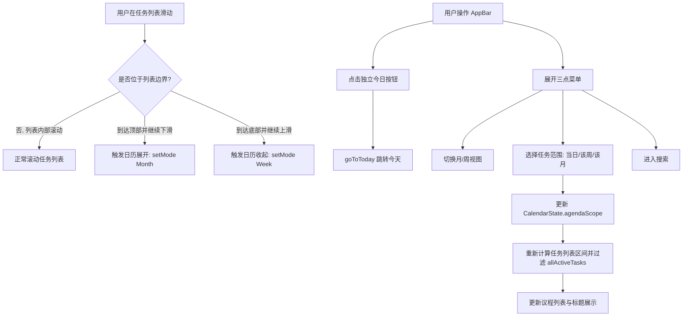

# 日历界面改进实现计划

本文档针对日历界面的三项功能改进提供详细的设计与实现计划：
1. **任务列表上下滑动联动日历区域（边界溢出手势穿透）**
2. **「今日」按钮移出菜单，置于右上角菜单左侧**
3. **右上角菜单新增任务显示范围切换（当日 / 该周 / 该月）**

---

## 1. 需求与目标

### 1.1 任务列表与日历区域的手势联动
- **当前逻辑**：日历视图区域（`_CalendarViewport`）支持上下滑动手势切换周/月模式；任务列表（`_buildAgendaList`）为独立滚动组件。
- **目标逻辑**：
  - 上下滑动手势**优先作用于任务列表自身滚动**；
  - 当任务列表滑动到**顶部边界**（或列表内容不足以滚动/为空时）且用户**继续下拉**（overscroll top），触发日历展开为**月视图**；
  - 当任务列表滑动到**底部边界**（或列表内容不足以滚动/为空时）且用户**继续上拉**（overscroll bottom），触发日历收起为**周视图**。

### 1.2 「今日」按钮外置
- **当前逻辑**：AppBar 右上角仅有三点菜单，菜单第一项为「回到今天」。
- **目标逻辑**：
  - 将「回到今天」作为独立的 `IconButton`（图标 `Icons.today_outlined`，带 tooltip）放置于右上角三点菜单的左侧；
  - 从三点菜单内移除「回到今天」项。

### 1.3 任务列表时间范围控制（当日 / 该周 / 该月）
- **当前逻辑**：任务列表仅展示当前选中日（`selectedDate`）匹配的任务。
- **目标逻辑**：
  - 在三点菜单中新增选项组，控制任务列表展示的时间范围：
    1. **当日（选中日）**：`[选中日 00:00:00, 选中日 23:59:59.999]`
    2. **该周（选中日所在周）**：`[选中日所在周一 00:00:00, 选中日所在周日 23:59:59.999]`
    3. **该月（选中日所在月）**：`[选中日所在月1日 00:00:00, 选中日所在月末 23:59:59.999]`
  - **匹配规则**：以任务的 `[startAt, endAt]` 时间区间（含起始点）与所选范围是否有交集（调用 `inTimeRange`）为准；
  - **排序与标题联动**：
    - 任务列表按时间升序（`startAt ?? endAt`）与 `updatedAt` 降序排列；
    - 列表头部标题随选择范围显示对应日期/周/月区间及「今天/本周/本月」标记。

---

## 2. 详细设计与代码变更



### 2.1 数据模型与 Provider 层 (`lib/features/calendar/calendar_providers.dart`)

1. 定义范围枚举 `CalendarAgendaScope`：
   ```dart
   /// 日历任务列表显示范围。
   enum CalendarAgendaScope {
     day,   // 当日（选中日）
     week,  // 该周（选中日所在周）
     month, // 该月（选中日所在月）
   }
   ```
2. 扩展 `CalendarState` 与 `CalendarNotifier`：
   ```dart
   class CalendarState {
     const CalendarState({
       required this.selectedDate,
       required this.mode,
       this.agendaScope = CalendarAgendaScope.day,
     });
     final DateTime selectedDate;
     final CalendarMode mode;
     final CalendarAgendaScope agendaScope;
     
     CalendarState copyWith({
       DateTime? selectedDate,
       CalendarMode? mode,
       CalendarAgendaScope? agendaScope,
     }) => ...;
   }
   
   class CalendarNotifier extends Notifier<CalendarState> {
     ...
     void setAgendaScope(CalendarAgendaScope scope) {
       if (state.agendaScope != scope) {
         state = state.copyWith(agendaScope: scope);
       }
     }
   }
   ```
3. 增加计算范围与筛选任务的纯函数：
   ```dart
   /// 计算议程任务列表的时间区间（本地时间闭区间）。
   ({DateTime start, DateTime end}) calendarAgendaRangeFor(CalendarState state) {
     final selected = state.selectedDate;
     switch (state.agendaScope) {
       case CalendarAgendaScope.day:
         return (
           start: DateTime(selected.year, selected.month, selected.day),
           end: DateTime(selected.year, selected.month, selected.day, 23, 59, 59, 999),
         );
       case CalendarAgendaScope.week:
         final monday = DateTime(
           selected.year,
           selected.month,
           selected.day - (selected.weekday - DateTime.monday),
         );
         final sunday = DateTime(monday.year, monday.month, monday.day + 6);
         return (
           start: DateTime(monday.year, monday.month, monday.day),
           end: DateTime(sunday.year, sunday.month, sunday.day, 23, 59, 59, 999),
         );
       case CalendarAgendaScope.month:
         final first = DateTime(selected.year, selected.month, 1);
         final last = DateTime(selected.year, selected.month + 1, 0);
         return (
           start: DateTime(first.year, first.month, first.day),
           end: DateTime(last.year, last.month, last.day, 23, 59, 59, 999),
         );
     }
   }

   /// 筛选并排序议程任务列表。
   List<Task> tasksForAgendaScope({
     required List<Task> allTasks,
     required CalendarState state,
   }) {
     final range = calendarAgendaRangeFor(state);
     final matched = allTasks.where((t) => inTimeRange(t, range.start, range.end)).toList();
     matched.sort((a, b) {
       final aTime = a.startAt ?? a.endAt ?? 0;
       final bTime = b.startAt ?? b.endAt ?? 0;
       final cmp = aTime.compareTo(bTime);
       if (cmp != 0) return cmp;
       return b.updatedAt.compareTo(a.updatedAt);
     });
     return matched;
   }
   ```

### 2.2 日期格式化工具 (`lib/core/utils/dates.dart`)

增加或扩展标题格式化函数 `formatAgendaHeader`：
- `day` 模式：沿用 `formatAgendaDateHeader`（例如：「8月29日 周六」/「8月29日 · 今天」）；
- `week` 模式：例如：「8月24日 – 8月30日」（如果是本周，附加「 · 本周」/「 · This week」）；
- `month` 模式：例如：「2026年8月」（如果是本月，附加「 · 本月」/「 · This month」）。

### 2.3 国际化文案 (`app_zh.arb` & `app_en.arb`)

添加以下键：
- `calendarScopeDay`: `"当日"` / `"Day"`
- `calendarScopeWeek`: `"该周"` / `"Week"`
- `calendarScopeMonth`: `"该月"` / `"Month"`
- `thisWeek`: `"本周"` / `"This week"`
- `thisMonth`: `"本月"` / `"This month"`

### 2.4 日历主界面 (`lib/features/calendar/calendar_page.dart`)

1. **AppBar actions**：
   - 增加 `IconButton(icon: const Icon(Icons.today_outlined, size: 22), tooltip: l10n.goToToday, onPressed: ...)`。
   - 三点菜单内移除 `today`，保留 `toggleView` 与 `search`，新增 `scopeDay`、`scopeWeek`、`scopeMonth`。
   - 菜单项采用 `AppMenuItem` 配合 `icon: isSelected ? Icons.check : null` 呈现单选效果，并通过 `PopupMenuDivider()` 合理分组。
2. **任务列表滑动联动与边界穿透**：
   - 包装 `CustomScrollView`（配置 `physics: const AlwaysScrollableScrollPhysics(parent: BouncingScrollPhysics())`）；
   - 使用 `NotificationListener<ScrollNotification>` 监听滚动事件：
     - 在拖动状态下（`ScrollStartNotification` 标记 `_isDragging = true`）；
     - 记录顶部溢出距离 `_overscrollTop` 与底部溢出距离 `_overscrollBottom`；
     - 在 `ScrollEndNotification` 结算时，若 `_overscrollTop > 30` 或下拉速度 > 150，触发 `notifier.setMode(CalendarMode.month)`；若 `_overscrollBottom > 30` 或上拉速度 < -150，触发 `notifier.setMode(CalendarMode.week)`；
     - 结算后重置状态。

---

## 3. 待修改文件清单

| 文件 | 操作 | 内容简述 |
|---|---|---|
| `lib/core/l10n/app_zh.arb` | MODIFY | 添加范围选项与本周/本月本地化文案 |
| `lib/core/l10n/app_en.arb` | MODIFY | 添加对应的英文本地化文案 |
| `lib/core/utils/dates.dart` | MODIFY | 添加议程范围标题格式化方法 |
| `lib/features/calendar/calendar_providers.dart` | MODIFY | 新增 `CalendarAgendaScope` 枚举、状态扩展与任务筛选/排序纯函数 |
| `lib/features/calendar/calendar_page.dart` | MODIFY | 顶栏今日按钮外置、菜单新增范围单选、列表滑动手势穿透联动 |
| `test/features/calendar/calendar_page_test.dart` | MODIFY | 更新及新增今日按钮、手势穿透、范围筛选的单测与 Widget 测试 |

---

## 4. 验证计划

### 4.1 自动化测试
1. 执行 l10n 生成：`flutter gen-l10n`
2. 执行代码分析：`flutter analyze` 确保 0 error, 0 warning
3. 执行自动化测试：`unset http_proxy https_proxy && flutter test` 确保全部单测通过

### 4.2 交互测试用例
- **用例 1（今日按钮）**：点击 AppBar 今日图标，日历跳转至今天。
- **用例 2（菜单范围选择）**：在菜单中分别切换为「当日」、「该周」、「该月」，任务列表显示对应时间段内的所有任务，且标题正确响应。
- **用例 3（手势穿透联动）**：
  - 任务列表向上滚动到最底部时，继续上拉 -> 日历区域收起为周视图；
  - 任务列表向下滚动到最顶部时，继续下拉 -> 日历区域展开为月视图；
  - 空列表状态下直接上拉/下拉 -> 正确触发周/月视图切换。
