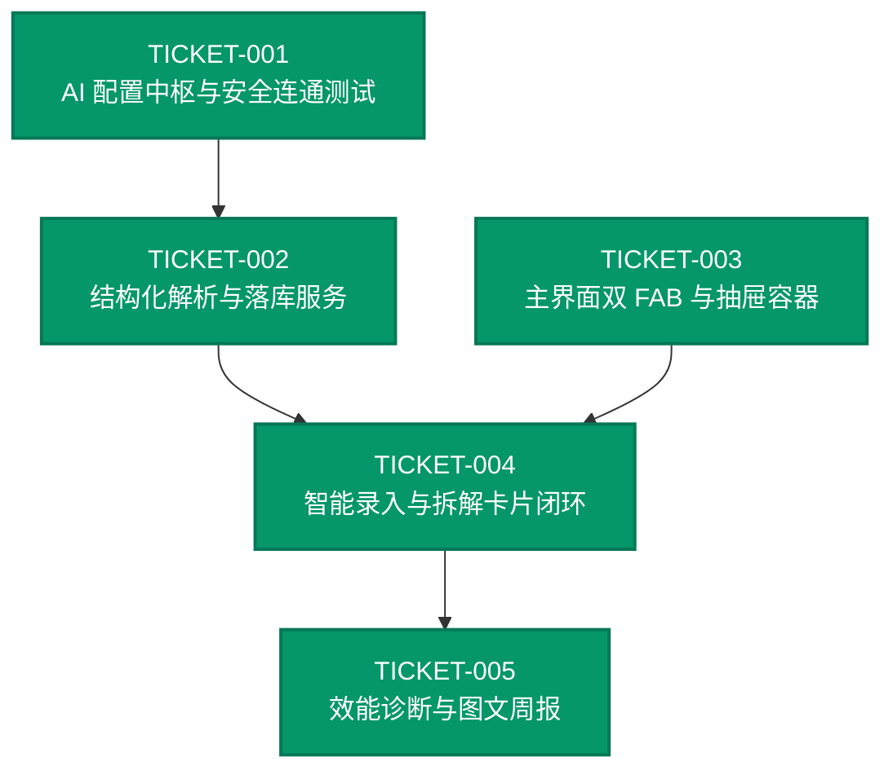

# 工单索引 (Tickets Index): AI 智能助理与效能诊断 (ai-copilot-assistant)

基于规格说明书 [`specs/SPEC-ai-copilot-assistant.md`](../../specs/SPEC-ai-copilot-assistant.md) 拆解的垂直切片工单集合。

---

## 📊 工单清单与状态

| 工单编号 | 标题 | 优先级 | 预估工作量 | 状态 | 依赖 |
|---|---|---|---|---|---|
| [TICKET-001](TICKET-001.md) | AI 服务商配置中枢与安全连通测试 | P0 | 0.5 天 | done | none |
| [TICKET-002](TICKET-002.md) | 自然语言结构化解析与任务树原子落库服务 | P0 | 0.5 天 | done | TICKET-001 |
| [TICKET-003](TICKET-003.md) | 主界面双 FAB 改造与 Linear 风格抽屉容器 | P0 | 0.5 天 | done | none |
| [TICKET-004](TICKET-004.md) | 智能任务录入与多步骤拆解卡片端到端闭环 | P0 | 0.5 天 | done | TICKET-002, TICKET-003 |
| [TICKET-005](TICKET-005.md) | 近 7 天周期效能诊断与高信息密度图文周报 | P1 | 0.5 天 | done | TICKET-004 |

---

## 🔗 依赖 DAG (Dependency DAG)

---

## 💡 建议实现顺序
1. **第一步**：执行 [TICKET-001](TICKET-001.md)（已完成 ✅）
2. **第二步**：并行执行 [TICKET-002](TICKET-002.md) 与 [TICKET-003](TICKET-003.md)（已完成 ✅）
3. **第三步**：执行 [TICKET-004](TICKET-004.md)（已完成 ✅）
4. **第四步**：执行 [TICKET-005](TICKET-005.md)（已完成 ✅）

🎉 **全部工单均已交付完成并通过 100% 测试自审验证！**
